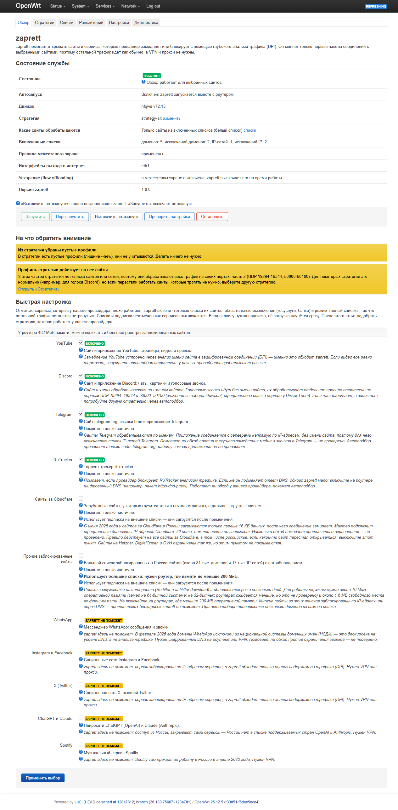
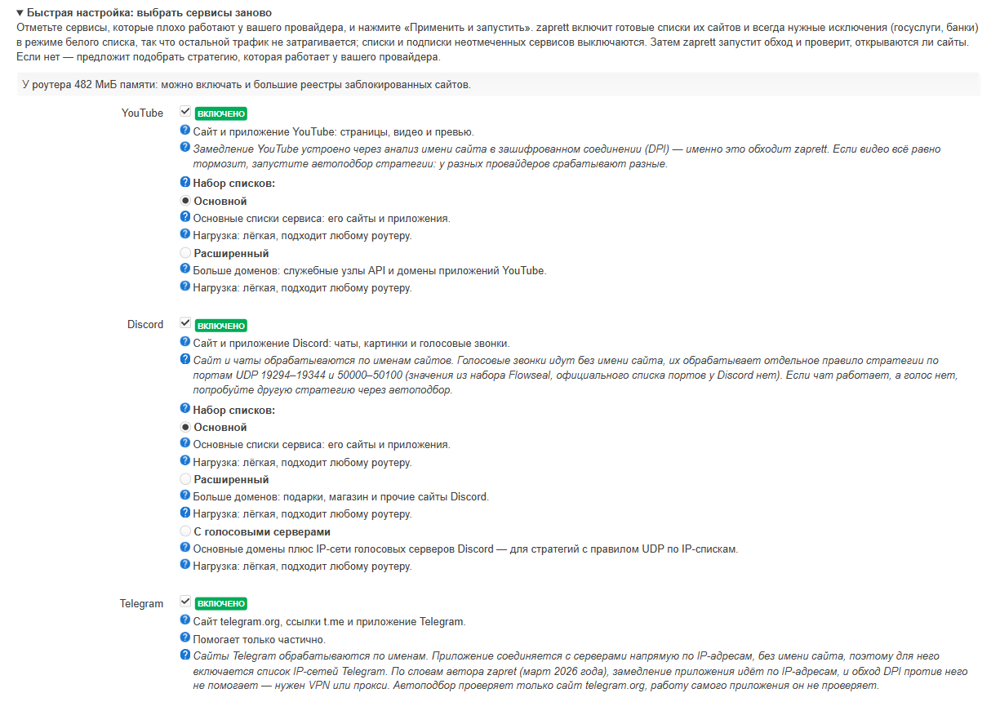
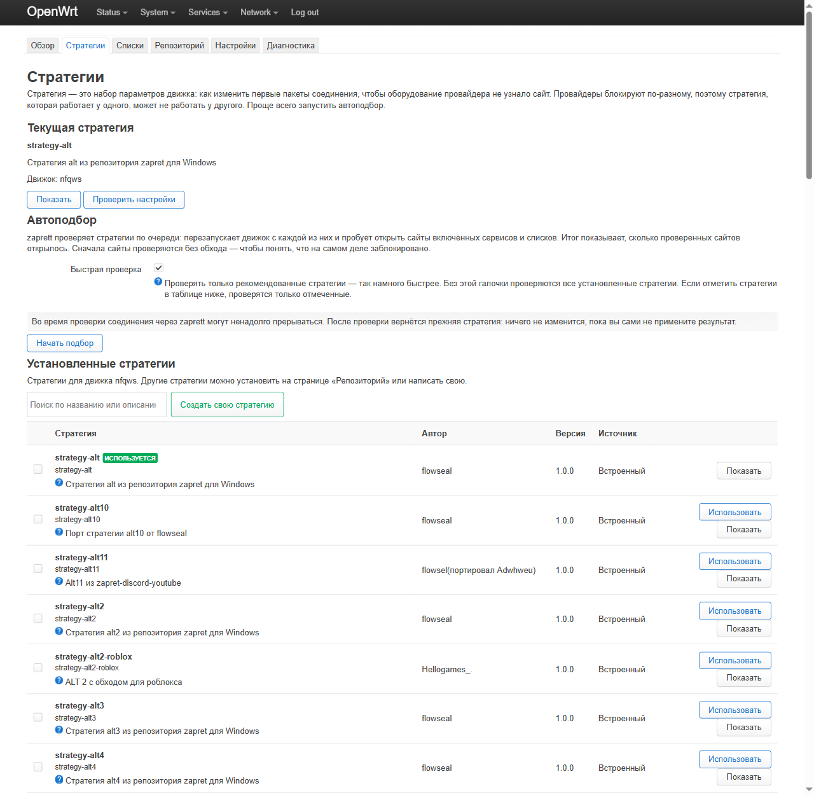
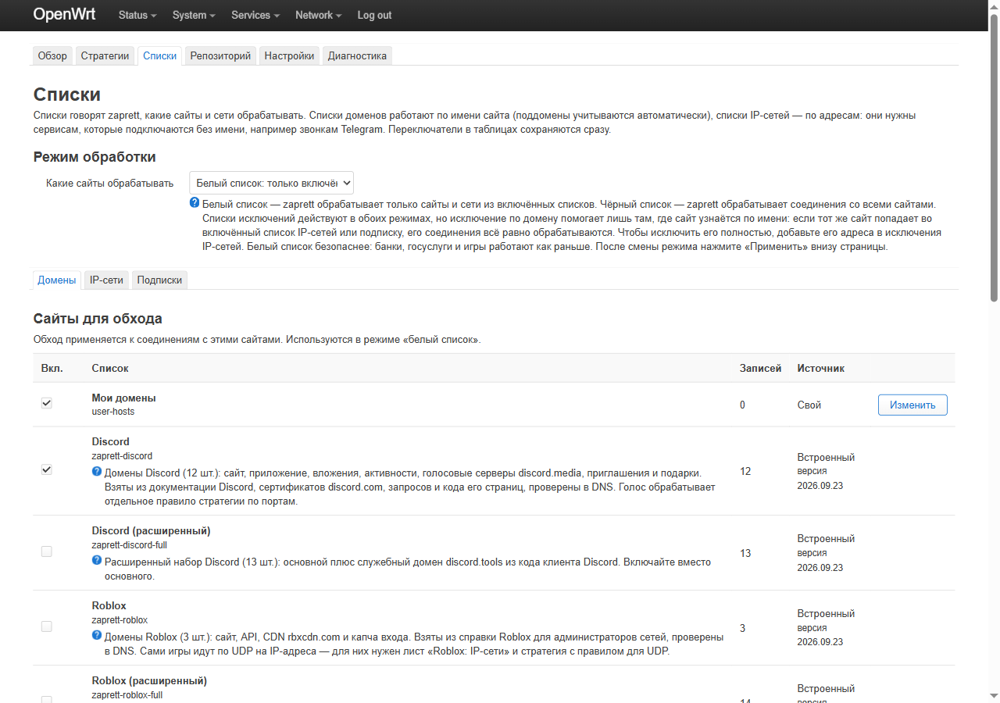
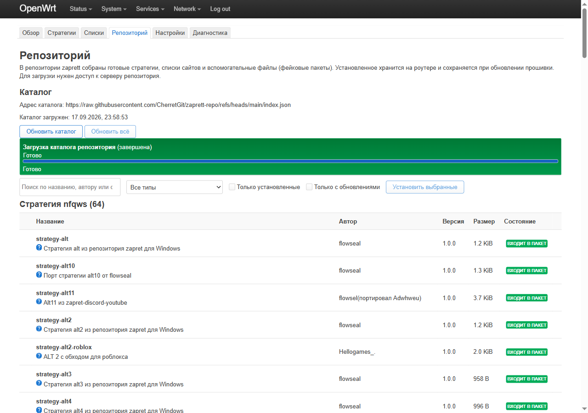
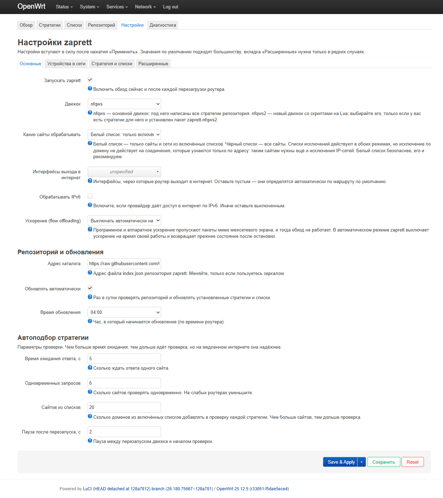
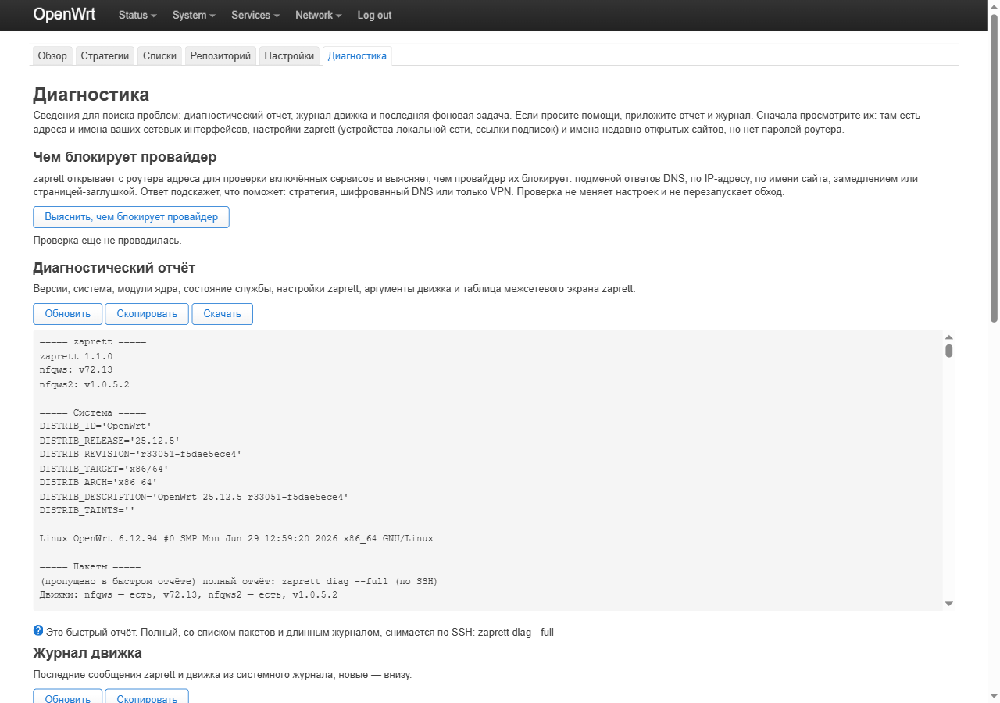

# zaprett для OpenWrt и Windows

**Русский** | [English](README.en.md)

[](https://github.com/RomanKern89/zaprett-openwrt/releases)
[](https://github.com/RomanKern89/zaprett-openwrt/releases)
[](LICENSE)

**Обход замедлений и блокировок по DPI** — дома для всех устройств сразу (роутер с OpenWrt) или на одном компьютере
(Windows). Порт Android-менеджера [zaprett](https://github.com/CherretGit/zaprett-app) на движке
[zapret](https://github.com/bol-van/zapret), с понятным интерфейсом на русском и английском.

Это **не VPN и не прокси**: трафик никуда не перенаправляется. Меняются только первые пакеты соединений с
выбранными сайтами — так, что оборудование провайдера не может прочитать имя сайта, а сам сайт может. Остальной
трафик идёт как обычно: без посредников и без потери скорости.



| | Роутер с OpenWrt | Компьютер с Windows |
|---|---|---|
| **Версия** | 1.1.0-r1 | 0.1.3 |
| **Для чего** | все устройства в доме: телефоны, телевизоры, приставки, консоли | один ПК с Windows 10/11 |
| **Установка** | бандл `.tar.gz` и `sh install.sh` | `zaprett-0.1.3-x64-setup.exe` (или MSI для администраторов) |
| **Интерфейс** | LuCI → Службы → zaprett | приложение и значок в трее |
| **Руководство** | [docs/GUIDE.md](docs/GUIDE.md) · [установка](docs/INSTALL.md) | [windows/README.md](windows/README.md) |

---

## Содержание

- [Как это работает](#как-это-работает)
- [zaprett для роутера: возможности](#zaprett-для-роутера-возможности)
- [Как выглядит](#как-выглядит)
- [Требования](#требования)
- [Установка за 5 минут](#установка-за-5-минут)
- [Командная строка](#командная-строка)
- [zaprett для Windows](#zaprett-для-windows)
- [Политика подписи кода (Code signing policy)](#политика-подписи-кода-code-signing-policy)
- [Новое в версии 1.1](#новое-в-версии-11)
- [Честно о возможностях](#честно-о-возможностях)
- [Приватность](#приватность)
- [Документация](#документация)
- [Благодарности и лицензии](#благодарности-и-лицензии)

---

## Как это работает

Даже в зашифрованном соединении (HTTPS, QUIC) первые пакеты несут **имя сайта** открытым текстом. Оборудование
глубокого анализа трафика (DPI) читает его и замедляет или рвёт соединение. zaprett меняет **форму первых пакетов**
(делит запрос на части, посылает поддельный пакет, меняет порядок и так далее), и DPI уже не может собрать имя.
Какой приём сработает, зависит от провайдера, поэтому в продукте есть автоподбор стратегии.

```
устройства ──► роутер: nftables ──► движок nfqws ──► провайдер (DPI) ──► сайт
                       (только сайты из включённых списков)
```

---

## zaprett для роутера: возможности

**Быстрая настройка в один экран.** Отмечаете сервисы, которые плохо работают: YouTube, Discord, Telegram,
RuTracker, сайты за Cloudflare, Roblox, Signal, «прочие заблокированные сайты». Включаются готовые списки, списки
IP-сетей и обязательные исключения (госуслуги, банки, Яндекс, VK, маркетплейсы), режим «белый список» — остальной
трафик не трогается. Затем обход запускается, и роутер сам проверяет, открываются ли сайты. Сервисы, которым обход
**не поможет** (WhatsApp, Instagram и Facebook, X, ChatGPT и Claude, Spotify), показаны с честной причиной, и включить
их нельзя. Интерфейс знает объём памяти роутера и предупреждает, если выбранное для него тяжело.

**Автоподбор стратегии без остановки обхода.** Сначала проверяются сайты без обхода — чтобы знать, что на самом деле
заблокировано, — затем каждая стратегия; результаты ранжируются, лучшая применяется одной кнопкой или сама, но
**только если она лучше текущей**. 12 рекомендованных стратегий — за несколько минут, все — дольше. Кандидатов
проверяет отдельная копия движка, так что устройства в доме всё это время остаются с обходом.

**64 + 14 стратегий.** 64 готовые стратегии для `nfqws` из репозитория zaprett и 14 собственных стратегий для
движка `nfqws2` (zapret2), включая оркестратор, который сам меняет приёмы, когда сайт перестаёт открываться.
Можно написать свою: перед сохранением её проверяет движок, стратегия с ошибкой не сохраняется.

**Видно, работает ли обход сейчас.** «Проверить сейчас» открывает адреса включённых сервисов через работающий обход
и показывает карточки «YouTube ✓ 3/3, 616 мс». **Монитор доступности** делает то же по расписанию, хранит историю
48 проверок и при устойчивой деградации может сам подобрать стратегию. **Сторож** каждые 5 минут поднимает движок и
правила, если они пропали.

**Чем блокирует провайдер.** Диагностика отличает подмену DNS, блокировку по IP-адресу, обрыв по имени сайта,
замедление и страницу-заглушку и говорит, что поможет: стратегия, шифрованный DNS или только VPN. Шифрованный DNS
(`https-dns-proxy`) включается одной кнопкой.

**Собственные списки проекта.** YouTube, Discord, Telegram, RuTracker, Roblox, Signal и сайты за Cloudflare — с
вариантами «основной», «расширенный», «с голосовыми серверами» (Discord), «снимок в пакете» (Cloudflare). Их
собирает генератор проекта из первоисточников — документации сервисов, сертификатов, реальных сессий браузера, кода
клиентов; каждая запись проверена и объяснена ([docs/LISTS.md](docs/LISTS.md)).

**Списки под контролем.** Свои домены и IP-сети, исключения (действуют в обоих режимах), подписки на внешние списки
по https с автообновлением (Re:filter, antifilter.download, диапазоны Cloudflare) — с пределом 16 МиБ на загрузку,
защитой от «пустых» файлов и записью на флеш только при реальном изменении.

**Репозиторий zaprett** прямо из интерфейса: каталог стратегий и списков, проверка sha256, зависимости, установка и
обновление фоновыми задачами с прогрессом и отменой, автообновление раз в сутки.

**Быстро и бережно к роутеру.** Своя таблица ускорения (flow offloading) вместо отключения ускорения для всего
роутера; блокировка QUIC одной галочкой; игровой фильтр для игр по UDP; фильтр по устройствам локальной сети (все,
только указанные, все кроме указанных — по IP, подсети или MAC). Правила живут в отдельной таблице nftables
`inet zaprett` и переживают перезапуск межсетевого экрана и перезагрузку; движок работает не от root.

**Интерфейс и CLI.** Шесть страниц LuCI на русском и английском: обзор, стратегии, списки, репозиторий, настройки,
диагностика. Всё то же доступно из командной строки `zaprett` с выводом в JSON.

**Работает без доступа к GitHub**: движок, 64 + 14 стратегий и собственные списки лежат в пакете.

---

## Как выглядит

| | |
|---|---|
| [](docs/screenshots/07-quick-setup.png) | [](docs/screenshots/02-strategies.png) |
| **Быстрая настройка**: сервисы и наборы списков | **Стратегии**: текущая, автоподбор, установленные |
| [](docs/screenshots/03-lists.png) | [](docs/screenshots/04-repo.png) |
| **Списки**: домены, IP-сети, исключения, подписки | **Репозиторий**: каталог zaprett, обновления |
| [](docs/screenshots/05-settings.png) | [](docs/screenshots/06-diagnostics.png) |
| **Настройки**: движок, режим, ускорение, QUIC, устройства | **Диагностика**: чем блокирует провайдер, отчёт, журнал |

Каждая страница подробно разобрана в [руководстве](docs/GUIDE.md).

---

## Требования

- OpenWrt **24.10.x** (opkg) или **25.12.x** (apk), межсетевой экран fw4/nftables. 23.05 и старше, snapshot — не
  поддерживаются.
- Архитектуры: 27 для 25.12 и 28 для 24.10 — x86_64, i386, aarch64 (cortex-a53/a72/a76/generic), arm (cortex-a5/a7/
  a8/a9/a15, arm1176jzf-s), mips/mipsel (24kc, 74kc, mips32), mips64, powerpc. **Не поддерживаются:** ARMv4/v5
  (`arm926ej-s`, `fa526`, `xscale`), `loongarch64`, `mips64el`, `powerpc64` и `riscv64`.
- Свободная оперативная память: от ~20 МБ со встроенными списками. Большие реестры заблокированных сайтов требуют
  роутера **от 200 МБ ОЗУ** — интерфейс предупредит.
- Флеш-память: около 2 МБ (пакеты 0,6–0,8 МБ плюс зависимости).
- Интернет на роутере при установке: зависимости (`kmod-nft-queue`, `ucode`) ставятся из официального репозитория.

## Установка за 5 минут

1. Скачайте со страницы [Releases](https://github.com/RomanKern89/zaprett-openwrt/releases) бандл для своей версии
   OpenWrt и архитектуры (как узнать — [INSTALL.md §2](docs/INSTALL.md#2-узнайте-версию-openwrt-и-архитектуру)).
2. Скопируйте его на роутер и запустите установщик:

   ```sh
   cd /tmp
   tar -xzf zaprett-1.1.0-r1-25.12-x86_64.tar.gz
   cd zaprett-1.1.0-r1-25.12-x86_64
   sh install.sh             # --with-nfqws2 — второй движок; --feed — обновления через apk/opkg
   ```

   Одинаково для OpenWrt 25.12 (apk) и 24.10 (opkg). Установщик сам проверит, что бандл подходит роутеру, добавит
   ключ, подключит фид с проверкой подписи и поставит пакеты. Установка без SSH, только через LuCI, —
   [INSTALL.md §4](docs/INSTALL.md#4-установка-только-через-веб-интерфейс).
3. Откройте LuCI → **Службы → zaprett** → «Быстрая настройка» → отметьте сервисы → **«Применить и запустить»**.
   Мастер включит списки, запустит обход и проверит сайты; если что-то не открылось, он предложит «Выяснить, чем
   блокирует провайдер» и «Подобрать рабочую стратегию».

Обновление — новым бандлом или `apk upgrade` / `opkg upgrade` при установке с `--feed`. Удаление —
`sh install.sh --uninstall` (с `--purge` — вместе с настройками). Подробно — [руководство, §12–13](docs/GUIDE.md#12-обновление).

## Командная строка

```sh
zaprett status                # состояние, списки, предупреждения
zaprett start | stop | restart
zaprett test start --quick    # автоподбор стратегии; zaprett test status — ход
zaprett probe                 # проверить, открываются ли сайты
zaprett diagnose              # чем блокирует провайдер
zaprett list enable zaprett-telegram
zaprett diag                  # отчёт для поиска проблем; --full — полный
```

У любой команды есть `--json`. Полный список — [руководство, §11](docs/GUIDE.md#11-командная-строка).

---

## zaprett для Windows

Нет роутера с OpenWrt или обход нужен только на одном компьютере? **zaprett для Windows 0.1.3** делает то же на ПК с
Windows 10 (2004 и новее, включая LTSC 2021) и Windows 11 x64: мастер первой настройки, проверка сайтов, автоподбор
стратегии без остановки обхода, монитор, диагностика, свои списки и подписки. Один установщик — среда .NET,
драйвер WinDivert и движки zapret и zapret2 уже внутри; интерфейс на русском, английском и китайском. Скачивайте
`zaprett-0.1.3-x64-setup.exe`: он сразу спрашивает права администратора и запускает установку; сам `.msi` — для
администраторов и тихой установки.

| | |
|---|---|
| [](windows/docs/screenshots/light-ru-01-home.png) | [](windows/docs/screenshots/light-ru-29-wizard-2-services.png) |
| **Главная**: состояние обхода и проверка сайтов | **Мастер**: выбор сервисов за пару минут |

Установка, проверка файла по SHA256 и все возможности — **[руководство zaprett для Windows](windows/README.md)**
([English](windows/README.en.md), [简体中文](windows/README.zh-CN.md)).

## Политика подписи кода (Code signing policy)

Free code signing provided by [SignPath.io](https://about.signpath.io/), certificate by [SignPath Foundation](https://signpath.org/). Выпуски для Windows подписываются после одобрения заявки в SignPath Foundation; до этого MSI и `setup.exe` не подписаны Authenticode. Роли, что подписывается и конфиденциальность: [docs/CODE_SIGNING.ru.md](docs/CODE_SIGNING.ru.md).

---

## Новое в версии 1.1

- **Монитор доступности** проверяет сайты по расписанию и при устойчивой деградации может сам подобрать стратегию;
  **сторож** поднимает движок и правила, если они пропали.
- **Диагностика «чем блокирует провайдер»** и шифрованный DNS одной кнопкой.
- **Собственные списки проекта** для YouTube, Discord, Telegram, RuTracker, Roblox, Signal и сайтов за Cloudflare с
  вариантами.
- **Автоподбор без остановки обхода**: стратегии проверяет отдельный тестовый движок.
- Своя таблица ускорения, блокировка QUIC, игровой фильтр, 14 стратегий для движка zapret2.
- **Исправление безопасности.** В 1.0.0 проверка опций пользовательских стратегий была неполной: опцию можно было
  записать так, что проверка её не узнавала. В 1.1.0 каждая опция перед проверкой приводится к полному имени по
  таблицам опций самого движка, неизвестные и неоднозначные опции отклоняются. **Всем, кто пользуется 1.0.0,
  рекомендуется обновиться.**

---

## Честно о возможностях

- Обход помогает против **анализа трафика (DPI)**: замедление YouTube, блокировка Discord и подобное.
- Он **не помогает**, если сервис заблокирован по IP-адресам (Instagram, Facebook, X), закрывает доступ сам
  (ChatGPT, Claude, Spotify) или блокировка сделана через DNS — тогда нужен шифрованный DNS на роутере.
- **Стратегия по умолчанию может не работать у вашего провайдера.** Это нормально: запустите автоподбор.
- Проверено на стенде через реального провайдера: без обхода из 25 целей открывалась 1; с подобранной стратегией
  YouTube, Discord и RuTracker открывались полностью с клиента за роутером; Telegram ни одна стратегия не починила.
- Проверялось на x86-виртуальных машинах OpenWrt 25.12.5 и 24.10.8. На реальном железе (MIPS/ARM) пакеты собраны,
  но не протестированы. Совместная работа с VPN и маршрутизацией по политике на том же роутере не проверялась.
  Полный список проверенного и непроверенного — [tests/RESULTS.md](tests/RESULTS.md).
- Изменение пакетов ради обхода анализа трафика может ограничиваться условиями провайдера, правилами сети
  работодателя или учебного заведения и местным законодательством. Ответственность за использование — на вас.

## Приватность

Трафик не уходит на сторонние серверы, телеметрии нет, списки и настройки остаются на роутере. Роутер обращается в
интернет только за тем, что вы включили: каталог репозитория, подписки, проверочные адреса сервисов при проверке и
автоподборе, DNS over HTTPS при диагностике, репозитории OpenWrt при установке шифрованного DNS. Полный перечень
адресов — [руководство, §16](docs/GUIDE.md#16-границы-возможностей-и-приватность).

## Документация

| Файл | О чём |
|---|---|
| [docs/GUIDE.md](docs/GUIDE.md) · [EN](docs/GUIDE.en.md) | **руководство: установка, каждая страница и настройка, CLI, обновление, удаление, вопросы, приватность** |
| [docs/INSTALL.md](docs/INSTALL.md) · [EN](docs/INSTALL.en.md) | установка по SSH и через LuCI, онлайн-фид, обновление, удаление, после смены прошивки, ошибки установщика |
| [windows/README.md](windows/README.md) | zaprett для Windows: установка, мастер, все страницы, командная строка |
| [docs/CODE_SIGNING.ru.md](docs/CODE_SIGNING.ru.md) | политика подписи кода Windows-приложения |
| [docs/LISTS.md](docs/LISTS.md) | какие списки встроены, откуда взяты, что включать под объём памяти |
| [docs/LUCI.md](docs/LUCI.md) | устройство веб-интерфейса и соответствие Android-версии |
| [docs/BACKEND.md](docs/BACKEND.md) | CLI, устройство службы, отладка |
| [docs/BUILD.md](docs/BUILD.md) | сборка пакетов под все архитектуры |
| [docs/ARCHITECTURE.md](docs/ARCHITECTURE.md) | контракт между частями продукта |
| [tests/RESULTS.md](tests/RESULTS.md) | как тестировалось и что получилось, включая список непроверенного |

## Благодарности и лицензии

- [bol-van/zapret](https://github.com/bol-van/zapret) — движок nfqws (MIT).
- [CherretGit/zaprett-app](https://github.com/CherretGit/zaprett-app) и
  [egor-white/zaprett](https://github.com/egor-white/zaprett) — оригинальный менеджер и модель стратегий и списков.
- [CherretGit/zaprett-repo](https://github.com/CherretGit/zaprett-repo) — стратегии и списки (лицензия не указана).
- [Flowseal/zapret-discord-youtube](https://github.com/Flowseal/zapret-discord-youtube),
  [remittor/zapret-openwrt](https://github.com/remittor/zapret-openwrt),
  [1andrevich/Re-filter-lists](https://github.com/1andrevich/Re-filter-lists) — списки и решения для OpenWrt (MIT).

Код этого проекта — MIT (см. [LICENSE](LICENSE)). Списки и стратегии сохраняют условия своих источников; часть
источников лицензию не указывает, это отмечено в [docs/LISTS.md](docs/LISTS.md). Лицензии компонентов
Windows-приложения — в [windows/README.md](windows/README.md#благодарности-и-лицензии).
