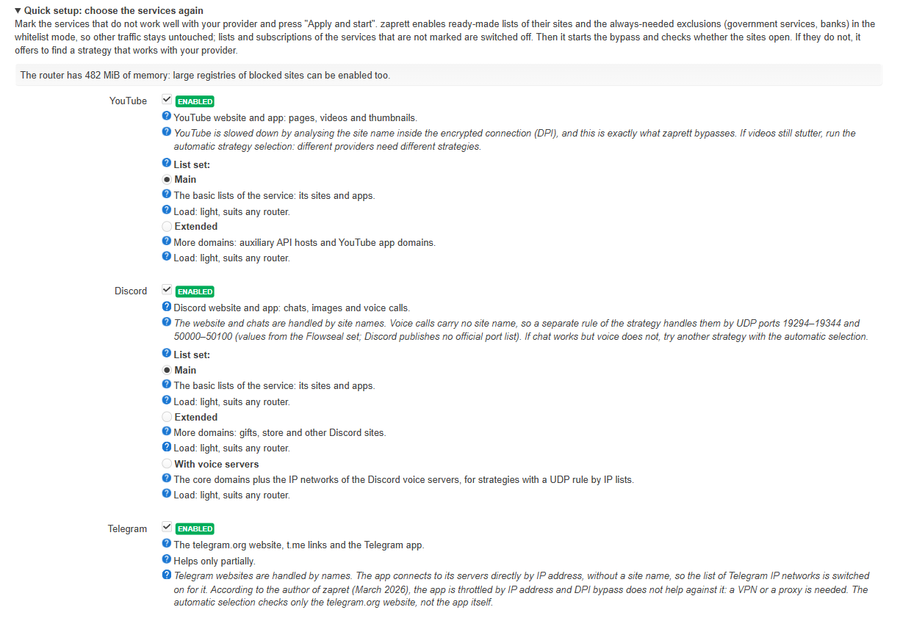
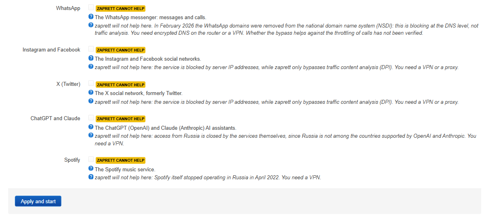
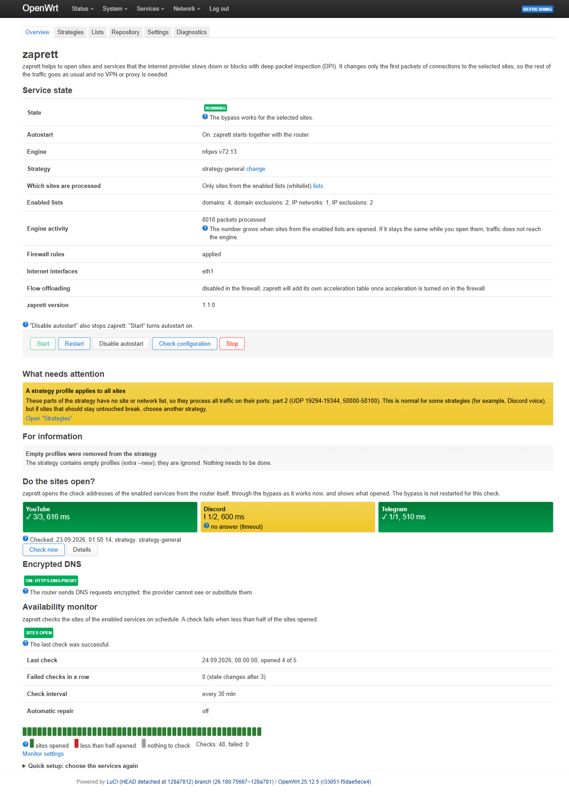
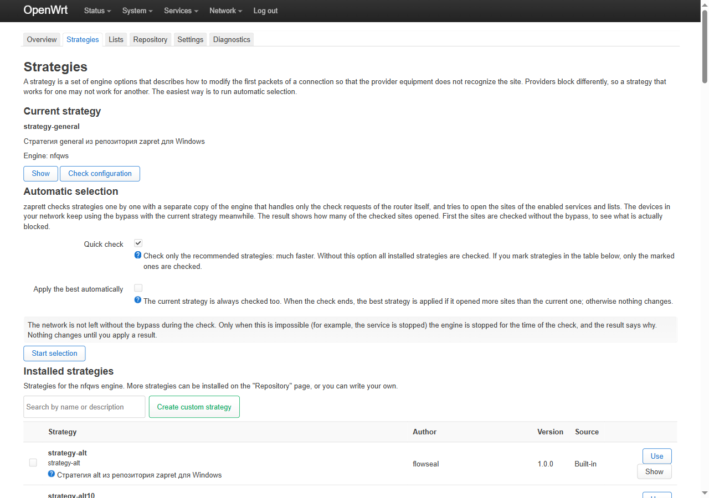
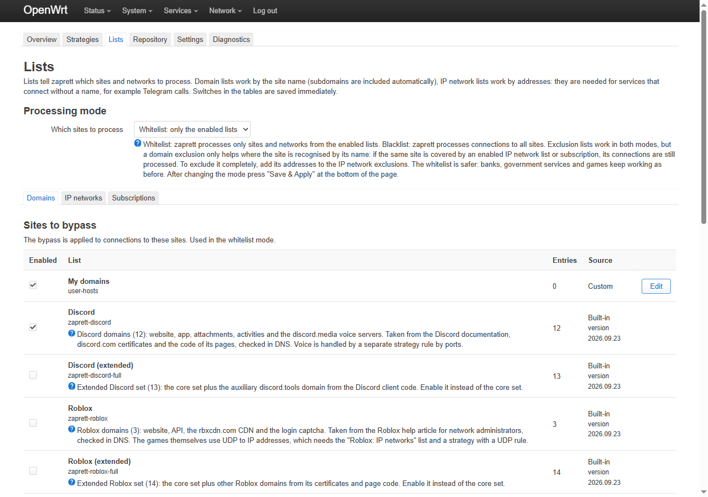
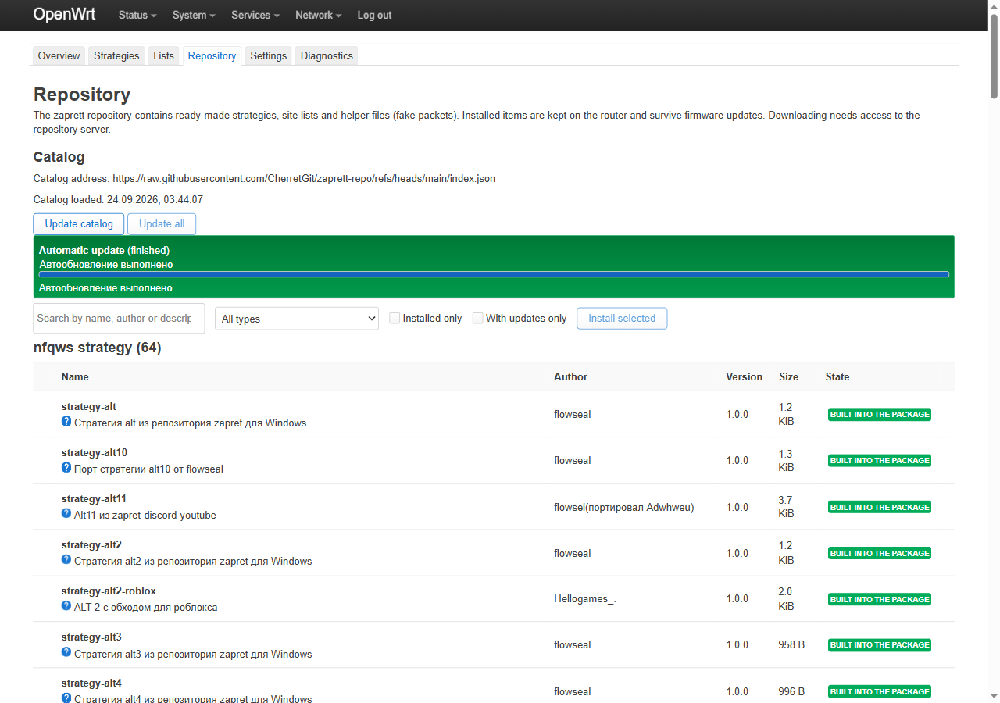
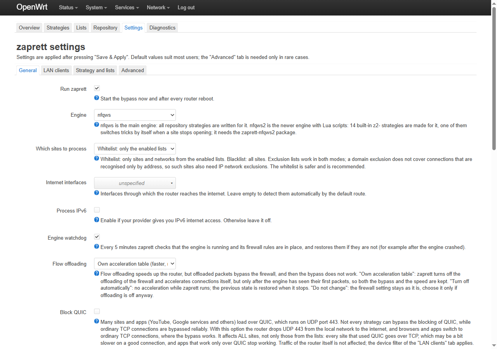
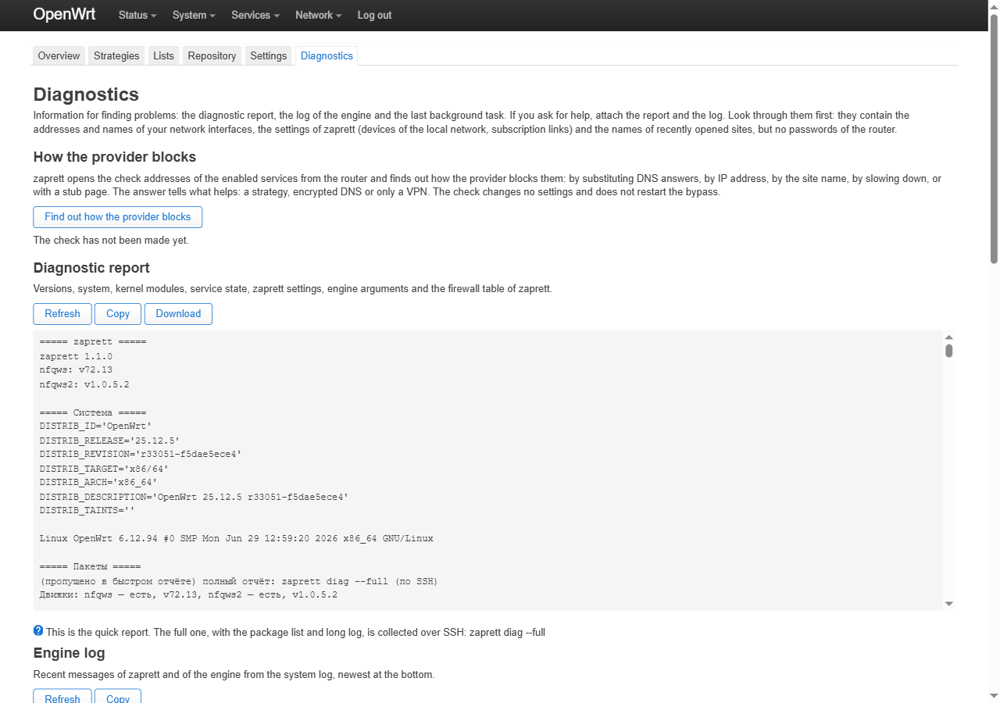

# zaprett for OpenWrt: user guide

[Русский](GUIDE.md) | **English**

A detailed guide for version **1.1.0**. It covers how the bypass works, how to install and set up zaprett, what every
page and setting of the web interface means, how to use the command line, how to update and uninstall the product
and what to do if it does not work.

Installation details are in [INSTALL.en.md](INSTALL.en.md). What the built-in lists contain and where every entry
comes from is in [LISTS.md](LISTS.md) (Russian).

## Contents

1. [How it works](#1-how-it-works)
2. [Installation](#2-installation)
3. [First setup in 5 minutes](#3-first-setup-in-5-minutes)
4. [The Overview page](#4-the-overview-page)
5. [Quick setup: choosing services](#5-quick-setup-choosing-services)
6. [Strategies and automatic selection](#6-strategies-and-automatic-selection)
7. [Lists: domains, IP networks, exclusions, subscriptions](#7-lists-domains-ip-networks-exclusions-subscriptions)
8. [Repository](#8-repository)
9. [Settings: every option](#9-settings-every-option)
10. [Diagnostics](#10-diagnostics)
11. [Command line](#11-command-line)
12. [Updating](#12-updating)
13. [Uninstalling](#13-uninstalling)
14. [Typical scenarios](#14-typical-scenarios)
15. [FAQ and troubleshooting](#15-faq-and-troubleshooting)
16. [Limits and privacy](#16-limits-and-privacy)

---

## 1. How it works

Your provider sees the start of every connection you make. Even when the traffic is encrypted (HTTPS, QUIC), the
first packets carry the **site name** in plain text: the SNI field in TLS, the `Host` header in plain HTTP.
Deep packet inspection (DPI) equipment reads that name and decides whether to pass, throttle or drop the connection.

zaprett does not encrypt or redirect your traffic. It changes the **shape of the first packets** of a connection so
that the DPI box cannot reassemble the site name while the server at the other end still can. After that the
connection goes on as usual: directly, with no middleman and no speed penalty.

```
                ┌──────────── OpenWrt router ────────────┐
home devices    │                                         │
          ───►  │  nftables ──► NFQUEUE queue ──►         │ ──► provider (DPI) ──► site
                │               nfqws engine              │
                │  (only the ports and sites from lists)  │
                └─────────────────────────────────────────┘
```

What follows from this:

- **Set up once on the router**, it works for every device at home: phones, set-top boxes, TVs, consoles. Nothing
  is installed on the devices.
- **Only the selected sites are processed.** The default mode is "whitelist": the engine touches connections to
  sites from the enabled lists only, everything else passes by.
- **It works against traffic analysis specifically.** If a site is blocked by IP address or has left your region by
  itself, reshaping the start of the connection is pointless, see [section 16](#16-limits-and-privacy).
- **The right strategy depends on the provider.** DPI behaves differently at different operators, so a strategy
  that works for one may fail for another. That is what automatic selection is for.

What the product consists of:

| Part | What it is |
|---|---|
| `nfqws` engine | from [bol-van/zapret](https://github.com/bol-van/zapret), version v72.13 in the package |
| `nfqws2` engine (optional) | from the zapret2 project, Lua strategies; a separate `zaprett-nfqws2` package |
| 64 strategies for `nfqws` | from the [zaprett repository](https://github.com/CherretGit/zaprett-repo), the same one the Android app uses |
| 14 `z2-…` strategies for `nfqws2` | the project's own strategies; one of them switches tricks by itself when a site stops opening |
| built-in lists | the project's own lists for YouTube, Discord, Telegram, RuTracker, Roblox, Signal, sites behind Cloudflare and the always-needed exclusions ([LISTS.md](LISTS.md)) |
| `zaprett` service | manages the engine, nftables rules, lists, subscriptions, the monitor and the watchdog; the `zaprett` command over SSH |
| `luci-app-zaprett` | the web interface: LuCI → **Services → zaprett** |

---

## 2. Installation

zaprett is installed from a **bundle**, an archive named `zaprett-<version>-<OpenWrt>-<architecture>.tar.gz` on the
[Releases](https://github.com/RomanKern89/zaprett-openwrt/releases) page. Inside are the packages, a signed package
index, the public key and the `install.sh` installer. The full instructions with error messages are in
[INSTALL.en.md](INSTALL.en.md); here are the essentials.

| OpenWrt | Package manager | Bundle |
|---|---|---|
| 25.12.x | apk | `zaprett-1.1.0-r1-25.12-<architecture>.tar.gz` |
| 24.10.x | opkg | `zaprett-1.1.0-r1-24.10-<architecture>.tar.gz` |

**You need** internet access on the router (dependencies such as `kmod-nft-queue` and `ucode` come from the official
OpenWrt repositories) and about 2 MB of free flash.

**Step 1. Find the release and architecture.** Over SSH:

```sh
cat /etc/openwrt_release          # DISTRIB_RELEASE: the OpenWrt release
cat /etc/apk/arch                 # OpenWrt 25.12: package architecture
opkg print-architecture           # OpenWrt 24.10: the line with the highest number
```

Without SSH: LuCI → System → Software → repository configuration; the architecture is the
`…/packages/<architecture>/…` part of the addresses.

**Step 2 (the same on OpenWrt 25.12 and 24.10). Install over SSH.** Copy the bundle to `/tmp` on the router
(`scp -O …` or WinSCP in SCP mode) and run:

```sh
cd /tmp
tar -xzf zaprett-1.1.0-r1-25.12-aarch64_cortex-a53.tar.gz
cd zaprett-1.1.0-r1-25.12-aarch64_cortex-a53
sh install.sh                     # --with-nfqws2 adds the nfqws2 engine; --feed keeps updates in the package manager
```

The installer checks the checksums, the OpenWrt release and the architecture, adds the zaprett key and installs
`zaprett`, `zaprett-nfqws`, `luci-app-zaprett` and `luci-i18n-zaprett-ru` from the signed feed inside the bundle.
At the end it prints the address of the zaprett page in LuCI. The installer's own messages are in Russian.

**Without SSH:**

- **OpenWrt 24.10 (opkg):** LuCI → System → Software → "Update lists…", then "Upload Package…" and the files from
  the bundle's `feed/` folder in this order: `zaprett-nfqws`, `zaprett`, `luci-app-zaprett`, `luci-i18n-zaprett-ru`.
- **OpenWrt 25.12 (apk):** uploading a single package through LuCI does not accept a package signed with a foreign
  key, so install `luci-app-ttyd`, open "Services → Terminal" and run the commands from step 2 there.

Both paths in detail: [INSTALL.en.md §4](INSTALL.en.md#4-installing-through-the-web-interface-only).

**Step 3.** Open LuCI → **Services → zaprett**. If the menu item is missing, log out of LuCI and log in again.

**Interface language.** The zaprett pages use the LuCI language (System → System → "Language and Style"); with
"auto" they follow the browser language. The source strings are English; the Russian translation of the zaprett pages
is installed with the packages and is used only when the interface language is Russian. You can remove it with
`apk del luci-i18n-zaprett-ru` / `opkg remove luci-i18n-zaprett-ru`.

What is still Russian in an English interface (version 1.1.0-r1): the descriptions of the built-in strategies and of
the repository catalogue, the names of the default subscriptions, and messages produced by the service itself (the
diagnostic report headings, background task messages, CLI output). The quick setup services and the built-in lists
are shown in English.

---

## 3. First setup in 5 minutes

While nothing is configured, **Quick setup** is open at the top of the Overview page. Later it is folded at the
bottom of the same page as "Quick setup: choose the services again".



1. **Tick the services** that work badly with your provider (YouTube and Discord are ticked by default). If a service
   has a **List set**, keep "Main": the other sets are for later and only if something does not work
   (see [section 5](#5-quick-setup-choosing-services)).
2. Press **Apply and start** at the bottom of the block. The interface goes step by step and shows each step:
   - "Enable the lists of the selected services": the lists and IP networks of the services, the always-needed
     exclusions (government services, banks, Yandex, VK, marketplaces) and the whitelist mode; if a service uses a
     subscription, it waits for the download;
   - "Start the bypass", or restart it if it was already running;
   - "Check whether the sites open": the router itself opens the check addresses of the services through the bypass
     and shows cards such as "YouTube ✓ 3/3, 616 ms" or "Discord ! 1/2, no answer (timeout)".
3. **If everything opened**, you are done: the bypass works and comes back by itself after a router reboot.
4. **If a service did not open**, first press **Find out how the provider blocks**: against DNS substitution or
   blocking by address, trying strategies will not help. If the cause is traffic analysis, press **Find a working
   strategy**: a quick automatic selection checks the recommended strategies together with the current one and
   applies the best one **only if more sites open with it**, then checks the sites again. The default strategy
   `strategy-general` does not work with every provider, and that is normal.
5. **Check on your own device**: open what you enabled. A check from the router is often stricter than one from a
   phone or a computer (see [section 6](#6-strategies-and-automatic-selection)).

Services that the bypass cannot fix carry a yellow "zaprett cannot help" mark with the reason and cannot be enabled:



The rest is for when you want to dig deeper or something does not work. The state is always visible on the Overview
page: the "Check now" button and the availability monitor that checks the sites on schedule.

---

## 4. The Overview page



The **Service state** table, row by row:

| Row | Meaning |
|---|---|
| **State** | "Running": the engine is running and the firewall rules are applied. "Running, autostart is off": running now, but will not come back after a router reboot. "Stopped": switched off. "Enabled, but not running": it should run but there is no process (see "What needs attention" and "Diagnostics"). "Strategy selection is running": strategies are being checked right now. |
| **Autostart** | Whether the bypass comes back by itself after a router reboot. |
| **Engine** | `nfqws` and its version; `nfqws2` if you installed the extra package and chose it. |
| **Strategy** | The current strategy and a "change" link. |
| **Which sites are processed** | "Only sites from the enabled lists" (whitelist) or every site except the exclusions (blacklist). |
| **Enabled lists** | How many domain lists, domain exclusions, IP network lists and IP exclusions are enabled. |
| **Engine activity** | How many packets went through the engine since it started. It grows when sites from the enabled lists are opened; if it stays the same while you open them, traffic does not reach the engine. |
| **Firewall rules** | Whether the nftables rules that send traffic to the engine are applied. |
| **Internet interfaces** | The interfaces the router uses to reach the internet (normally detected automatically). |
| **Flow offloading** | Offloading lets packets skip the firewall, and then the bypass does not work. The row shows the firewall setting and whether zaprett's own acceleration table is active (see [section 9](#9-settings-every-option)). |
| **zaprett version** | The package version. |

Buttons: **Start**, **Restart**, **Disable autostart** / **Enable autostart**, **Check configuration** and **Stop**.
"Disable autostart" also stops zaprett; "Start" turns autostart on. "Check configuration" builds the engine
arguments and asks the engine to validate them without starting: a quick way to make sure the configuration is valid.

**What needs attention** lists the service warnings in plain language: each one explains what happened and what to
do, with a link to the right page. Messages that need no action (empty profiles removed from the strategy, some
strategy options ignored, selection running) go to a calm **For information** block. The main warnings:

| Warning | Meaning and what to do |
|---|---|
| "A strategy profile applies to all sites" | Part of the strategy has no site list and processes all traffic on its ports. This is normal for Discord voice; if other sites break because of it, choose another strategy. |
| "The strategy processes a wide port range" | Similar: the strategy touches many ports. If something broke, choose another strategy. |
| "zaprett is enabled but not running" | The engine is not running. Press Restart; if it repeats, see Diagnostics. |
| "Firewall rules are not applied" | Traffic does not reach the engine. Press Restart. |
| "Kernel modules are missing" | `kmod-nft-queue` (or another required module) is not installed. Install the package. |
| "Flow offloading is enabled" | The bypass does not work while firewall offloading is on. Choose "Own acceleration table" or "Turn off automatically" in Settings. |
| "The own acceleration table did not start" | The router did not accept zaprett's acceleration table (no suitable devices or no kernel support). The bypass works, but without acceleration; leave it or choose "Turn off automatically". |
| "No site lists are enabled" | In whitelist mode there is nothing to process: tick services in Quick setup. |
| "An enabled list was not found" / "The selected strategy was not found" / "No strategy is selected" | The settings point to an item that is not on the router. Choose another one or install it from the Repository. |
| "A subscription has not been downloaded yet" | An external list is enabled but not downloaded yet. Update it on the Subscriptions tab. |
| "IPv6 connections go without the bypass" | The connection has IPv6, but IPv6 processing is off. Turn on "Process IPv6" in Settings. |
| "The enabled lists are too large for this router" | Large subscriptions or `full`-tier services on a router with little memory: the engine may crash. Turn the large subscriptions off. |
| "Sites of the enabled services stopped opening" | The monitor failed to open the sites several times in a row: the provider may have changed the blocking. Run automatic selection (or wait for automatic repair if it is on). |
| "The game filter is not working: no IP network list" | The game filter is on, but no IP network list is enabled, so the filter is skipped. |
| "Some settings have invalid values" / "The engine settings could not be prepared" | Some settings were dropped or the engine rejected the arguments. Check Settings, then "Check configuration". |
| "DNS requests go without encryption" (for information) | The provider may substitute DNS answers for the enabled services, and encrypted DNS is not on. A "Turn on encrypted DNS" button is next to it. |

**Do the sites open?** is a live check. The router opens the check addresses of the enabled services **through the
bypass as it runs now** (the engine is not restarted) and shows a card per service: how many addresses opened, the
average time and the reason if something failed. A green card means everything opened, yellow means part of it,
red means nothing. "Check now" repeats the check, "Details" shows every address.

**Encrypted DNS** shows whether the router uses encrypted DNS (`https-dns-proxy`, `stubby` or `dnscrypt-proxy`:
installed and its service running). Some providers answer a DNS query for a blocked site with the address of their
stub page, and then the site will not open even though the bypass works. **Turn on encrypted DNS**, after a
confirmation, installs `https-dns-proxy` (and its LuCI page) with the regular package manager and starts it; the
progress is shown in the card. It needs internet access and a little free flash. Devices that get DNS from the router
over DHCP (the usual setup) start using encrypted DNS by themselves.

**Availability monitor** runs the same check on schedule (every 30 minutes by default, while zaprett runs). States:
"Sites open", "Sites stopped opening" (several failed checks in a row), "Repairing" (automatic repair is selecting a
strategy) or "No data yet". Below is a strip of the last 48 checks: green means at least half of the sites opened,
red means less than half, grey means there was nothing to check. Hover over a cell to see the time and result.
Monitor settings are in Settings.

The page refreshes its state every 10 seconds and pauses while the browser tab is hidden.

---

## 5. Quick setup: choosing services

This is the counterpart of the Android app's list of apps, turned around: you mark not apps but services that work
badly for you. Each service is a ready-made set of domain lists and, where needed, IP network lists and
subscriptions to external lists.

| Service | Helps | What it enables |
|---|---|---|
| **YouTube** | yes | the YouTube domain list (site, videos, thumbnails) |
| **Discord** | yes | the Discord domain list; voice is handled by strategy rules on UDP ports 19294–19344 and 50000–50100 |
| **Telegram** | partially | the Telegram domain list and IP network list: the website and `t.me` links open; the app connects to IP addresses directly |
| **RuTracker** | partially | the RuTracker domain list; if the provider substitutes DNS answers, encrypted DNS is needed too |
| **Sites behind Cloudflare** | partially | Cloudflare's official IP ranges (a subscription, 22 networks) against throttling that lets only the start of a page load |
| **Roblox** | partially | Roblox domains and the Roblox IP network list: the games themselves use UDP to IP addresses and need a strategy with a UDP rule |
| **Signal** | partially | Signal domains; whether the bypass helps against this block has not been verified |
| **Other blocked websites** | partially | the large registries (Re:filter, antifilter.download), about 81 thousand domains and 17 thousand IP networks with automatic updates. **Needs a router with at least 200 MiB of RAM** |
| WhatsApp, Instagram and Facebook, X (Twitter), ChatGPT and Claude, Spotify | **no** | nothing: these cannot be enabled. The reason is shown next to them: blocking by IP address, blocking in DNS, or the service itself refusing the region. You need a VPN or a proxy |

Above the services the interface shows **the router's memory** and the recommended tier: `light` (any router) or
`full` (200 MiB or more). `full` services on a small router are marked "not recommended": large lists take memory,
and a router with 64–128 MiB may run out of it.

What **Apply and start** does:

- enables the lists and IP networks of the selected services (in the selected set);
- always adds the **mandatory exclusions** `zaprett-exclude` (domains) and `zaprett-exclude-ipset` (IP networks):
  government services, banks, Yandex, VK, marketplaces, local networks — the engine leaves their traffic alone;
- switches the mode to **whitelist**;
- **switches off the lists and subscriptions of services you did not mark**; your own lists (`user-…`) are never touched;
- enables the subscriptions of the selected services and queues their download;
- starts the bypass (or restarts it to apply the new lists);
- checks whether the sites open and, if they do not, offers "Find out how the provider blocks" and "Find a working strategy".

Service names and descriptions are shown in the interface language.

### List set of a service: main or extended

Some services have several **list sets**; a "List set" choice appears under the service:

| Set | When to choose it |
|---|---|
| **Main** (default) | almost always: the minimal set of domains the site and the app need |
| **Extended** (YouTube, Discord, RuTracker, Roblox, Signal) | the main set is on, a strategy is selected, but part of the service still fails: thumbnails, the store, the wiki, the TV or console app. It has more auxiliary domains, CDNs and APIs |
| **With voice servers** (Discord) | the site and chat work but voice does not, and the strategy handles UDP by IP network lists |
| **Built-in snapshot** (Sites behind Cloudflare) | the Cloudflare range subscription cannot be downloaded: the same official networks from the package, without automatic updates |

Each set says what it contains and its load: "light" suits any router, "heavy" needs 200 MiB of RAM or more. When
you switch sets, the wizard switches off the lists of the other sets of that service, so unused lists do not pile up.

The same from the command line: `zaprett wizard apply youtube:full discord:voice` (without `:<set>` the main one is
used); the sets of a service are in `zaprett presets --json`, field `variants`.

---

## 6. Strategies and automatic selection



A **strategy** is a set of engine options: how exactly to change the first packets (split the request, send a fake
packet before the real one, change TTL and so on), on which ports and for which sites. The package ships 64
strategies for `nfqws` and 14 for `nfqws2`. One strategy may contain several profiles, for example a separate
profile for Discord voice on its UDP ports.

At the top is the **Current strategy** with "Show" (the text and the built engine arguments) and "Check configuration".

### Automatic selection

Providers use different DPI equipment, and trying strategies is faster than guessing. Selection starts with **Start
selection**; what it checks depends on the options and the table:

1. **Quick check** (on by default): the recommended strategies; for the `nfqws` engine these are 12 strategies, `strategy-general`, `strategy-alt`, `strategy-alt2`,
   `strategy-alt3`, `strategy-alt4`, `strategy-alt8`, `strategy-alt11`, `strategy-fake-tls-auto-alt`,
   `strategy-fake-tls-auto-alt3`, `strategy-simple-fake`, `strategy-discord-fix`, `strategy-youtubefix-alt`; a few minutes;
2. with the option off, **all installed** strategies of the current engine are checked; this takes tens of minutes;
3. if you mark strategies in the table below, **only the marked ones** are checked, whatever the option says.

**Apply the best automatically** (off by default): the current strategy is always checked too, and when the check
ends the best strategy is applied only if more sites opened with it than with the current one; otherwise nothing
changes. Quick setup and the monitor's automatic repair work the same way.

**Your network keeps the bypass during the check.** The main engine keeps serving every device with the current
strategy, while the candidates are tested by a separate copy of the engine that sees only the router's own check
requests (they come from a dedicated system user, `zaprett-test`). After the check this copy and its rules are
removed. If that is impossible (the service is stopped, there is no `zaprett-test` user, the firewall did not accept
the test rules), the engine is stopped for the time of the check and the result says why. You can choose that mode on
purpose with `zaprett test start --exclusive`.

How the check goes: the product takes the targets of the enabled services (plus up to 20 domains from your enabled
lists), first checks them **without the bypass** to learn what is actually blocked, and then checks the same targets
with each strategy. The result is a table: how many targets opened out of how many, the average response time and a
verdict:

| Verdict | Meaning |
|---|---|
| works | all targets opened |
| works partially | some targets opened |
| does not help | no target opened |
| rejected by the engine | the engine rejected the strategy's options |
| the engine did not start | the engine did not come up with this strategy |
| not checked | the strategy has not been checked yet, or the check was interrupted |

Then press **Apply the best strategy** or "Apply" on a row; "Details" shows every checked address and the error
reason. If every target opened even without the bypass, the interface warns that the comparison means nothing: the
provider is not interfering right now, or the wrong sites are being checked. Selection runs as a background job: you
can close the page, see the progress when you come back and cancel it. Everything temporary is removed at the end, on
cancel and even if the job was killed: the next state request or the watchdog cleans up.

**An important limit of the method.** Selection checks the targets **from the router itself**, while your devices go
through the router, and these are different traffic paths. On the test bench Discord did not open from the router
but did open from a client behind it. So the score can be **too low**: if a strategy got "works partially", try it on
your phone or computer before discarding it.

### Installed and custom strategies

At the bottom is **Installed strategies** with a search box: "Use", "Show", and a checkbox for a selective check.
**Create custom strategy** makes your own: the id gets the `user-` prefix, up to 64 KiB. On "Check and save" the
engine validates the options, and **a strategy with an error is not saved**, so you cannot leave the router with a
broken bypass by accident. Options are checked against the engine's own option tables; unknown and ambiguous options
are rejected. Custom strategies can be edited and deleted; strategies from the package and the repository can only
be used.

The format is the same `nfqws` arguments as in the Android app, with substitutions: `${hostlists}`, `${ipsets}`,
`${hostlist:id}`, `${bin:id}`, `${lua_lib:id}`, `${zaprettdir}`. Details: [BACKEND.md](BACKEND.md) §3 (Russian).

---

## 7. Lists: domains, IP networks, exclusions, subscriptions



### Processing mode

- **Whitelist** (default, recommended): the engine touches only sites and networks from the enabled lists.
  Everything else passes by: banks, government services and games keep working as before.
- **Blacklist**: connections to every site are processed except the exclusions. Sometimes helps when a site is hard
  to describe with a list, but adds load and the risk of touching something you did not mean to.

After changing the mode press "Save & Apply" at the bottom of the page.

**Exclusions work in both modes**, with one limit: a **domain** exclusion does not cover connections that are
recognised **only by address**. If a site is covered by an enabled IP network list or an address subscription, its
connections are still processed even if the domain is excluded. Then add the site's addresses to "Networks to leave
untouched".

### Tabs

- **Domains**: the groups "Sites to bypass" and "Sites to leave untouched". Each list shows the number of entries,
  the source (built-in, repository, subscription, custom), the version and which strategies use it. The "Enabled"
  switch is saved immediately.
- **IP networks**: the same for addresses and subnets, "Networks to bypass" and "Networks to leave untouched".
- **Subscriptions**: external lists by https link.

### Your own entries

Four editable lists (the "Edit" button): **My domains** (`user-hosts`), **My excluded domains**
(`user-hosts-exclude`), **My IP networks** (`user-ipset`) and **My excluded IP networks** (`user-ipset-exclude`).
Input rules:

- one entry per line; empty lines are skipped, lines starting with `#` are comments;
- a domain is `example.com`; an entry covers subdomains as well;
- masks such as `*.example.com` and addresses such as `http://example.com/path` are **not accepted**: remove the
  prefix and the `*.`;
- convert internationalised domains to punycode (`xn--…`); no spaces inside a line;
- for addresses: `203.0.113.0/24`, `2001:db8::/32`, a single address works too;
- a list can be up to 1 MiB.

Invalid lines are shown with their number and reason, and the list is not saved until they are fixed.

### Subscriptions

Ready-made subscriptions (all **off** by default; their titles are Russian only for now):

| Subscription | What it is | Interval | Memory |
|---|---|---|---|
| `refilter_domains` | Re:filter domains (the registry of blocked sites) | 72 h | ~9 MiB |
| `antifilter_allyouneed` | antifilter.download IP networks | 72 h | ~2 MiB |
| `cloudflare_v4` | Cloudflare's official IPv4 ranges | 168 h | ~1 MiB |
| `cloudflare_v6` | the same for IPv6 | 168 h | ~1 MiB |

"Add subscription": a name, a title, a type (domains, domain exclusions, IP networks, IP network exclusions), an
**https-only** link, an update interval of 1…8760 h and a minimum number of entries. A downloaded list appears as a
regular `src-<name>` item that you still have to **enable**. "Update enabled now" downloads every enabled subscription.

Safeguards worth knowing:

- a download is capped at **16 MiB**; at the cap the download stops and the previous file stays in place;
- a result is accepted only if it has at least the minimum number of valid entries and at least 99% of its lines are
  valid; otherwise the previous file stays and the subscription state shows the error;
- flash is written only when the content actually changed;
- the interface estimates how much memory the enabled subscriptions need and warns when it exceeds 1/8 of the
  router's RAM (or 5 MiB on a small router).

What each built-in list contains and where it comes from: [LISTS.md](LISTS.md).

---

## 8. Repository



The catalogue of the same repository the Android version of zaprett uses: strategies for `nfqws` and `nfqws2`, domain
lists, exclusions, IP network lists, fake packet files, Lua libraries.

- **Update catalog** downloads a fresh index; **Update all** updates the installed items.
- Search, a type filter ("All types"), "Installed only", "With updates only".
- Mark several items → **Install selected**; per item: "Install", "Update", "Remove".
- Item states: not installed, installed, built into the package, update available, not supported on the router
  (ByeDPI items: that engine does not exist in the OpenWrt version).
- Only items installed from the repository can be removed; the package contents cannot.

Everything downloaded is checked against the **sha256** in the manifest, dependencies are pulled in automatically.
Operations run as background jobs with progress and cancel. **Automatic update** once a day is on by default: it runs
between 04:00 and 04:59 router time (the minute is chosen at random) and also refreshes the enabled subscriptions
according to their intervals. Item descriptions come from the repository as they are (mostly in Russian).

Without access to GitHub the product still works: everything needed to start ships in the package.

---

## 9. Settings: every option



The defaults suit most users. Changes take effect after "Save & Apply" at the bottom of the page.

### General tab

| Option | Default | Description |
|---|---|---|
| Run zaprett | off until the first start | Starts the bypass now and after every router reboot. "Start" and Quick setup turn it on by themselves. |
| Engine | `nfqws` | The main engine; every repository strategy is written for it. `nfqws2` (zapret2, Lua strategies) needs the `zaprett-nfqws2` package; 14 built-in `z2-` strategies are made for it. |
| Which sites to process | whitelist | See [section 7](#7-lists-domains-ip-networks-exclusions-subscriptions). |
| Internet interfaces | empty (automatic) | Empty means detected by the default route. Set them by hand with several providers or unusual routing. |
| Process IPv6 | off | Turn on if your provider gives you IPv6. |
| Engine watchdog | on | Every 5 minutes zaprett checks that the engine runs and its rules are in place, and restores them if not. |
| Flow offloading | "Own acceleration table" on a new install | **"Own acceleration table (faster, recommended)"**: zaprett turns firewall offloading off (the old values come back when it stops) and adds its own acceleration that takes a connection over only **after** the engine has handled its first packets, so both the bypass and the speed are kept. **"Turn off automatically while zaprett runs"**: no acceleration while zaprett runs. **"Do not change"**: leave the firewall as it is (with offloading on, the bypass does not work). An upgrade from 1.0 keeps the previous value. |
| Block QUIC | off | The router drops UDP 443 from the local network to the internet, and browsers switch to TCP, where the bypass is more reliable. **Affects all sites**, not only those from the lists; apps that work only over QUIC stop working. The router's own traffic is not affected; the device filter applies. |

### LAN clients tab

A per-client filter, the counterpart of the Android app's per-app choice. The option **Which devices get the bypass**:

- **All devices** (default);
- **Only the listed devices**: the bypass works only for them; the router's own traffic is not processed in this mode;
- **All devices except the listed ones**: exclude, say, a work laptop or a TV.

The **Devices** field takes an IPv4 address, a subnet (CIDR) or a MAC address; suggestions come from the DHCP table.
Give those devices static addresses in "Network → DHCP and DNS".

### Strategy and lists tab

"Strategy for nfqws", "Strategy for nfqws2", "Domain lists", "Domain exclusions", "IP network lists", "IP network
exclusions": the same settings as on the Strategies and Lists pages, as a form. Values that are not installed are kept
and marked "not installed" (handy when moving a configuration to another router).

The **game filter** is here too:

| Option | Default | Description |
|---|---|---|
| Game filter | off | A separate engine profile for online games on the given ports, **only for addresses from the enabled IP network lists**. It needs an enabled IP network list of the game (for example "Roblox: IP networks" or your own); without one the profile is not added and Overview shows a warning. Turn it on only if a game is blocked or slow. |
| Game TCP ports | `1024-65535` | Ports or ranges separated by commas without spaces: `N` or `N-M`, for example `3478,50000-50100`. |
| Game UDP ports | `1024-65535` | The same for UDP. |

### Advanced tab

Rarely needed:

| Option | Default | Why change it |
|---|---|---|
| Queue number | 200 | The NFQUEUE number between the firewall and the engine. Change it only if 200 is taken by another program. |
| Mark of engine packets | `0x40000000` | Packets of the engine itself carry this mark so they are not processed again. Zero, equal marks and `0x08000000` (used by the device filter) are not allowed. |
| Mark of processed connections | `0x20000000` | Marks already processed packets so they are skipped after NAT. |
| Outgoing TCP packets | 9 | How many first packets of an outgoing TCP connection go to the engine. 0 means do not process outgoing TCP. |
| Incoming TCP packets | 3 | How many first reply packets go to the engine. |
| Outgoing UDP packets | 9 | The first packets of outgoing UDP flows (QUIC, voice). |
| Incoming UDP packets | 0 | Usually not needed. |
| Engine user | `daemon` | The user the engine runs as (deliberately not root). |
| Debug log | off | A detailed engine log in `logread`. The same switch is on the Diagnostics page. |

### Repository and updates

"Catalog address", **`https://` only** (change it only for a mirror); "Update automatically" (on) and "Update hour"
(4 by default).

### Automatic strategy selection

| Option | Default | Description |
|---|---|---|
| Request timeout, s | 5 | How long to wait for one site (1…60). Raise it on a slow connection. |
| Parallel requests | 6 | 1…16. Lower to 2–3 on a small router. |
| Sites from lists | 20 | How many domains from your enabled lists are added to the check. |
| Pause after restart, s | 2 | The pause between restarting the test engine and the start of the check (0…30). |

### Availability monitor

| Option | Default | Description |
|---|---|---|
| Check the sites on schedule | on | Works only while zaprett runs. |
| Check every | 30 min | 10, 15, 20, 30 or 60 minutes. |
| Failed checks before a warning | 3 | 1…20. A check fails when less than half of the sites opened. |
| Repair automatically | off | In the "Sites stopped opening" state zaprett runs a quick selection by itself and applies a strategy only if it is better than the current one. At most once every 6 hours. |
| Sites per check | 5 | 1…20. |
| Wait for a site, s | 8 | 2…30. |

---

## 10. Diagnostics



The blocks of the page from top to bottom:

- **How the provider blocks**: "Find out how the provider blocks" opens the check addresses of the enabled services
  from the router and determines the blocking method for each site. No settings change and the bypass is not
  restarted. The table shows the site, the result, the addresses (the answer of the router's DNS and of DNS over
  HTTPS) and a detail; below it are a summary and advice:

  | Result | What it means | What to do |
  |---|---|---|
  | Opens | no blocking seen | nothing |
  | DNS substitution | the provider's DNS returned an address that is not in the DNS over HTTPS answer, or a stub address | turn on encrypted DNS (the button is right there) |
  | Blocked by IP address | a connection to the site's real address cannot be established | the bypass will not help: you need a VPN or a proxy |
  | Blocked by site name (TLS) | the connection opens but breaks or hangs at the start of TLS | automatic strategy selection |
  | Slowed down | data flows and then breaks or freezes at 14–24 KB | automatic strategy selection |
  | Stub page of the provider | a block page arrived instead of the site | automatic selection; if that fails, encrypted DNS |
  | Could not be determined | the site did not open, but the signs fit no case | automatic selection; if that fails, check the site through a VPN |

  The check runs as a background job; its progress is shown in the block and it can be cancelled.
- **Diagnostic report**: versions, system, kernel modules, service state, zaprett settings, engine arguments and
  zaprett's firewall table. Buttons: "Refresh", "Copy", "Download". The full report with the package list and a long
  log is collected over SSH: `zaprett diag --full`. The report headings are in Russian.
- **Engine log**: the last 200 lines of the system log from zaprett and the engine, "Refresh" and "Copy".
- **Detailed engine log**: "Turn on the detailed log" (after a confirmation it saves the setting and restarts zaprett
  if it runs). The engine then logs what it does with each connection. The log grows fast and loads the router: turn
  it on for a short check and off again with "Turn off the detailed log".
- **Availability monitor**: the same state and history as on Overview.
- **Last background task**: task, state, progress, times, exit code and a log of the last 300 lines (installs from
  the repository, subscription updates, site checks, selection). "Copy log", "Cancel task".
- **Configuration check**: builds the engine arguments from the current settings and asks the engine to validate
  them without starting; shows the arguments, ports and the output of the check.

The report and the log contain no router passwords, but they do contain the addresses and names of your network
interfaces, zaprett settings (LAN devices, subscription links) and the names of recently opened sites: look through
them before you share them.

---

## 11. Command line

Everything the interface does is available over SSH. Every command accepts `--json`. The full reference is
[BACKEND.md](BACKEND.md) §6 (Russian). Command output is in Russian.

```sh
# state and control
zaprett status                      # state, lists, warnings
zaprett start | stop | restart
zaprett enable | disable            # autostart
zaprett check                       # validate the configuration without starting (arguments + engine check)
zaprett engine nfqws | nfqws2       # choose the engine

# strategies
zaprett items --type nfqws          # installed strategies
zaprett strategy show strategy-alt  # text and built arguments
zaprett strategy set strategy-alt
zaprett strategy save user-my < my-strategy.txt   # custom strategy (validated by the engine)
zaprett strategy delete user-my

# automatic selection
zaprett test start --quick          # the recommended strategies
zaprett test start                  # every installed strategy
zaprett test start --strategies strategy-alt,strategy-alt3
zaprett test start --quick --apply-if-better   # apply the best one if it beats the current one
zaprett test start --quick --exclusive         # stop the engine for the time of the check
zaprett test status [--brief]       # progress and results
zaprett test apply strategy-alt     # apply the chosen one
zaprett test stop

# site checks, monitor, watchdog
zaprett probe [--services youtube,discord]     # check the sites of the enabled services
zaprett probe status                # result of the last check
zaprett monitor status | run        # monitor state / a single monitor check
zaprett ensure                      # watchdog: bring back the engine and rules if they are gone

# how the provider blocks, encrypted DNS
zaprett diagnose [--services discord,youtube]
zaprett diagnose status
zaprett dns status | setup          # state / install and start https-dns-proxy

# lists and subscriptions
zaprett items --type list
zaprett list enable | disable zaprett-telegram
zaprett user get user-hosts
zaprett user set user-hosts < my-domains.txt
zaprett mode whitelist | blacklist
zaprett sources list
zaprett sources update [refilter_domains]

# repository
zaprett repo fetch
zaprett repo list --type list
zaprett repo install strategy-alt5
zaprett repo upgrade --all
zaprett repo remove strategy-alt5

# services (the quick setup wizard)
zaprett presets
zaprett wizard apply youtube discord:voice telegram

# firewall, jobs, log, report
zaprett fw show | apply | remove
zaprett job status | log --tail 50 | cancel
zaprett log --tail 200              # zaprett and engine log (at most 1000 lines)
zaprett diag [--full]
zaprett version
zaprett help
```

Exit codes: `0` success, `1` error, `2` bad arguments. Changes made through the CLI (`list`, `strategy set`, `mode`,
`engine`, `wizard apply`) are validated by the engine first, so a change that would break a working configuration is
not saved.

---

## 12. Updating

**From a new bundle.** Download the bundle of the new version for your OpenWrt release and architecture and run
`sh install.sh` exactly as during installation. The zaprett packages are updated; settings, your own lists and your
own strategies are kept.

**Through the online feed.** If you install with `--feed` (or run the installer with it later), the zaprett feed stays
configured and zaprett is updated like OpenWrt's own packages:

```sh
# OpenWrt 25.12
apk update && apk upgrade
# OpenWrt 24.10
opkg update && opkg upgrade zaprett zaprett-nfqws luci-app-zaprett luci-i18n-zaprett-ru
```

Through LuCI: System → Software → "Update lists…", then the "Updates" tab. The feed is signed with the zaprett key and
the package manager rejects a tampered index. On 25.12, while the feed is unreachable, apk refuses to install **any**
package; what to do about it is in [INSTALL.en.md §6](INSTALL.en.md#6-updating).

**Strategies and lists from the repository** are updated separately: the daily automatic update or "Update all" on
the Repository page.

**After a firmware upgrade** (`sysupgrade`) the zaprett packages are gone; settings stay if "Keep settings" was
checked. Install the bundle again, see [INSTALL.en.md §8](INSTALL.en.md#8-after-a-firmware-upgrade-sysupgrade).

**From 1.0 to 1.1.** Upgrading is strongly advised: 1.1.0 fixes the validation of options in custom strategies.
Settings are kept, including the previous offloading mode (the 1.0 default was "Turn off automatically"); you can
choose "Own acceleration table" in Settings by hand.

---

## 13. Uninstalling

From any unpacked bundle for your OpenWrt release:

```sh
sh install.sh --uninstall           # remove the packages, keep the settings
sh install.sh --uninstall --purge   # remove the packages, /etc/config/zaprett, /etc/zaprett and the zaprett key
```

`--uninstall` also removes the online feed if it was configured. Before removal zaprett is stopped, its nftables rules
are removed and firewall offloading is returned to its previous state. Uninstalling without a bundle and through LuCI:
[INSTALL.en.md §7](INSTALL.en.md#7-uninstalling).

---

## 14. Typical scenarios

**YouTube stutters or plays in low quality.** Quick setup → YouTube → Apply and start. If the YouTube card is red,
press "Find a working strategy". If videos play but thumbnails or the TV app do not, choose the "Extended" set for
YouTube.

**Discord: text works, voice does not.** Voice calls carry no site name; a separate strategy profile handles them on
UDP ports 19294–19344 and 50000–50100. Not every strategy has such a profile: try another one with automatic
selection (for example `strategy-discord-fix`) or the Discord set "With voice servers".

**A site does not open at all, and the bypass does not help.** Diagnostics → "Find out how the provider blocks".
"DNS substitution": turn on encrypted DNS and check again. "Blocked by IP address": you need a VPN. "Blocked by site
name" or "Slowed down": automatic selection.

**The browser opens a site slowly or only sometimes, while apps work.** The provider may interfere with QUIC. Turn on
Settings → "Block QUIC": browsers switch to TCP. The option affects all sites.

**A game does not connect or lags.** Enable the game's IP network list (Lists → IP networks: built-in, your own or a
subscription), then Settings → "Strategy and lists" → "Game filter", and narrow the ports if needed. Roblox has a
ready-made service in Quick setup.

**The speed dropped after installing zaprett.** If offloading is set to "Turn off automatically", choose "Own
acceleration table": the bypass stays and connections are accelerated again after their first packets.

**Sites that used to work stopped opening.** Most likely the strategy touches too much (Overview warns with "A strategy
profile applies to all sites"). Change the strategy, return to whitelist mode, or add the affected site to "Sites to
leave untouched", and, if it is recognised only by address, to "Networks to leave untouched" too.

**A small router (64–128 MiB of RAM).** Do not enable "Other blocked websites" and large subscriptions; stay with
`light` services. In the selection settings lower "Parallel requests" to 2–3.

**The router already runs a VPN or a proxy.** zaprett works in its own nftables table and does not rewrite other rules,
but coexistence with policy-based routing has **not been tested**: roll the bypass out carefully and check that the
VPN routes still work.

**Several providers or unusual routing.** Set "Internet interfaces" explicitly.

**One device must be excluded** (a work laptop, a TV). Settings → "LAN clients" → "All devices except the listed
ones" → add its IP or MAC.

---

## 15. FAQ and troubleshooting

**Do I need a VPN or a third-party server?** No. Traffic goes directly; only the first packets of connections to sites
from your lists are changed.

**Will my internet get slower?** Usually not: the engine sees only the first packets of connections to the selected
sites, and the own acceleration table keeps hardware and software offloading for the rest.

**Why did the default strategy not help?** Providers use different DPI equipment. Run automatic selection: this is the
most common reason for "it did not help".

**Selection says "works partially", but everything opens for me.** That is normal: a check from the router is stricter
than one from the devices behind it.

**What happens after a router reboot?** The bypass comes back by itself if autostart is on. The rules are also
restored after a firewall restart.

**The zaprett pages are in Russian and I want English (or the other way round).** Change the LuCI language (System →
System → "Language and Style"), or set your browser language when LuCI is on "auto".

**Does it work with IPv6?** Yes, with "Process IPv6" turned on; it is off by default.

**Can I use only the command line?** Yes, the web interface is optional; see [section 11](#11-command-line).

### What to do when it does not work

1. **Overview → State**: "Running"? If "Enabled, but not running", read the warnings and Diagnostics.
2. **Are the firewall rules applied?** If not, press Restart. If that does not help, make sure `kmod-nft-queue` is
   installed (there will be a warning about it).
3. **Flow offloading**: "Own acceleration table" or "Turn off automatically". Firewall offloading without zaprett's own
   table bypasses the engine completely.
4. **Are any lists enabled**, and is the site in them? In whitelist mode the engine touches only what is in the lists.
5. **Change the strategy**: automatic selection, "Apply the best strategy".
6. **Check from a device, not from the router**: from the router some strategies look broken.
7. **Does the engine actually intervene?** The "Engine activity" number must grow when you open a site from a list.
   For more detail: Diagnostics → "Turn on the detailed log", open the site, press "Refresh" at the engine log: you
   should see lines like `hostlist check for youtube.com : positive`. No such lines means traffic does not reach the
   engine (steps 2–4). Turn the detailed log off afterwards.
8. **Is it DPI at all?** Diagnostics → "Find out how the provider blocks": DNS substitution needs encrypted DNS, and
   against blocking by IP address the bypass cannot help.
9. **Asking for help**: attach the diagnostic report and the engine log after looking through them.

---

## 16. Limits and privacy

What zaprett helps against:

- throttling and dropping connections by **site name** in the first packets (SNI in TLS, `Host` in HTTP, QUIC);
- typical cases: YouTube, Discord, part of the blocked sites, throttling of sites behind Cloudflare.

What it **does not** help against (and the interface says so):

- **blocking by IP address**: Instagram, Facebook, X (Twitter);
- **the service itself refusing the region**: ChatGPT, Claude, Spotify;
- **blocking in DNS**: you need encrypted DNS on the router;
- a provider throttling mobile internet as a whole (not particular sites).

**Where it was built and tested.** The product was developed against DPI of Russian providers, and the built-in lists
and the service catalogue are oriented to that situation. The mechanism is generic and works against any inspection
that keys on SNI/`Host`; elsewhere, use your own domain and IP lists. Reshaping packets to defeat traffic inspection may
be restricted by your provider's terms, your employer's or school's network policy or local law. You are responsible
for how you use it.

What the test bench showed (details in [../tests/RESULTS.md](../tests/RESULTS.md), Russian):

- with a real provider, **without the bypass** 1 of 25 targets opened;
- the default `strategy-general` fixed nothing, the auto-selected `strategy-alt` opened 15 of 25 from the router;
- **from a client behind the router** YouTube (~894 KB), Discord (~170 KB) and RuTracker (~96 KB) loaded fully;
- none of the checked strategies fixed Telegram;
- tested on x86 virtual machines with OpenWrt 25.12.5 and 24.10.8; the packages for real MIPS/ARM hardware are built
  but not tested; coexistence with a VPN and policy-based routing was not tested.

### Privacy

- Traffic is **not redirected anywhere**: no VPN, proxy or external servers.
- The engine runs **as a non-root user** (`daemon`); the rules live in their own nftables table `inet zaprett` and do
  not rewrite your firewall rules.
- No telemetry. Your lists, strategies and settings stay on the router.
- The diagnostic report contains versions, rules and the log, **no passwords**, but it does contain interface names,
  addresses and recently opened site names: look through it before sharing.

**When and where the router itself connects:**

| When | Where |
|---|---|
| repository catalogue, automatic update, installing from the repository | `raw.githubusercontent.com` (the zaprett-repo catalogue) and the file addresses listed in it |
| subscriptions (enabled ones only) | `github.com` (Re:filter), `antifilter.download`, `www.cloudflare.com`, plus the addresses of your own subscriptions |
| "Check now", the monitor, automatic selection, quick setup | the check addresses of the enabled services (for example `www.youtube.com`, `discord.com`, `telegram.org`, `rutracker.org`, `speed.cloudflare.com`, `www.roblox.com`, `signal.org`); selection also opens up to 20 domains from your enabled lists. The monitor can be turned off |
| "Find out how the provider blocks" | the same check addresses, DNS over HTTPS at Google (`8.8.8.8`) and Cloudflare (`1.1.1.1`), and direct connections to the IP addresses of the checked sites |
| "Turn on encrypted DNS" | the OpenWrt package repositories; afterwards all of the router's DNS queries go to the servers configured in `https-dns-proxy` |
| installed with `--feed` | `romankern89.github.io` on every package list update |
