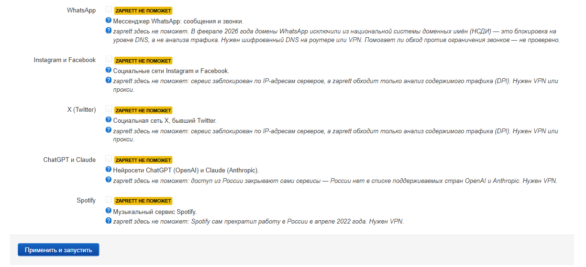

# Руководство пользователя zaprett для OpenWrt

**Русский** | [English](GUIDE.en.md)

Подробное руководство для версии **1.1.0**: как работает обход, как поставить и настроить zaprett, что означает
каждая страница и каждая настройка веб-интерфейса, как пользоваться командной строкой, как обновить и удалить
продукт и что делать, если не заработало.

Подробности установки — [INSTALL.md](INSTALL.md). Что лежит во встроенных списках и откуда взято — [LISTS.md](LISTS.md).

## Содержание

1. [Как это работает](#1-как-это-работает)
2. [Установка](#2-установка)
3. [Первая настройка за 5 минут](#3-первая-настройка-за-5-минут)
4. [Страница «Обзор»](#4-страница-обзор)
5. [Быстрая настройка: выбор сервисов](#5-быстрая-настройка-выбор-сервисов)
6. [Стратегии и автоподбор](#6-стратегии-и-автоподбор)
7. [Списки: домены, IP-сети, исключения, подписки](#7-списки-домены-ip-сети-исключения-подписки)
8. [Репозиторий](#8-репозиторий)
9. [Настройки: все параметры](#9-настройки-все-параметры)
10. [Диагностика](#10-диагностика)
11. [Командная строка](#11-командная-строка)
12. [Обновление](#12-обновление)
13. [Удаление](#13-удаление)
14. [Типовые сценарии](#14-типовые-сценарии)
15. [Частые вопросы и если не работает](#15-частые-вопросы-и-если-не-работает)
16. [Границы возможностей и приватность](#16-границы-возможностей-и-приватность)

---

## 1. Как это работает

Провайдер видит начало каждого вашего соединения. Даже когда трафик зашифрован (HTTPS, QUIC), в первых
пакетах передаётся **имя сайта** открытым текстом — в TLS это поле SNI, в обычном HTTP — заголовок `Host`.
Оборудование глубокого анализа трафика (DPI) читает это имя и решает: пропустить, замедлить или разорвать.

zaprett не шифрует и не перенаправляет ваш трафик. Он меняет **форму первых пакетов** соединения так, что DPI
не может собрать из них имя сайта, а сервер на другом конце — может. Дальше соединение идёт как обычно,
напрямую, без посредников и без потери скорости.

```
             ┌───────── роутер с OpenWrt ──────────┐
устройства   │                                      │
в доме  ───► │  nftables ──► очередь NFQUEUE ──►    │ ──► провайдер (DPI) ──► сайт
             │               движок nfqws           │
             │  (только порты и сайты из списков)   │
             └──────────────────────────────────────┘
```

Что из этого следует:

- **Настраивается один раз на роутере** — обход работает для всех устройств в доме: телефонов, приставок,
  телевизоров, консолей. На самих устройствах ничего ставить не нужно.
- **Обрабатываются только выбранные сайты.** По умолчанию включён режим «белый список»: движок трогает
  соединения только с сайтами из включённых списков, остальное идёт мимо него.
- **Помогает именно против анализа трафика.** Если сайт заблокирован по IP-адресам или закрылся сам,
  подменять начало соединения бесполезно — см. [раздел 16](#16-границы-возможностей-и-приватность).
- **Стратегия зависит от провайдера.** DPI у разных операторов ведёт себя по-разному, поэтому одна и та же
  стратегия у одного работает, у другого — нет. Для этого в продукте есть автоподбор.

Из чего состоит продукт:

| Часть | Что это |
|---|---|
| движок `nfqws` | из проекта [bol-van/zapret](https://github.com/bol-van/zapret), в пакете версия v72.13 |
| движок `nfqws2` (по желанию) | из проекта zapret2, стратегии на Lua; отдельный пакет `zaprett-nfqws2` |
| 64 стратегии для `nfqws` | из [репозитория zaprett](https://github.com/CherretGit/zaprett-repo) — того же, что использует Android-версия |
| 14 стратегий `z2-…` для `nfqws2` | собственные стратегии проекта, одна из них сама меняет приёмы, когда сайт перестаёт открываться |
| встроенные списки | собственные списки проекта для YouTube, Discord, Telegram, RuTracker, Roblox, Signal, сайтов за Cloudflare и обязательных исключений ([LISTS.md](LISTS.md)) |
| служба `zaprett` | управляет движком, правилами nftables, списками, подписками, монитором и сторожем; команда `zaprett` в SSH |
| `luci-app-zaprett` | веб-интерфейс: LuCI → **Службы → zaprett** |

---

## 2. Установка

zaprett ставится из **бандла** — архива `zaprett-<версия>-<OpenWrt>-<архитектура>.tar.gz` со страницы
[Releases](https://github.com/RomanKern89/zaprett-openwrt/releases). Внутри — пакеты, подписанный список пакетов,
открытый ключ и установщик `install.sh`. Полная инструкция с разбором ошибок — [INSTALL.md](INSTALL.md); здесь — главное.

| OpenWrt | Менеджер пакетов | Бандл |
|---|---|---|
| 25.12.x | apk | `zaprett-1.1.0-r1-25.12-<архитектура>.tar.gz` |
| 24.10.x | opkg | `zaprett-1.1.0-r1-24.10-<архитектура>.tar.gz` |

**Что нужно:** доступ роутера в интернет (зависимости вроде `kmod-nft-queue` и `ucode` ставятся из официальных
репозиториев OpenWrt) и около 2 МБ свободного места во flash.

**Шаг 1. Узнайте версию и архитектуру.** По SSH:

```sh
cat /etc/openwrt_release          # DISTRIB_RELEASE — версия OpenWrt
cat /etc/apk/arch                 # OpenWrt 25.12: архитектура пакетов
opkg print-architecture           # OpenWrt 24.10: строка с наибольшим числом
```

Без SSH: LuCI → Система → Программное обеспечение → настройка репозиториев; архитектура — часть
`…/packages/<архитектура>/…` в адресах.

**Шаг 2 (OpenWrt 25.12 и 24.10 одинаково). Установка по SSH.** Скопируйте бандл в `/tmp` роутера
(`scp -O …` или WinSCP в режиме SCP) и выполните:

```sh
cd /tmp
tar -xzf zaprett-1.1.0-r1-25.12-aarch64_cortex-a53.tar.gz
cd zaprett-1.1.0-r1-25.12-aarch64_cortex-a53
sh install.sh                     # с --with-nfqws2 — ещё и движок nfqws2; с --feed — обновления штатно
```

Установщик проверит контрольные суммы, версию OpenWrt и архитектуру, добавит ключ zaprett и поставит
`zaprett`, `zaprett-nfqws`, `luci-app-zaprett` и `luci-i18n-zaprett-ru` из подписанного фида бандла.
В конце он напечатает адрес страницы zaprett в LuCI.

**Без SSH:**

- **OpenWrt 24.10 (opkg):** LuCI → Система → Программное обеспечение → «Обновить списки…», затем «Загрузить пакет…»
  и по порядку файлы из папки `feed/` бандла: `zaprett-nfqws`, `zaprett`, `luci-app-zaprett`, `luci-i18n-zaprett-ru`.
- **OpenWrt 25.12 (apk):** загрузка отдельного пакета через LuCI не примет пакет с чужой подписью, поэтому
  поставьте `luci-app-ttyd`, откройте «Службы → Терминал» и выполните команды из шага 2.

Подробно оба пути — [INSTALL.md §4](INSTALL.md#4-установка-только-через-веб-интерфейс).

**Шаг 3.** Откройте LuCI → **Службы → zaprett**. Если пункта нет — выйдите из LuCI и войдите снова.

**Язык интерфейса.** Страницы zaprett показываются на языке LuCI (System → System → Language and Style, параметр Language);
при значении «auto» — на языке браузера. Русский перевод страниц zaprett ставится вместе с пакетами. Меню самого
LuCI («Services», «Save & Apply») переводит отдельный пакет `luci-i18n-base-ru`, установщик его не ставит.

---

## 3. Первая настройка за 5 минут

Пока ничего не настроено, вверху страницы «Обзор» открыта **«Быстрая настройка»**. Позже она свёрнута внизу той
же страницы: «Быстрая настройка: выбрать сервисы заново».


1. **Отметьте сервисы**, которые плохо работают у вашего провайдера (по умолчанию уже отмечены YouTube и
   Discord). Если у сервиса есть **«Набор списков»**, оставьте «Основной» — расширенные нужны позже и только
   при проблемах (см. [раздел 5](#5-быстрая-настройка-выбор-сервисов)).
2. Нажмите **«Применить и запустить»** внизу блока. Интерфейс идёт по шагам и показывает каждый:
   - «Включить списки выбранных сервисов» — списки и IP-сети сервисов, обязательные исключения (госуслуги,
     банки, Яндекс, VK, маркетплейсы) и режим «белый список»; если у сервиса есть подписка, он дожидается её загрузки;
   - «Запустить обход» — или перезапустить, если обход уже работал;
   - «Проверить, открываются ли сайты» — роутер сам открывает проверочные адреса сервисов через обход и
     показывает карточки вида «YouTube ✓ 3/3, 616 мс» или «Discord ! 1/2 — нет ответа (таймаут)».
3. **Если всё открылось** — готово: обход работает и поднимется сам после перезагрузки роутера.
4. **Если какой-то сервис не открылся** — сначала **«Выяснить, чем блокирует провайдер»**: при подмене DNS или
   блокировке по адресу перебор стратегий ничего не даст. Если причина в анализе трафика — **«Подобрать рабочую
   стратегию»**: быстрый автоподбор проверит рекомендованные стратегии вместе с текущей и применит лучшую, **только
   если с ней открывается больше сайтов**, после чего проверит сайты ещё раз. Стратегия по умолчанию
   `strategy-general` работает не у всех провайдеров, и это нормально.
5. **Проверьте на своём устройстве**: откройте то, что включили. Проверка с роутера бывает строже, чем с
   телефона или компьютера (см. [раздел 6](#6-стратегии-и-автоподбор)).

Сервисы, которым обход не поможет, отмечены жёлтой пометкой «zaprett не поможет» с причиной, и включить их нельзя:



Дальше — только если хочется разобраться или что-то не работает. Состояние всегда видно на «Обзоре»: кнопка
«Проверить сейчас» и монитор доступности, который сам проверяет сайты по расписанию.

---

## 4. Страница «Обзор»


Таблица **«Состояние службы»** — по строкам:

| Строка | Что означает |
|---|---|
| **Состояние** | «Работает» — движок запущен и правила межсетевого экрана применены. «Работает, автозапуск выключен» — сейчас работает, но после перезагрузки роутера сам не поднимется. «Остановлен» — выключен. «Включён, но не работает» — должен работать, но процесса нет (смотрите «На что обратить внимание» и «Диагностику»). «Идёт автоподбор стратегии» — сейчас проверяются стратегии. |
| **Автозапуск** | Поднимется ли обход сам после перезагрузки роутера. |
| **Движок** | `nfqws` и его версия; `nfqws2` — если вы поставили дополнительный пакет и выбрали его. |
| **Стратегия** | Текущая стратегия и ссылка «изменить». |
| **Какие сайты обрабатываются** | «Только сайты из включённых списков» (белый список) или все сайты, кроме исключений (чёрный список). |
| **Включённые списки** | Сколько включено списков доменов, исключений доменов, IP-сетей и исключений IP-сетей. |
| **Работа движка** | Сколько пакетов прошло через движок с его запуска. Число растёт, когда вы открываете сайты из включённых списков; если оно стоит на месте, трафик до движка не доходит. |
| **Правила межсетевого экрана** | Применены ли правила nftables, через которые трафик попадает в движок. |
| **Интерфейсы выхода в интернет** | Через какие интерфейсы роутер выходит в интернет (обычно определяется автоматически). |
| **Ускорение (flow offloading)** | Ускорение пропускает пакеты мимо межсетевого экрана, и тогда обход не работает. Строка показывает, что сейчас в брандмауэре и действует ли своя таблица ускорения zaprett (см. [раздел 9](#9-настройки-все-параметры)). |
| **Версия zaprett** | Версия пакета. |

Кнопки: **«Запустить»**, **«Перезапустить»**, **«Выключить автозапуск»** / **«Включить автозапуск»**,
**«Проверить настройки»** и **«Остановить»**. «Выключить автозапуск» заодно останавливает zaprett, «Запустить»
включает автозапуск. «Проверить настройки» собирает параметры движка и просит его проверить их без запуска —
быстрый способ убедиться, что конфигурация валидна.

**«На что обратить внимание»** — предупреждения службы человеческим языком: каждое объясняет, что случилось и что
сделать, и даёт ссылку на нужную страницу. Сообщения, которые ничего не требуют (из стратегии убраны пустые
профили, часть параметров стратегии не учитывается, идёт автоподбор), вынесены в спокойный блок **«К сведению»**.
Главные предупреждения:

| Предупреждение | Смысл и что делать |
|---|---|
| «Профиль стратегии действует на все сайты» | Часть стратегии не ограничена списками и работает на своих портах для всего трафика. Для голоса Discord это нормально; если из-за этого перестали открываться другие сайты — смените стратегию. |
| «Стратегия обрабатывает широкий диапазон портов» | Похоже на предыдущее: стратегия трогает много портов. Если что-то сломалось — смените стратегию. |
| «zaprett включён, но не работает» | Движок не запущен. Нажмите «Перезапустить», при повторе — смотрите «Диагностику». |
| «Правила межсетевого экрана не применены» | Трафик не попадает в движок. Нажмите «Перезапустить». |
| «Не хватает модулей ядра» | Не установлен `kmod-nft-queue` (или другой нужный модуль) — поставьте пакет. |
| «Включено ускорение (flow offloading)» | Обход не работает, пока ускорение брандмауэра включено. Выберите в настройках «Своя таблица ускорения» или «Выключать автоматически». |
| «Своя таблица ускорения не включилась» | Роутер не принял таблицу ускорения zaprett (нет подходящих устройств или ядро не поддерживает). Обход работает, но без ускорения; можно оставить так или выбрать «Выключать автоматически». |
| «Не включено ни одного списка сайтов» | В режиме «белый список» обрабатывать нечего — отметьте сервисы в быстрой настройке. |
| «Включённый список не найден» / «Выбранная стратегия не найдена» / «Стратегия не выбрана» | В настройках указан элемент, которого нет на роутере. Выберите другой или установите его из «Репозитория». |
| «Подписка ещё не загружена» | Включён внешний список, который ещё не скачался. Обновите его на вкладке «Подписки». |
| «Соединения по IPv6 идут без обхода» | У подключения есть IPv6, а обработка IPv6 выключена. Включите «Обрабатывать IPv6» в настройках. |
| «Включённые списки слишком велики для этого роутера» | Большие подписки или сервисы уровня `full` на роутере с малой памятью: движок может падать. Выключите большие подписки. |
| «Сайты включённых сервисов перестали открываться» | Монитор несколько раз подряд не смог открыть сайты: провайдер мог изменить блокировку. Запустите автоподбор (или дождитесь авторемонта, если он включён). |
| «Игровой фильтр не работает: нет списка IP-сетей» | Игровой фильтр включён, но ни один список IP-сетей не включён, поэтому фильтр пропущен. |
| «В настройках есть неверные значения» / «Не удалось подготовить параметры движка» | Часть настроек отброшена или движок не принял параметры. Проверьте «Настройки», затем «Проверить настройки». |
| «DNS-запросы идут без шифрования» (к сведению) | Для включённых сервисов провайдер может подменять ответы DNS, а шифрованный DNS на роутере не включён. Рядом есть кнопка «Включить шифрованный DNS». |

**«Открываются ли сайты?»** — живая проверка. Роутер открывает проверочные адреса включённых сервисов **через
обход в том виде, в каком он работает сейчас** (движок не перезапускается), и показывает карточку на каждый
сервис: сколько адресов открылось, среднее время и причина, если не открылось. Зелёная карточка — всё открылось,
жёлтая — часть, красная — ничего. «Проверить сейчас» запускает проверку заново, «Подробнее» показывает каждый адрес.

**«Шифрованный DNS»** — включён ли на роутере DNS с шифрованием (`https-dns-proxy`, `stubby` или
`dnscrypt-proxy`: пакет установлен и служба запущена). Некоторые провайдеры на запрос адреса заблокированного сайта
отвечают адресом своей заглушки, и тогда сайт не откроется, даже если обход работает. Кнопка **«Включить
шифрованный DNS»** после подтверждения ставит `https-dns-proxy` (и его страницу LuCI) штатным менеджером пакетов и
запускает его; ход установки виден в карточке. Нужны интернет и немного места во flash. Устройства, которые
получают DNS от роутера по DHCP (обычная настройка), начинают пользоваться шифрованным DNS сами.

**«Монитор доступности»** — такая же проверка по расписанию (по умолчанию раз в 30 минут, пока zaprett
запущен). Состояния: «Сайты открываются», «Сайты перестали открываться» (несколько неудачных проверок подряд),
«Идёт ремонт» (авторемонт подбирает стратегию) или «Пока нет данных». Ниже — полоса последних 48 проверок:
зелёная клетка — открылось не меньше половины сайтов, красная — меньше половины, серая — проверять было нечего.
Наведите на клетку, чтобы увидеть время и результат. Настройки монитора — в «Настройках».

Страница обновляет состояние раз в 10 секунд и не делает этого, пока вкладка браузера скрыта.

---

## 5. Быстрая настройка: выбор сервисов

Это аналог «списка приложений» из Android-версии, только наоборот: вы отмечаете не приложения, а сервисы,
которые у вас плохо работают. Каждый сервис — готовый набор: списки доменов, при необходимости списки IP-сетей и
подписки на внешние списки.

| Сервис | Помогает | Что включает |
|---|---|---|
| **YouTube** | да | список доменов YouTube (сайт, видео, превью) |
| **Discord** | да | список доменов Discord; голос идёт по правилам стратегии на портах UDP 19294–19344 и 50000–50100 |
| **Telegram** | частично | список доменов и список IP-сетей Telegram: сайт и ссылки `t.me` открываются, приложение соединяется по IP-адресам |
| **RuTracker** | частично | список доменов RuTracker; если провайдер подменяет ответы DNS, дополнительно нужен шифрованный DNS |
| **Сайты за Cloudflare** | частично | официальные диапазоны IP-адресов Cloudflare (подписка, 22 сети) — против ограничения, при котором грузится только начало страницы |
| **Roblox** | частично | домены Roblox и список IP-сетей Roblox: сами игры идут по UDP на IP-адреса, для них нужна стратегия с правилом для UDP |
| **Signal** | частично | домены Signal; помогает ли обход против этой блокировки, не проверено |
| **Прочие заблокированные сайты** | частично | большие реестры (Re:filter, antifilter.download) — около 81 тыс. доменов и 17 тыс. IP-сетей с автообновлением. **Нужен роутер с памятью от 200 МиБ** |
| WhatsApp, Instagram и Facebook, X (Twitter), ChatGPT и Claude, Spotify | **нет** | ничего: эти пункты нельзя включить. Рядом написана причина — блокировка по IP-адресам, блокировка через DNS или отказ самого сервиса. Нужен VPN или прокси |

Над списком сервисов интерфейс показывает **объём памяти роутера** и рекомендованный уровень: `light` (любой роутер)
или `full` (от 200 МиБ). Сервисы уровня `full` на слабом роутере помечаются «не рекомендуется»: большие списки
съедают память, а роутер с 64–128 МиБ может уйти в нехватку памяти.

Что происходит при нажатии **«Применить и запустить»**:

- включаются списки и IP-сети выбранных сервисов (в выбранном наборе);
- всегда добавляются **обязательные исключения** `zaprett-exclude` (домены) и `zaprett-exclude-ipset` (IP-сети):
  госуслуги, банки, Яндекс, VK, маркетплейсы, локальные сети — их трафик движок не трогает;
- режим переключается на **белый список**;
- **списки и подписки неотмеченных сервисов выключаются**; ваши собственные списки (`user-…`) мастер не трогает никогда;
- подписки выбранных сервисов включаются и сразу ставятся в очередь на загрузку;
- обход запускается (или перезапускается, чтобы применить новые списки);
- роутер проверяет, открываются ли сайты, и при неудаче предлагает «Выяснить, чем блокирует провайдер» и «Подобрать
  рабочую стратегию».

Названия и описания сервисов показываются на языке интерфейса.

### Набор списков сервиса: основной или расширенный

У части сервисов есть несколько **наборов списков** — под сервисом появляется «Набор списков»:

| Набор | Когда выбирать |
|---|---|
| **Основной** (по умолчанию) | почти всегда: минимальный набор доменов, которого хватает сайту и приложению |
| **Расширенный** (YouTube, Discord, RuTracker, Roblox, Signal) | основной включён, стратегия подобрана, а часть сервиса всё равно не работает: не грузятся превью, магазин, вики, приложение на телевизоре или приставке. В нём больше вспомогательных доменов, CDN и API |
| **С голосовыми серверами** (Discord) | сайт и чат работают, а голос нет, и стратегия обрабатывает UDP по спискам IP-сетей |
| **Снимок в пакете** (Сайты за Cloudflare) | подписка на диапазоны Cloudflare не скачивается: те же официальные сети из пакета, но без автообновления |

Рядом с каждым набором написано, что в него входит, и оценка нагрузки: «лёгкая» подходит любому роутеру,
«тяжёлая» требует памяти от 200 МиБ. При переключении набора мастер выключает списки других наборов этого сервиса,
поэтому лишние списки не накапливаются.

Из командной строки то же самое: `zaprett wizard apply youtube:full discord:voice` (без `:<набор>` — основной);
какие наборы есть у сервиса — `zaprett presets --json`, поле `variants`.

---

## 6. Стратегии и автоподбор


**Стратегия** — набор параметров движка: как именно менять первые пакеты (разбивать запрос на части, посылать
поддельный пакет перед настоящим, менять TTL и так далее), на каких портах и для каких сайтов. В пакете 64 стратегии
для `nfqws` и 14 для `nfqws2`. Одна стратегия может содержать несколько профилей — например, отдельный профиль для
голоса Discord на его портах UDP.

Вверху страницы — **«Текущая стратегия»** с кнопками «Показать» (текст и собранные параметры движка) и «Проверить
настройки».

### Автоподбор

Разные провайдеры используют разное оборудование DPI, и подобрать стратегию перебором быстрее, чем угадывать.
Подбор запускается кнопкой **«Начать подбор»**, а что проверять, определяют галочки и таблица:

1. **«Быстрая проверка»** (отмечена по умолчанию) — рекомендованные стратегии; для движка `nfqws` это 12 стратегий: `strategy-general`, `strategy-alt`,
   `strategy-alt2`, `strategy-alt3`, `strategy-alt4`, `strategy-alt8`, `strategy-alt11`, `strategy-fake-tls-auto-alt`,
   `strategy-fake-tls-auto-alt3`, `strategy-simple-fake`, `strategy-discord-fix`, `strategy-youtubefix-alt`; несколько минут;
2. галочка снята — проверяются **все установленные** стратегии текущего движка, это десятки минут;
3. отмечены стратегии в таблице ниже — проверяются **только отмеченные**, независимо от галочки.

**«Применить лучшую автоматически»** (по умолчанию снята): текущая стратегия проверяется вместе с остальными, и по
окончании лучшая применяется, только если с ней открылось больше сайтов, чем с текущей; иначе ничего не меняется.
Так же работают быстрая настройка и авторемонт монитора.

**Сеть во время подбора не остаётся без обхода.** Основной движок продолжает работать с текущей стратегией для всех
устройств, а стратегии-кандидаты проверяет отдельная копия движка, которая видит только проверочные запросы самого
роутера (они идут от отдельного системного пользователя `zaprett-test`). После проверки эта копия и её правила
снимаются. Если так проверить нельзя (служба остановлена, нет пользователя `zaprett-test`, межсетевой экран не принял
правила проверки), движок на время подбора останавливается, а в результатах указано почему. Такой режим можно
выбрать и нарочно: `zaprett test start --exclusive`.

Как идёт проверка: продукт берёт цели включённых сервисов (плюс до 20 доменов из ваших включённых списков), сначала
проверяет их **без обхода**, чтобы знать, что вообще недоступно, а затем проверяет те же цели с каждой стратегией.
Результат — таблица: сколько целей открылось из скольких, среднее время ответа и итог:

| Итог | Значение |
|---|---|
| работает | открылись все цели |
| работает частично | открылась часть целей |
| не помогает | не открылась ни одна цель |
| движок не принял | стратегия не прошла проверку параметров движком |
| движок не запустился | с этой стратегией движок не поднялся |
| не проверялась | стратегия ещё не проверена или проверку прервали |

Дальше — **«Применить лучшую стратегию»** или «Применить» у нужной строки; «Подробнее» показывает каждый проверенный
адрес и причину ошибки. Если все цели открылись и без обхода, интерфейс предупредит, что сравнение ни о чём не
говорит: провайдер сейчас не мешает или проверяются не те сайты. Автоподбор идёт фоновой задачей: страницу можно
закрыть, прогресс виден при возврате, задачу можно отменить. Всё временное снимается в конце, при отмене и даже
если задачу прервали: следующий запрос состояния или сторож наводят порядок сами.

**Важное ограничение метода.** Автоподбор проверяет цели **с самого роутера**, а ваши устройства идут через роутер —
это разные пути трафика. На тестовом стенде Discord с роутера не открывался, а с клиента за роутером открывался.
Поэтому оценка автоподбора бывает **заниженной**: если стратегия получила «работает частично», проверьте её на
телефоне или компьютере, прежде чем отбрасывать.

### Установленные и свои стратегии

Внизу страницы — **«Установленные стратегии»** с поиском: «Использовать», «Показать», галочка для выборочной
проверки. Свою стратегию создаёт кнопка **«Создать свою стратегию»**: к имени добавляется `user-`, размер до 64 КиБ.
При сохранении («Проверить и сохранить») параметры проверяются движком, и **стратегия с ошибкой не сохраняется** —
так нельзя случайно оставить роутер с неработающим обходом. Опции проверяются по таблицам самого движка,
неизвестные и неоднозначные отклоняются. Свои стратегии можно менять и удалять; стратегии из пакета и репозитория —
только использовать.

Формат — те же аргументы `nfqws`, что в Android-версии, с подстановками: `${hostlists}`, `${ipsets}`,
`${hostlist:id}`, `${bin:id}`, `${lua_lib:id}`, `${zaprettdir}`. Подробности — [BACKEND.md](BACKEND.md) §3.

---

## 7. Списки: домены, IP-сети, исключения, подписки


### Режим обработки

- **Белый список** (по умолчанию, рекомендуется) — движок трогает только сайты и сети из включённых списков.
  Остальной трафик идёт мимо: банки, госуслуги и игры работают как раньше.
- **Чёрный список** — обрабатываются соединения со всеми сайтами, кроме исключений. Иногда помогает, если сайт не
  удаётся описать списком, но увеличивает нагрузку и риск задеть лишнее.

После смены режима нажмите «Save & Apply» внизу страницы.

**Исключения действуют в обоих режимах**, но у них есть граница: исключение **по домену** не действует на соединения,
которые узнаются **только по адресу**. Если сайт попал во включённый список IP-сетей или в подписку с адресами, его
соединения будут обрабатываться, даже если домен в исключениях. В таком случае добавьте адреса сайта в «Сети,
которые не трогать».

### Вкладки

- **Домены** — группы «Сайты для обхода» и «Сайты, которые не трогать». У каждого списка видно число записей,
  источник (встроенный, репозиторий, подписка, свой), версию и какие стратегии его используют. Переключатель
  «Включено» сохраняется сразу.
- **IP-сети** — то же для адресов и подсетей: «Сети для обхода» и «Сети, которые не трогать».
- **Подписки** — внешние списки по https-ссылке.

### Свои записи

Четыре редактируемых списка (кнопка «Изменить»): **«Мои домены»** (`user-hosts`), **«Мои домены-исключения»**
(`user-hosts-exclude`), **«Мои IP-сети»** (`user-ipset`) и **«Мои IP-сети-исключения»** (`user-ipset-exclude`).
Правила ввода:

- по одной записи в строке; пустые строки пропускаются, строки, начинающиеся с `#`, — комментарии;
- домен — `example.com`; запись покрывает и поддомены;
- маски `*.example.com` и адреса вида `http://example.com/path` **не принимаются** — уберите префикс и `*.`;
- домены на кириллице приводите к punycode (`xn--…`), пробелы внутри строки недопустимы;
- для адресов — `203.0.113.0/24`, `2001:db8::/32`, одиночный адрес тоже можно;
- размер списка — до 1 МиБ.

Неверные строки показываются с номером и причиной, и список не сохраняется, пока они не исправлены.

### Подписки

Готовые подписки (по умолчанию **выключены**; их названия пока только на русском):

| Подписка | Что это | Период | Память |
|---|---|---|---|
| `refilter_domains` | домены Re:filter (реестр заблокированного) | 72 ч | ~9 МиБ |
| `antifilter_allyouneed` | IP-сети antifilter.download | 72 ч | ~2 МиБ |
| `cloudflare_v4` | официальные диапазоны Cloudflare IPv4 | 168 ч | ~1 МиБ |
| `cloudflare_v6` | то же для IPv6 | 168 ч | ~1 МиБ |

«Добавить подписку»: имя, название, тип (домены, исключения доменов, IP-сети, исключения IP-сетей), ссылка **только
https**, период обновления 1…8760 ч, минимальное число записей. Загруженный список появляется как обычный элемент
`src-<имя>`, его нужно ещё **включить**. «Обновить включённые сейчас» скачивает все включённые подписки.

Защиты, которые стоит знать:

- предел размера загрузки — **16 МиБ**; на пределе загрузка обрывается, прежний файл остаётся на месте;
- результат принимается, только если верных записей не меньше заданного минимума и не меньше 99 % строк верны,
  иначе остаётся прежний файл, а в состоянии подписки пишется ошибка;
- на флеш-память запись идёт только при реальном изменении содержимого;
- интерфейс оценивает, сколько памяти потребуют включённые подписки, и предупреждает, если это больше 1/8 памяти
  роутера (или от 5 МиБ на слабом роутере).

Что лежит в каждом встроенном списке и откуда взято — [LISTS.md](LISTS.md).

---

## 8. Репозиторий


Каталог того же репозитория, что использует Android-версия zaprett: стратегии для `nfqws` и `nfqws2`, списки
доменов, исключения, списки IP-сетей, файлы поддельных пакетов, Lua-библиотеки.

- **«Обновить каталог»** — скачать свежий индекс; **«Обновить всё»** — обновить установленные элементы.
- Поиск, фильтр по типу («Все типы»), «Только установленные», «Только с обновлениями».
- Отметьте несколько элементов → **«Установить выбранные»**; у элемента — «Установить», «Обновить», «Удалить».
- Состояние элемента: не установлено, установлено, входит в пакет, есть обновление, на роутере не поддерживается
  (так помечены элементы ByeDPI — этого движка в OpenWrt-версии нет).
- Удалять можно только то, что установлено из репозитория; содержимое пакета не удаляется.

Всё скачанное проверяется по **sha256** из манифеста, зависимости подтягиваются автоматически. Операции идут
фоновыми задачами с прогрессом и отменой. **Автообновление** раз в сутки включено по умолчанию: оно идёт между
04:00 и 04:59 по времени роутера (минута выбирается случайно) и заодно обновляет включённые подписки по их периодам.
Описания элементов каталога приходят из репозитория и показываются как есть (обычно на русском).

Если у роутера нет доступа к GitHub, продукт всё равно работает: всё нужное для старта лежит в пакете.

---

## 9. Настройки: все параметры


Значения по умолчанию подходят большинству. Изменения применяются кнопкой «Save & Apply» внизу страницы.

### Вкладка «Основные»

| Параметр | По умолчанию | Описание |
|---|---|---|
| Запускать zaprett | выключено до первого запуска | Включает обход сейчас и после каждой перезагрузки роутера. «Запустить» и быстрая настройка включают его сами. |
| Движок | `nfqws` | Основной движок, под него написаны все стратегии репозитория. `nfqws2` (zapret2, стратегии на Lua) — если поставлен пакет `zaprett-nfqws2`; для него есть 14 встроенных стратегий `z2-`. |
| Какие сайты обрабатывать | белый список | См. [раздел 7](#7-списки-домены-ip-сети-исключения-подписки). |
| Интерфейсы выхода в интернет | пусто (автоматически) | Пусто — определяются по маршруту по умолчанию. Задавайте вручную при нескольких провайдерах или нестандартной маршрутизации. |
| Обрабатывать IPv6 | выключено | Включите, если провайдер даёт IPv6. |
| Сторож движка | включено | Каждые 5 минут zaprett проверяет, что движок работает и его правила на месте, и восстанавливает их. |
| Ускорение (flow offloading) | «Своя таблица ускорения» на новой установке | **«Своя таблица ускорения (быстрее, рекомендуется)»** — zaprett выключает ускорение брандмауэра (прежние значения возвращаются при остановке) и ставит собственное ускорение, которое забирает соединение только **после** того, как движок обработал его первые пакеты: обход работает, а остальная часть соединения идёт с ускорением. **«Выключать автоматически на время работы zaprett»** — ускорения нет, пока zaprett работает. **«Не менять»** — оставить как есть (при включённом ускорении обход не работает). При обновлении с 1.0 прежнее значение сохраняется. |
| Блокировать QUIC | выключено | Роутер отбрасывает UDP 443 из локальной сети в интернет, и браузеры переходят на TCP, где обход работает надёжнее. **Действует на все сайты**, не только на сайты из списков; приложения, которые умеют работать только через QUIC, перестанут работать. Трафик самого роутера не трогается; фильтр устройств учитывается. |

### Вкладка «Устройства в сети»

Фильтр по клиентам — аналог выбора приложений в Android-версии, только на уровне устройств. Параметр
**«Каким устройствам нужен обход»**:

- **«Все устройства»** (по умолчанию);
- **«Только указанные устройства»** — обход работает лишь для перечисленных; трафик самого роутера в этом режиме не обрабатывается;
- **«Все, кроме указанных устройств»** — исключить, например, рабочий ноутбук или телевизор.

Поле **«Устройства»**: IPv4-адрес, подсеть (CIDR) или MAC-адрес; подсказки берутся из таблицы DHCP. Нужным
устройствам полезно дать статические адреса в «Сеть → DHCP и DNS».

### Вкладка «Стратегия и списки»

«Стратегия для nfqws», «Стратегия для nfqws2», «Списки доменов», «Исключения доменов», «Списки IP-сетей»,
«Исключения IP-сетей» — те же настройки, что на страницах «Стратегии» и «Списки», в форме. Значения, которых нет
среди установленных элементов, сохраняются и помечаются «не установлено» (удобно при переносе конфигурации).

Здесь же **игровой фильтр**:

| Параметр | По умолчанию | Описание |
|---|---|---|
| Игровой фильтр | выключен | Отдельный профиль движка для онлайн-игр по указанным портам — **только для адресов из включённых списков IP-сетей**. Нужен включённый список IP-сетей игры (например, «Roblox: IP-сети» или свой); без него профиль не добавляется, а «Обзор» предупреждает. Включайте, только если игра блокируется или тормозит. |
| Игровые порты TCP | `1024-65535` | Порты или диапазоны через запятую без пробелов: `N` или `N-M`, например `3478,50000-50100`. |
| Игровые порты UDP | `1024-65535` | То же для UDP. |

### Вкладка «Расширенные»

Нужна редко:

| Параметр | По умолчанию | Зачем менять |
|---|---|---|
| Номер очереди | 200 | Номер очереди NFQUEUE между межсетевым экраном и движком. Меняйте, только если 200 занят другой программой. |
| Метка пакетов движка | `0x40000000` | Метка, по которой пакеты самого движка не обрабатываются повторно. Нельзя ноль, совпадающие метки и `0x08000000` (её использует фильтр устройств). |
| Метка обработанных соединений | `0x20000000` | Метка, по которой уже обработанные пакеты пропускаются после NAT. |
| Исходящие TCP-пакеты | 9 | Сколько первых пакетов исходящего TCP-соединения уходит в движок. 0 — не обрабатывать исходящий TCP. |
| Входящие TCP-пакеты | 3 | Сколько первых ответных пакетов уходит в движок. |
| Исходящие UDP-пакеты | 9 | Первые пакеты исходящих UDP-потоков (QUIC, голос). |
| Входящие UDP-пакеты | 0 | Обычно не нужны. |
| Пользователь движка | `daemon` | Под каким пользователем работает движок (намеренно не root). |
| Отладочный журнал | выключен | Подробный журнал движка в `logread`. То же переключение есть на странице «Диагностика». |

### Репозиторий и обновления

«Адрес каталога» — **только `https://`** (меняйте, только если пользуетесь зеркалом), «Обновлять автоматически»
(включено) и «Время обновления» (час, по умолчанию 4).

### Автоподбор стратегии

| Параметр | По умолчанию | Описание |
|---|---|---|
| Время ожидания ответа, с | 5 | Сколько ждать ответа одного сайта (1…60). На медленном интернете увеличьте. |
| Одновременных запросов | 6 | 1…16. На слабом роутере уменьшите до 2–3. |
| Сайтов из списков | 20 | Сколько доменов из ваших включённых списков добавлять в проверку. |
| Пауза после перезапуска, с | 2 | Пауза между перезапуском тестового движка и началом проверки (0…30). |

### Монитор доступности

| Параметр | По умолчанию | Описание |
|---|---|---|
| Проверять сайты по расписанию | включено | Работает, только пока zaprett запущен. |
| Проверять каждые | 30 мин | 10, 15, 20, 30 или 60 минут. |
| Неудачных проверок до предупреждения | 3 | 1…20. Проверка неудачна, если открылось меньше половины сайтов. |
| Чинить автоматически | выключено | При состоянии «Сайты перестали открываться» zaprett сам запускает быстрый автоподбор и применяет стратегию, только если она лучше текущей. Не чаще раза в 6 часов. |
| Сайтов за проверку | 5 | 1…20. |
| Ожидание сайта, с | 8 | 2…30. |

---

## 10. Диагностика


Блоки страницы сверху вниз:

- **«Чем блокирует провайдер»** — кнопка «Выяснить, чем блокирует провайдер» открывает с роутера проверочные адреса
  включённых сервисов и для каждого сайта определяет способ блокировки. Настройки не меняются, обход не
  перезапускается. Таблица: сайт, результат, адреса (что ответил DNS роутера и что — DNS over HTTPS), подробность;
  под таблицей — общий вывод и совет:

  | Результат | Что это значит | Что делать |
  |---|---|---|
  | Открывается | блокировки не видно | ничего |
  | Подмена DNS | DNS провайдера дал адрес, которого нет в ответе DNS over HTTPS, или адрес заглушки | включить шифрованный DNS (кнопка тут же) |
  | Блокировка по IP-адресу | соединение с настоящим адресом сайта не устанавливается | обход не поможет — нужен VPN или прокси |
  | Блокировка по имени сайта (TLS) | соединение есть, но рвётся или зависает в начале TLS | автоподбор стратегии |
  | Замедление | данные идут и обрываются или замирают на 14–24 КБ | автоподбор стратегии |
  | Страница-заглушка провайдера | вместо сайта пришла страница о блокировке | автоподбор, если не поможет — шифрованный DNS |
  | Не удалось определить | сайт не открылся, но признаки не подходят ни под один случай | автоподбор; если не поможет — проверить сайт через VPN |

  Проверка идёт фоновой задачей; её ход виден в блоке, её можно отменить.
- **«Диагностический отчёт»** — версии, система, модули ядра, состояние службы, настройки zaprett, аргументы движка и
  таблица межсетевого экрана zaprett. Кнопки «Обновить», «Скопировать», «Скачать». Полный отчёт со списком пакетов и
  длинным журналом снимается по SSH: `zaprett diag --full`.
- **«Журнал движка»** — последние 200 строк системного журнала от zaprett и движка, «Обновить» и «Скопировать».
- **«Подробный журнал движка»** — кнопка «Включить подробный журнал» (после подтверждения сохраняет настройку и, если
  zaprett работает, перезапускает его). Движок начинает писать, что делает с каждым соединением. Журнал быстро
  растёт и нагружает роутер: включайте на короткую проверку и выключайте кнопкой «Выключить подробный журнал».
- **«Монитор доступности»** — то же состояние и история проверок, что на «Обзоре».
- **«Последняя фоновая задача»** — задача, состояние, прогресс, время, код возврата и журнал последних 300 строк
  (установка из репозитория, обновление подписок, проверка сайтов, автоподбор). «Скопировать журнал», «Отменить задачу».
- **«Проверка настроек»** — собирает параметры движка из текущих настроек и просит движок проверить их без запуска;
  показывает аргументы, порты и вывод проверки.

Паролей роутера в отчёте и журнале нет, но есть адреса и имена сетевых интерфейсов, настройки zaprett (устройства
локальной сети, ссылки подписок) и имена недавно открытых сайтов — просмотрите их, прежде чем выкладывать.

---

## 11. Командная строка

Всё, что делает интерфейс, доступно из SSH. У любой команды есть флаг `--json`. Полный справочник —
[BACKEND.md](BACKEND.md) §6.

```sh
# состояние и управление
zaprett status                      # состояние, списки, предупреждения
zaprett start | stop | restart
zaprett enable | disable            # автозапуск
zaprett check                       # проверить настройки без запуска (аргументы + проверка движком)
zaprett engine nfqws | nfqws2       # выбрать движок

# стратегии
zaprett items --type nfqws          # установленные стратегии
zaprett strategy show strategy-alt  # текст и собранные аргументы
zaprett strategy set strategy-alt
zaprett strategy save user-my < my-strategy.txt   # своя стратегия (проверяется движком)
zaprett strategy delete user-my

# автоподбор
zaprett test start --quick          # рекомендованные стратегии
zaprett test start                  # все установленные
zaprett test start --strategies strategy-alt,strategy-alt3
zaprett test start --quick --apply-if-better   # применить лучшую, если она лучше текущей
zaprett test start --quick --exclusive         # движок на время подбора останавливается
zaprett test status [--brief]       # ход и результаты
zaprett test apply strategy-alt     # применить выбранную
zaprett test stop

# проверка сайтов, монитор, сторож
zaprett probe [--services youtube,discord]     # проверить сайты включённых сервисов
zaprett probe status                # результат последней проверки
zaprett monitor status | run        # состояние монитора / одна проверка
zaprett ensure                      # сторож: поднять движок и правила, если их нет

# чем блокирует провайдер и шифрованный DNS
zaprett diagnose [--services discord,youtube]
zaprett diagnose status
zaprett dns status | setup          # состояние / поставить и запустить https-dns-proxy

# списки и подписки
zaprett items --type list
zaprett list enable | disable zaprett-telegram
zaprett user get user-hosts
zaprett user set user-hosts < my-domains.txt
zaprett mode whitelist | blacklist
zaprett sources list
zaprett sources update [refilter_domains]

# репозиторий
zaprett repo fetch
zaprett repo list --type list
zaprett repo install strategy-alt5
zaprett repo upgrade --all
zaprett repo remove strategy-alt5

# сервисы (мастер быстрой настройки)
zaprett presets
zaprett wizard apply youtube discord:voice telegram

# межсетевой экран, задачи, журнал, отчёт
zaprett fw show | apply | remove
zaprett job status | log --tail 50 | cancel
zaprett log --tail 200              # журнал zaprett и движка (не больше 1000 строк)
zaprett diag [--full]
zaprett version
zaprett help
```

Коды возврата: `0` — успех, `1` — ошибка, `2` — неверные аргументы. Изменения через CLI (`list`, `strategy set`,
`mode`, `engine`, `wizard apply`) сначала проверяются движком: изменение, которое ломает рабочую конфигурацию,
не сохраняется. Сообщения CLI — на русском.

---

## 12. Обновление

**Из нового бандла.** Скачайте бандл новой версии для своей OpenWrt и архитектуры и выполните `sh install.sh`
так же, как при установке. Пакеты zaprett обновятся, настройки, свои списки и свои стратегии сохранятся.

**Штатно, через онлайн-фид.** Если ставить с ключом `--feed` (или запустить установщик с ним позже), фид zaprett
остаётся подключённым, и дальше zaprett обновляется как пакеты самой OpenWrt:

```sh
# OpenWrt 25.12
apk update && apk upgrade
# OpenWrt 24.10
opkg update && opkg upgrade zaprett zaprett-nfqws luci-app-zaprett luci-i18n-zaprett-ru
```

Через LuCI: Система → Программное обеспечение → «Обновить списки…», затем вкладка «Обновления». Фид подписан
ключом zaprett, подменённый индекс пакетный менеджер отвергнет. На 25.12 при недоступном фиде apk останавливает
установку **любых** пакетов — что делать, описано в [INSTALL.md §6](INSTALL.md#6-обновление).

**Стратегии и списки из репозитория** обновляются отдельно: автообновление раз в сутки или «Обновить всё» на
странице «Репозиторий».

**После обновления прошивки** (`sysupgrade`) пакеты zaprett пропадают, настройки остаются, если была отмечена
«Сохранить настройки». Поставьте бандл заново — см. [INSTALL.md §8](INSTALL.md#8-после-обновления-прошивки-sysupgrade).

**С 1.0 на 1.1.** Обновление обязательно: в 1.1.0 исправлена проверка опций пользовательских стратегий. Настройки
сохраняются, в том числе прежний режим ускорения (в 1.0 по умолчанию — «Выключать автоматически»); «Свою таблицу
ускорения» можно выбрать в «Настройках» вручную.

---

## 13. Удаление

Из любого распакованного бандла для вашей версии OpenWrt:

```sh
sh install.sh --uninstall           # удалить пакеты, настройки оставить
sh install.sh --uninstall --purge   # удалить пакеты, /etc/config/zaprett, /etc/zaprett и ключ zaprett
```

`--uninstall` заодно отключает онлайн-фид, если он был подключён. Перед удалением zaprett останавливается, его
правила nftables снимаются, а ускорение брандмауэра возвращается в прежнее состояние. Удаление без бандла и через
LuCI — [INSTALL.md §7](INSTALL.md#7-удаление).

---

## 14. Типовые сценарии

**YouTube грузится рывками или в низком качестве.** Быстрая настройка → YouTube → «Применить и запустить». Если
карточка YouTube красная — «Подобрать рабочую стратегию». Если видео идёт, а превью или приложение на телевизоре
нет — выберите у YouTube набор «Расширенный».

**Discord: текст работает, голос нет.** Голосовые звонки идут без имени сайта, их обрабатывает отдельный профиль
стратегии на портах UDP 19294–19344 и 50000–50100. Такой профиль есть не во всех стратегиях: попробуйте другую
через автоподбор (например, `strategy-discord-fix`) или набор Discord «С голосовыми серверами».

**Сайт не открывается вовсе, и обход не помогает.** «Диагностика» → «Выяснить, чем блокирует провайдер». «Подмена
DNS» — включите шифрованный DNS и проверьте снова. «Блокировка по IP-адресу» — нужен VPN. «По имени сайта»,
«Замедление» — автоподбор.

**Браузер открывает сайт медленно или через раз, а приложения работают.** Возможно, провайдер мешает QUIC.
Включите «Настройки» → «Блокировать QUIC»: браузеры перейдут на TCP. Флаг действует на все сайты.

**Игра не подключается или лагает.** Включите список IP-сетей игры («Списки» → «IP-сети»: встроенный, свой или
подписка), затем «Настройки» → «Стратегия и списки» → «Игровой фильтр» и при необходимости сузьте порты. Для
Roblox есть готовый сервис в быстрой настройке.

**Скорость упала после установки zaprett.** Если ускорение стоит «Выключать автоматически», выберите «Своя таблица
ускорения» — обход сохранится, а соединения после первых пакетов снова пойдут с ускорением.

**Перестали открываться сайты, которые раньше работали.** Скорее всего стратегия задевает лишнее (на «Обзоре» об
этом предупреждает «Профиль стратегии действует на все сайты»). Смените стратегию, вернитесь в режим «белый список»
или добавьте пострадавший сайт в «Сайты, которые не трогать» — а если он узнаётся только по адресу, ещё и в «Сети,
которые не трогать».

**Слабый роутер (64–128 МиБ памяти).** Не включайте «Прочие заблокированные сайты» и большие подписки: держитесь
сервисов уровня `light`. В настройках автоподбора уменьшите «Одновременных запросов» до 2–3.

**На роутере уже есть VPN или прокси.** zaprett работает в своей таблице nftables и не переписывает чужие правила,
но совместную работу с маршрутизацией по политике мы **не проверяли**: вводите обход осторожно и проверьте, что
VPN-маршруты не сломались.

**Несколько провайдеров или нестандартная маршрутизация.** Укажите «Интерфейсы выхода в интернет» явно.

**Нужно исключить одно устройство** (рабочий ноутбук, телевизор). «Настройки» → «Устройства в сети» → «Все, кроме
указанных устройств» → добавьте его IP или MAC.

---

## 15. Частые вопросы и если не работает

**Нужен ли VPN или сторонний сервер?** Нет. Трафик идёт напрямую, меняются только первые пакеты соединений с
сайтами из ваших списков.

**Замедлится ли интернет?** Обычно нет: движок видит только первые пакеты соединений с выбранными сайтами, а
своя таблица ускорения сохраняет аппаратное и программное ускорение для остального.

**Почему стратегия по умолчанию не помогла?** У разных провайдеров разное оборудование DPI. Запустите
автоподбор — это самая частая причина «не помогло».

**Автоподбор пишет «работает частично», а у меня всё открывается.** Это нормально: проверка с роутера строже,
чем с устройств за ним.

**Что будет после перезагрузки роутера?** Обход поднимется сам, если включён автозапуск. Правила восстанавливаются
и после перезапуска межсетевого экрана.

**Интерфейс на английском, хотя стоит русский перевод.** Смените язык LuCI на русский (System → System → Language and
Style, параметр Language) или установите в браузере русский язык при значении «auto».

**Меню LuCI на английском, а страницы zaprett — на русском.** Меню LuCI переводит пакет `luci-i18n-base-ru`.

**Работает ли с IPv6?** Да, если включить «Обрабатывать IPv6»; по умолчанию выключено.

**Можно ли пользоваться только из командной строки?** Да, веб-интерфейс не обязателен; см. [раздел 11](#11-командная-строка).

### Порядок действий, если не работает

1. **«Обзор» → «Состояние»**: «Работает»? Если «Включён, но не работает» — смотрите предупреждения и «Диагностику».
2. **Правила межсетевого экрана применены?** Если нет — «Перезапустить». Не помогло — проверьте, что установлен
   `kmod-nft-queue` (об этом будет предупреждение).
3. **Ускорение** — «Своя таблица ускорения» или «Выключать автоматически». Включённое ускорение брандмауэра без
   своей таблицы полностью обходит движок.
4. **Есть ли включённые списки** и попадает ли в них нужный сайт? В режиме «белый список» движок трогает только то,
   что в списках.
5. **Сменить стратегию** — автоподбор, «Применить лучшую стратегию».
6. **Проверять с устройства, а не с роутера**: с роутера часть стратегий выглядит нерабочей.
7. **Движок действительно вмешивается?** Число в строке «Работа движка» должно расти, когда вы открываете сайт из
   списка. Подробнее — «Диагностика» → «Включить подробный журнал», откройте сайт, нажмите «Обновить» у журнала
   движка: должны быть строки вида `hostlist check for youtube.com : positive`. Нет таких строк — трафик до движка
   не доходит (пункты 2–4). После проверки подробный журнал выключите.
8. **Проблема вообще в DPI?** «Диагностика» → «Выяснить, чем блокирует провайдер»: при подмене DNS нужен
   шифрованный DNS, при блокировке по IP-адресу обход не поможет.
9. **Просите помощи** — приложите диагностический отчёт и журнал движка, предварительно просмотрев их.

---

## 16. Границы возможностей и приватность

Против чего zaprett помогает:

- замедление и разрыв соединений по **имени сайта** в первых пакетах (SNI в TLS, `Host` в HTTP, QUIC);
- типовые случаи: YouTube, Discord, часть заблокированных сайтов, ограничение скорости у сайтов за Cloudflare.

Против чего **не помогает** (и интерфейс говорит это прямо):

- **блокировка по IP-адресам** — Instagram, Facebook, X (Twitter);
- **сервис сам не обслуживает регион** — ChatGPT, Claude, Spotify;
- **блокировка на уровне DNS** — нужен шифрованный DNS на роутере;
- ограничение мобильного интернета оператором в целом (не по конкретным сайтам).

Что известно из проверок на стенде (подробно — [../tests/RESULTS.md](../tests/RESULTS.md)):

- у реального провайдера **без обхода** из 25 проверяемых целей открывалась 1;
- стратегия по умолчанию `strategy-general` не дала ничего, подобранная `strategy-alt` — 15 из 25 с роутера;
- **с клиента за роутером** YouTube (~894 КБ), Discord (~170 КБ) и RuTracker (~96 КБ) открывались полностью;
- Telegram ни одна из проверенных стратегий не починила;
- проверялось на x86-виртуальных машинах OpenWrt 25.12.5 и 24.10.8; на реальном железе MIPS/ARM продукт собран,
  но не протестирован; совместная работа с VPN и маршрутизацией по политике не проверялась.

### Приватность

- Трафик **никуда не перенаправляется**: нет VPN, прокси и внешних серверов.
- Движок работает **не от root** (пользователь `daemon`); правила живут в отдельной таблице nftables `inet zaprett`
  и не переписывают правила вашего межсетевого экрана.
- Телеметрии нет. Содержимое ваших списков, стратегий и настроек остаётся на роутере.
- Диагностический отчёт содержит версии, правила и журнал — **без паролей**, но с именами интерфейсов, адресами и
  именами недавно открытых сайтов; просматривайте его перед публикацией.

**Куда и когда обращается сам роутер:**

| Когда | Куда |
|---|---|
| каталог репозитория, автообновление, установка из репозитория | `raw.githubusercontent.com` (каталог zaprett-repo) и адреса файлов из каталога |
| подписки (только включённые) | `github.com` (Re:filter), `antifilter.download`, `www.cloudflare.com`, а также адреса ваших подписок |
| «Проверить сейчас», монитор, автоподбор, быстрая настройка | проверочные адреса включённых сервисов (например, `www.youtube.com`, `discord.com`, `telegram.org`, `rutracker.org`, `speed.cloudflare.com`, `www.roblox.com`, `signal.org`); автоподбор — ещё до 20 доменов из ваших включённых списков. Монитор можно выключить |
| «Выяснить, чем блокирует провайдер» | те же проверочные адреса, DNS over HTTPS Google (`8.8.8.8`) и Cloudflare (`1.1.1.1`) и прямые соединения с IP-адресами проверяемых сайтов |
| «Включить шифрованный DNS» | репозитории пакетов OpenWrt; после включения все DNS-запросы роутера идут к серверам, заданным в `https-dns-proxy` |
| установка с `--feed` | `romankern89.github.io` при каждом обновлении списков пакетов |
