# zaprett for Windows

[Русский](README.md) · [简体中文](README.zh-CN.md) · [zaprett for OpenWrt routers](../README.en.md)

**DPI bypass for a Windows PC.** zaprett does on one computer what [zaprett for OpenWrt](../README.en.md) does on a
router: it opens YouTube, Discord and other sites that the provider slows down or cuts off by analysing traffic.
Inside are the [zapret](https://github.com/bol-van/zapret) engine (`winws`) with the WinDivert driver, ready-made site
lists and strategies, a first-run wizard, site checks, automatic strategy selection, an availability monitor and
diagnostics. The interface is available in Russian, English and Simplified Chinese.

<p align="center">
  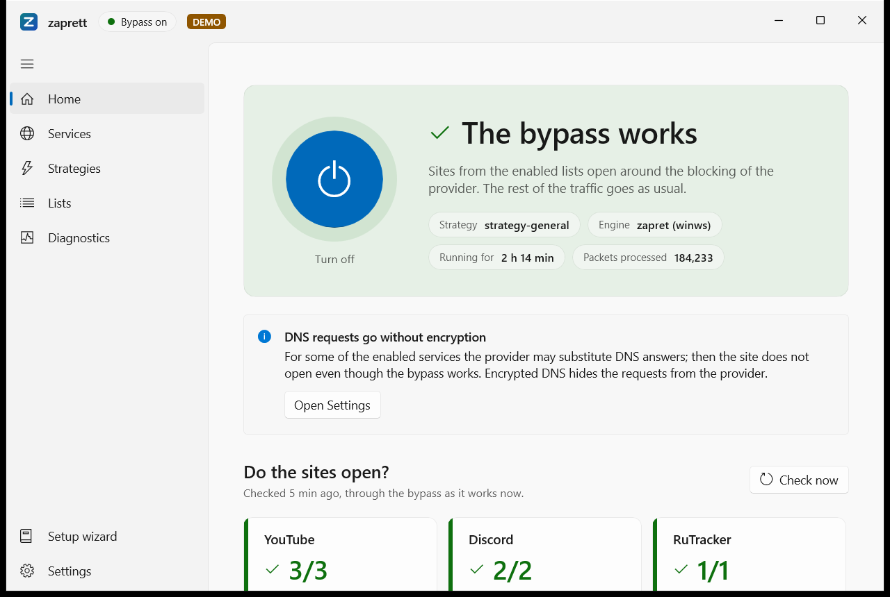
</p>

> [!IMPORTANT]
> **zaprett is not a VPN and not a proxy.** Your IP address does not change and your traffic is not redirected
> anywhere. zaprett changes only the first packets of connections to the chosen sites. It cannot open sites blocked by
> IP address or services that have closed access for your country themselves.

> [!NOTE]
> **Download:** the [**zaprett for Windows 0.1.2**](https://github.com/RomanKern89/zaprett-openwrt/releases/tag/win-v0.1.2)
> release (tag `win-v0.1.2`), file `zaprett-0.1.2-x64.msi`. The installer is not yet signed with a code-signing
> certificate, so Windows shows a SmartScreen warning: how to verify the file and what to click is in sections
> [4](#4-download-and-verify) and [5](#5-install). More about signing: [Code signing policy](#code-signing-policy).

The screenshots in this guide were taken in the interface's demo mode (the "DEMO" badge next to the name): the
numbers, addresses and version number on them are examples, yours will differ.

---

## Contents

1. [What it is and who it is for](#1-what-it-is-and-who-it-is-for)
   - [How it works](#how-it-works)
2. [Features](#2-features)
3. [Requirements](#3-requirements)
4. [Download and verify](#4-download-and-verify)
   - [Code signing policy](#code-signing-policy)
5. [Install](#5-install)
6. [First run: the setup wizard](#6-first-run-the-setup-wizard)
7. [Home page](#7-home-page)
8. [Services](#8-services)
9. [Strategies and automatic selection](#9-strategies-and-automatic-selection)
10. [Lists](#10-lists)
11. [Diagnostics](#11-diagnostics)
12. [Settings](#12-settings)
13. [Notification area icon](#13-notification-area-icon)
14. [Who can control the bypass](#14-who-can-control-the-bypass)
15. [Updating and uninstalling](#15-updating-and-uninstalling)
16. [For administrators: silent install](#16-for-administrators-silent-install)
17. [Command line `zaprett.exe`](#17-command-line-zaprettexe)
18. [FAQ and troubleshooting](#18-faq-and-troubleshooting)
19. [Privacy](#19-privacy)
20. [What was tested and limitations](#20-what-was-tested-and-limitations)

---

## 1. What it is and who it is for

The provider's DPI equipment reads the site name from the first packets of a connection and uses it to slow the
connection down or cut it off. zaprett changes **only the first packets of connections to the chosen sites** so that
the provider's equipment cannot recognise the name, while the site itself still can. All other traffic goes as usual.

**Who it is for:** people whose provider slows down or blocks particular services and who want them back on one
Windows computer without a VPN and without touching the router. You do not need to understand how the bypass works:
the wizard turns on the right lists, checks the sites and finds a strategy by itself.

**What zaprett does:**

- opens sites and apps that the provider slows down or blocks by traffic analysis (DPI): YouTube, Discord and others;
- works only for the services you choose; government services, banks and other always-needed exclusions are not
  touched;
- checks by itself whether the sites open and finds a strategy that works with your provider;
- explains how exactly the provider blocks and says honestly when it cannot help.

**What zaprett is not:**

- **it is not a VPN or a proxy.** Your IP address does not change and your traffic is not redirected anywhere.
  Services that have closed access for your country themselves stay closed;
- zaprett **does not help** against blocking by IP address (such sites need a VPN) or against DNS substitution alone
  (encrypted DNS helps with that — on Windows 11 zaprett can turn it on);
- zaprett **does not unblock traffic of other devices** that this PC shares its connection with (mobile hotspot,
  Internet Connection Sharing). To bypass for every device at home, use
  [zaprett for an OpenWrt router](../README.en.md).

### How it works

```
programs ──► Windows ──► WinDivert ──► winws engine ──► provider (DPI) ──► site
                         (capture)     (changes the first packets only
                                        for sites from the enabled lists)
```

1. **The `zaprett` service** is the main part of the program. It starts with Windows under the system account
   (LocalSystem), so the bypass works with the window closed and, with "Turn the bypass on when Windows starts", even
   before anyone signs in. The service keeps settings and lists in `C:\ProgramData\zaprett`, builds the engine command
   line from the enabled services, lists and the selected strategy, and runs the engine as its child process.
2. **The WinDivert driver** hands the engine only outgoing packets to the ports the selected strategy needs (usually
   web traffic: TCP 80/443 and UDP 443 for QUIC; with the game filter on, also the game ports you set). The rest of
   the computer's traffic is not touched.
3. **The `winws` engine** (zapret; optionally `winws2` from zapret2) matches the site name against the lists. When the
   site is in an enabled list and not in the exclusions, the engine changes the **shape of the first packets** of the
   connection according to the strategy: splits the request, sends a fake packet that never reaches the site,
   reorders segments and so on. The provider's equipment cannot reassemble the site name and lets the connection
   through, while the site itself receives a normal request. Which trick works depends on the provider, which is why
   the automatic selection picks the strategy.
4. **The watchdog** in the service restarts the engine if it stops unexpectedly. **The availability monitor** checks
   the sites of the enabled services on a schedule and, when they stop opening, warns you or runs a quick automatic
   selection by itself. The automatic selection tests strategies with a separate test engine, without interrupting
   your bypass.
5. **The window and the tray icon** (`zaprett-ui.exe`) and **the command line** (`zaprett.exe`) only control the
   service over a local Windows pipe. The service checks who is asking: any user can view, only administrators and
   members of the "zaprett Operators" group can change anything ([section 14](#14-who-can-control-the-bypass)).

zaprett has no servers of its own: the program goes online only to check sites and to download lists and the strategy
catalog ([section 19](#19-privacy)).

## 2. Features

| | What zaprett for Windows can do |
|---|---|
| **Bypass** | The Windows service **zaprett** with the **zapret** engine (`winws`, the default) or **zapret2** (`winws2`) and the WinDivert driver. The bypass keeps working when the window is closed. The **watchdog** restarts the engine if it stops unexpectedly. You can turn the bypass on when Windows starts, process IPv6, block QUIC and turn on a game filter by TCP/UDP ports. |
| **Ready-made services** | 13 services with an honest mark **"Helps"**, **"Helps partially"** or **"Will not help"**: YouTube, Discord, Telegram, RuTracker, sites behind Cloudflare, Roblox, Signal, "Other blocked websites" (a large registry of blocked sites) — plus WhatsApp, Instagram and Facebook, X (Twitter), ChatGPT and Claude, Spotify, which zaprett honestly marks "Will not help". Some services have list sets: "Basic", "Extended", and for Discord also "With voice servers". The always-needed exclusions (government services, banks, local networks) are always on. |
| **Site checks** | A **"Check now"** button on the home page and in the icon menu; the **availability monitor** checks the sites on schedule, warns when they stop opening and can **repair** the bypass by itself with a quick strategy selection. |
| **Automatic strategy selection** | **Quick** (about 12 proven strategies, a few minutes) and **Full** (all installed strategies, 10–20 minutes). A separate test engine does the checking, so **your bypass keeps working during the selection**. The best strategy can be applied automatically. |
| **Own strategies** | View any installed strategy; an editor for your own ones (named `user-…`) with syntax highlighting and a check: the engine tells right away whether it accepts the strategy. |
| **Lists** | Two modes: only sites from the enabled lists (recommended) or all sites except the exclusions. Built-in lists of domains, IP networks and exclusions; your own lists with import from and export to a file; **subscriptions** to external lists by an https link, updated automatically. |
| **Diagnostics** | **"How the provider blocks"**: DNS substitution, blocking by IP address, by site name, slowdown or a stub page — and what will help. Detection of **conflicting programs** (GoodbyeDPI, another copy of zapret, AdGuard, WinDivert of another program, VPN, a system proxy and more). Configuration check without restarting anything, the log, a detailed engine log, and a **diagnostic report** to attach when asking for help. |
| **Encrypted DNS** | Turned on with one button (DNS over HTTPS, Windows 11): the provider can no longer see or substitute DNS requests. Uninstalling zaprett restores the previous DNS settings. |
| **Where it works** | In all networks or only in chosen Wi-Fi networks; not in a corporate (domain) network. |
| **Interface** | A 6-step first-run wizard; Russian, English and Chinese; light, dark or system theme; a notification area icon that shows the state; Windows notifications. |
| **Permissions** | Anyone can view; administrators and members of the **"zaprett Operators"** group can change things. Everyone else gets a **"View only"** interface. |
| **For administrators** | Silent MSI install with parameters (services, autostart, language, icon, folder) and the `zaprett.exe` command line with JSON output. |

## 3. Requirements

| What | Requirement |
|---|---|
| System | Windows 10 version 2004 (build 19041) or later, including **Windows 10 LTSC 2021**; Windows 11 |
| Architecture | x64 only (64-bit Windows on Intel/AMD processors); ARM64 is not supported |
| Rights | administrator rights **only to install and uninstall**; using the program does not need them ([section 14](#14-who-can-control-the-bypass)) |
| Installer | one MSI of about 60 MB |

**Nothing else needs to be installed** — everything is inside the MSI:

- the .NET 10 runtime and the Windows App SDK (the WinUI 3 interface) are built into the program;
- the Visual C++ Redistributable is not needed;
- the `winws` engine (zapret v72.13) and the WinDivert driver are included; the files come unchanged from the official
  zapret release and their checksums are verified at build time;
- the second engine `winws2` (zapret2 1.0.5.2) is installed alongside and can be selected in "Settings".

## 4. Download and verify

1. Open the [**zaprett for Windows 0.1.2**](https://github.com/RomanKern89/zaprett-openwrt/releases/tag/win-v0.1.2)
   release (tag `win-v0.1.2`). Releases for routers in the same section are named differently (tags `v1.1.0-r1` and
   so on).
2. Download `zaprett-0.1.2-x64.msi` and the `SHA256SUMS` file.
3. Check that the file is neither damaged nor replaced. Open PowerShell in your downloads folder and run:

   ```powershell
   Get-FileHash .\zaprett-0.1.2-x64.msi -Algorithm SHA256
   ```

   The `Hash` value must match the line for `zaprett-0.1.2-x64.msi` in `SHA256SUMS` (letter case does not matter).
   In the classic command prompt the same check is `certutil -hashfile zaprett-0.1.2-x64.msi SHA256`.

If the hashes do not match, do not run the file — download it again.

## Code signing policy

Free code signing provided by [SignPath.io](https://about.signpath.io/), certificate by [SignPath Foundation](https://signpath.org/).
Windows releases are signed once the SignPath Foundation application is approved; until then the MSI is not
Authenticode-signed. Team roles, what is signed and the privacy policy: [docs/CODE_SIGNING.md](../docs/CODE_SIGNING.md).

## 5. Install

1. **Double-click** `zaprett-0.1.2-x64.msi`.
2. **If a blue "Windows protected your PC" window appears** (SmartScreen), click **"More info"**, then **"Run anyway"**.
   Windows shows this for installers that are not signed with a code-signing certificate and have few downloads yet.
   The zaprett 0.1.2 installer is **not yet signed**; you have verified the file with the SHA256 hash in the previous
   step.
3. **The installer language follows the Windows regional format** (Settings → Time & language → Region →
   Regional format): an English format gives the English installer, a Chinese one the Chinese installer, any other
   the Russian installer. The app opens in the same language; you can change it later in "Settings" → "Language". To
   choose the language explicitly, use the command line:

   ```powershell
   msiexec /i zaprett-0.1.2-x64.msi TRANSFORMS=:1033 LANG=en       # English
   msiexec /i zaprett-0.1.2-x64.msi TRANSFORMS=:2052 LANG=zh-CN    # Chinese
   ```
4. Go through the installer pages:
   - **welcome** and **license** (MIT);
   - **"Before you install"** — explains that zaprett intercepts network packets with the WinDivert driver and that
     some antivirus products flag WinDivert and `winws.exe` as a "hacking tool" or a "potentially unwanted
     application" (the driver can intercept traffic). The same page has the check box
     **"Show the zaprett icon in the notification area at sign-in"**;
   - **install folder** — `C:\Program Files\zaprett` by default; you can choose another one (spaces and non-Latin
     letters in the path are fine);
   - **installation**. Windows asks for administrator confirmation (UAC); the publisher is shown as unknown — the same
     consequence of the missing signature;
   - **finish**, with the check box **"Start zaprett"**.
5. On the first start the setup wizard opens. Later you open zaprett from the Start menu or by clicking the icon in
   the notification area.

**What the installer does:** it adds the Windows service **zaprett** (it starts with Windows and does the bypass; the
zaprett window is only a remote control for it), creates the local group **"zaprett Operators"** and adds the user who
installed the program to it, and adds a Start menu shortcut. Settings and lists are kept in `C:\ProgramData\zaprett`.

## 6. First run: the setup wizard

The wizard opens by itself while the bypass is not set up yet. You can run it again at any time: the **"Setup wizard"**
item in the left menu, or **"Settings" → "Setup wizard" → "Run the wizard"**. The button to the next step is at the
bottom right; **"Skip setup"** closes the wizard without changes.

### Step 1 of 6. What it is

A short explanation of what zaprett does and does not do. Click **"Begin"**.

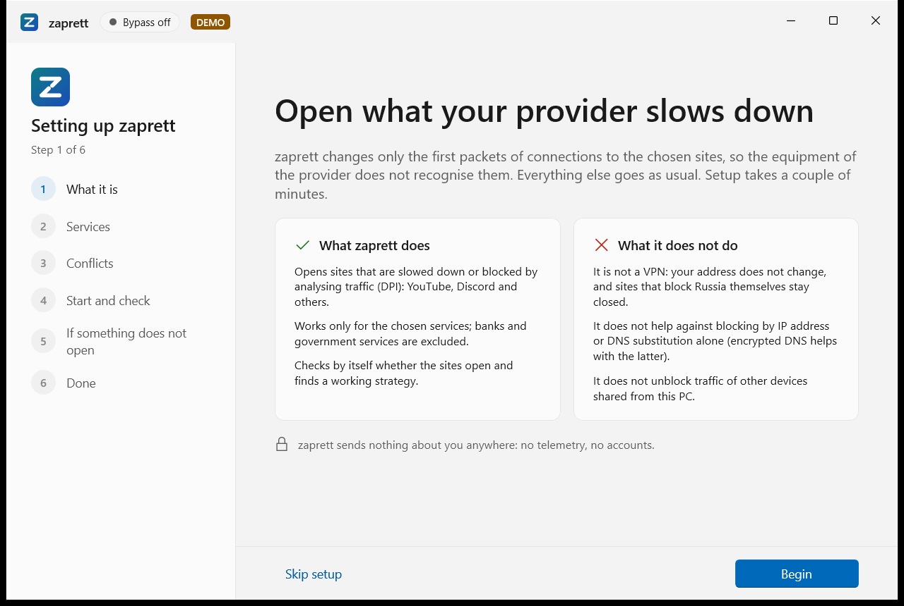

### Step 2 of 6. Services

Mark the services that do not work well for you. Each one says whether zaprett will help: **"Helps"**,
**"Helps partially"** or **"Will not help"** (such services are blocked by address or have closed access themselves,
so they cannot be turned on). In **"List set:"** you can choose the basic or extended set; the **"What to expect"**
block explains what exactly will work. Click **"Next"**.

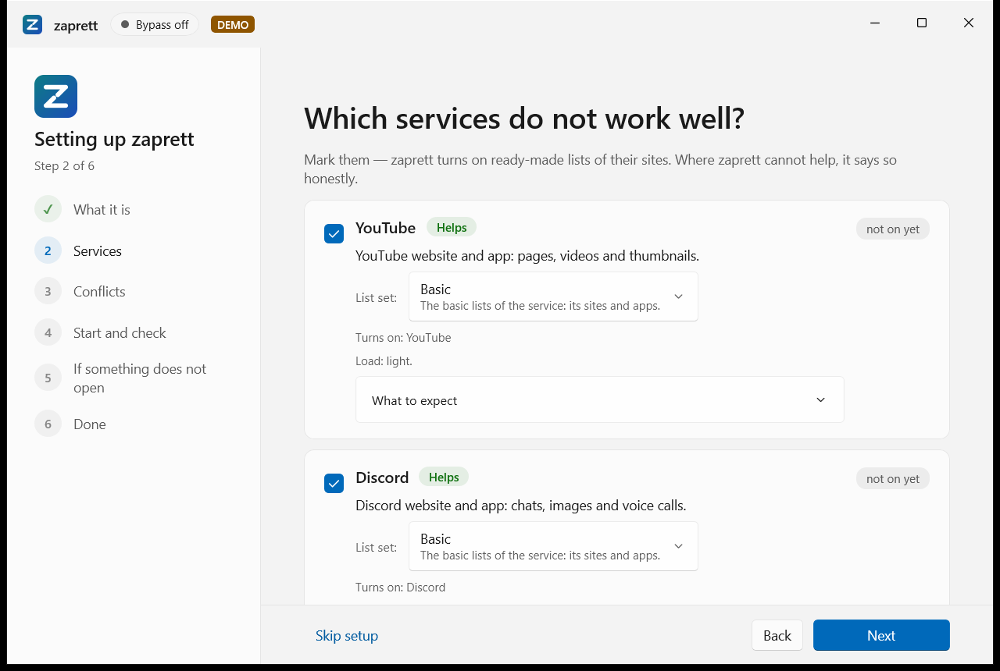

### Step 3 of 6. Conflicts

zaprett looks for programs that also intercept traffic and can get in the way of the bypass: GoodbyeDPI, another copy
of zapret, AdGuard, some VPN and network utilities. Each finding is marked **"Blocks the bypass"**, **"May interfere"**
or **"For information"** and comes with a **"What to do:"** tip. You can continue with findings. Click
**"Apply and start"**.

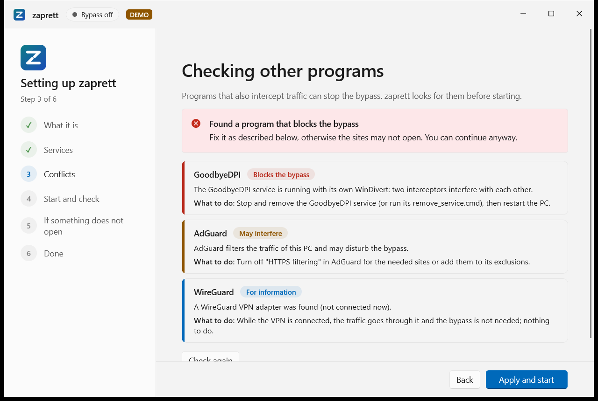

### Step 4 of 6. Start and check

zaprett turns on the lists of the chosen services, starts the bypass and checks by itself whether the sites open. For
each service you see how many check addresses opened. If everything opened, click **"Next"**. If a service did not
open, click **"Find out and fix"**.

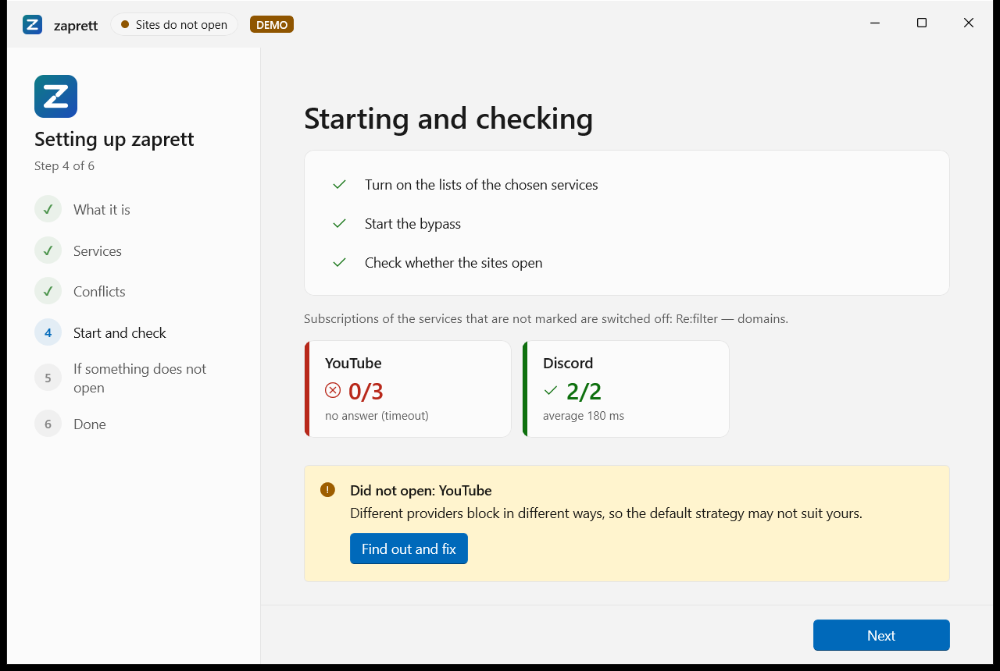

### Step 5 of 6. If something does not open

Providers block in different ways, and the default strategy may not suit yours.

1. **"Find out"** — in about half a minute zaprett finds out **how the provider blocks**: substitutes DNS, blocks the
   address, breaks the connection by site name or slows it down — and says what will help. With DNS substitution a
   **"Turn on encrypted DNS"** button appears (Windows 11).
2. **"Find a strategy"** — quick automatic selection: about 12 strategies in a few minutes. The bypass keeps working
   meanwhile; the best strategy is applied by itself.
3. **"Check again"** — check the sites once more.

<table>
  <tr>
    <td width="33%">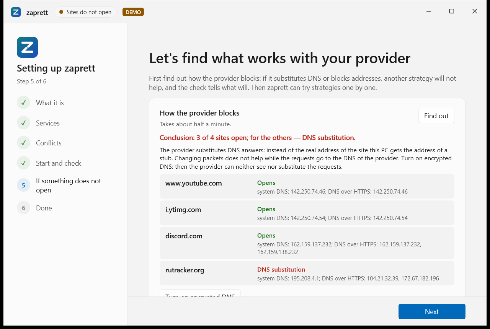</td>
    <td width="33%">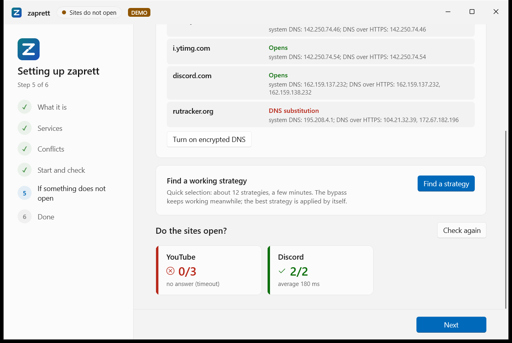</td>
    <td width="33%">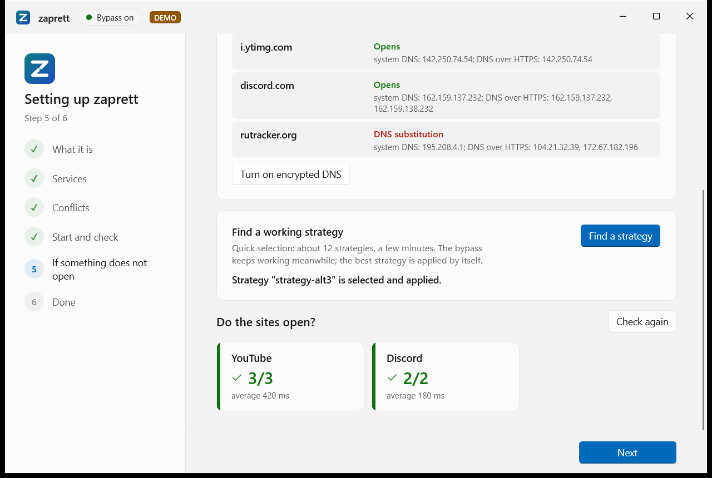</td>
  </tr>
  <tr>
    <td><sub>"Find out": how the provider blocks</sub></td>
    <td><sub>Result: DNS substitution for one address, YouTube did not open</sub></td>
    <td><sub>After "Find a strategy": everything opens</sub></td>
  </tr>
</table>

### Step 6 of 6. Done

There are two switches here:

- **"Turn the bypass on when Windows starts"** (recommended) decides whether the bypass is on after a restart: when it
  is on, the bypass turns itself on with the current settings. It does not turn off the bypass that is running now —
  the button on the home page does that;
- **"Update strategies and lists from the repository daily"** (on by default) — once a day zaprett connects to GitHub,
  repository CherretGit/zaprett-repo, and updates the strategies and lists installed from it. The same switch is in
  "Settings" → "Updates".

Click **"Finish"**.

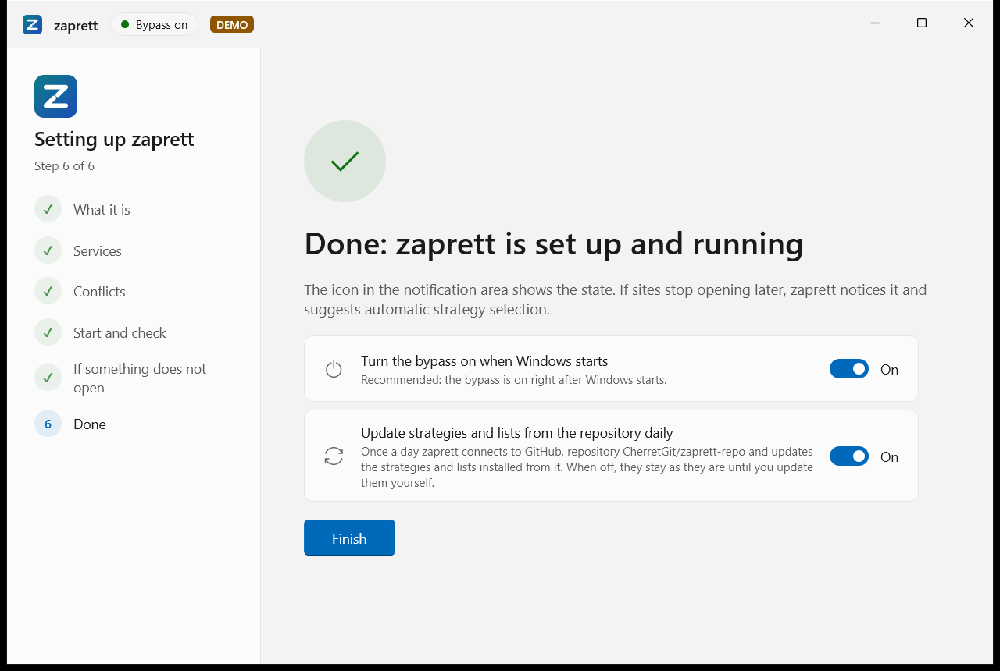

## 7. Home page

The big button turns the bypass on and off **right now**. Next to it are the state, the current strategy, the engine,
the uptime and the number of processed packets. Below:

- **"Do the sites open?"** with the **"Check now"** button — checks the addresses of the enabled services through the
  running bypass; for each service you see how many addresses opened and how fast;
- **"Availability monitor"** — the history of scheduled checks (green — the sites opened, red — less than half
  opened, grey — nothing to check);
- **"What is processed"** — the list mode and links to services, lists and strategies;
- warnings when something needs attention (for example "DNS requests go without encryption"), with a button that
  takes you to where it is fixed.

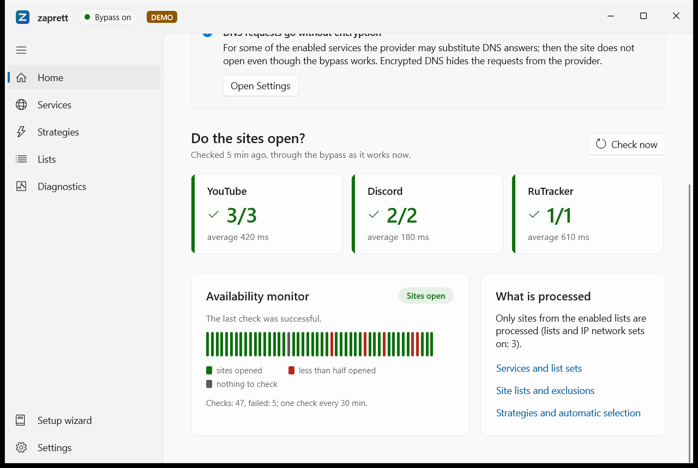

**Bypass states.** The colour of the card and the badge in the window title tell you whether all is well:

<table>
  <tr>
    <td width="50%"></td>
    <td width="50%">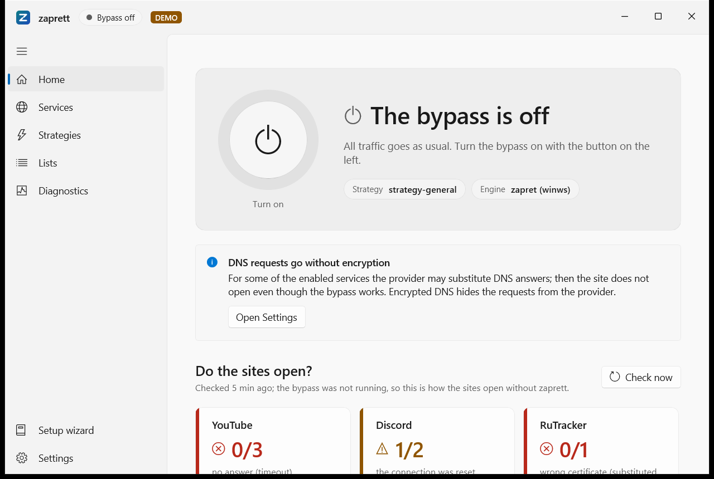</td>
  </tr>
  <tr>
    <td><b>The bypass works.</b> Sites from the enabled lists open; the rest of the traffic goes as usual.</td>
    <td><b>The bypass is off.</b> All traffic goes as usual; turn it on with the big button.</td>
  </tr>
  <tr>
    <td>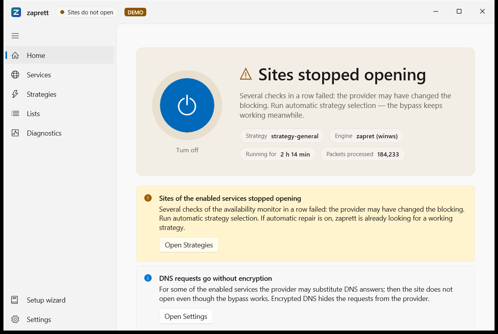</td>
    <td>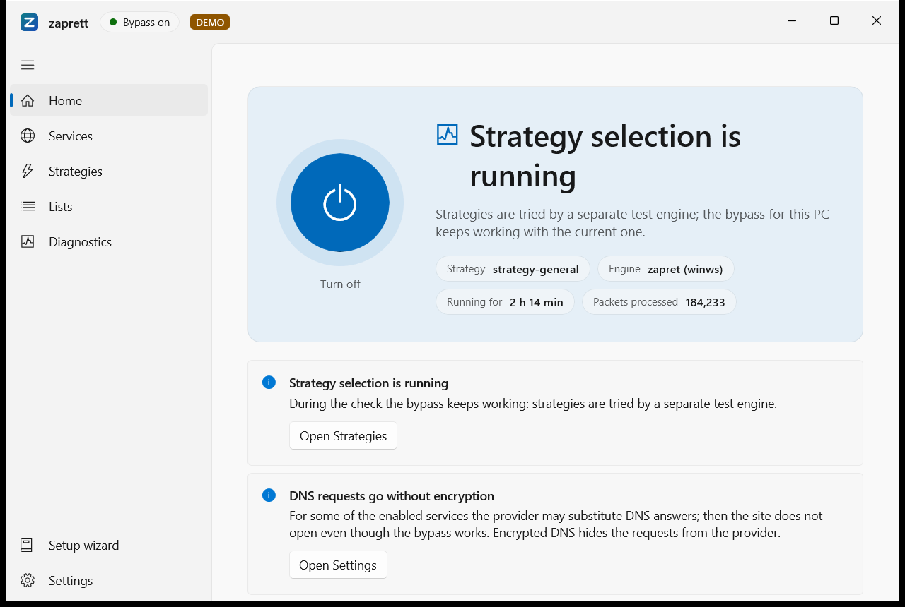</td>
  </tr>
  <tr>
    <td><b>Sites stopped opening.</b> Several monitor checks in a row failed — the provider has probably changed the blocking. Run automatic selection (or turn on "Repair automatically").</td>
    <td><b>Strategy selection is running.</b> Strategies are tried by a separate test engine; the bypass for this PC keeps working.</td>
  </tr>
  <tr>
    <td>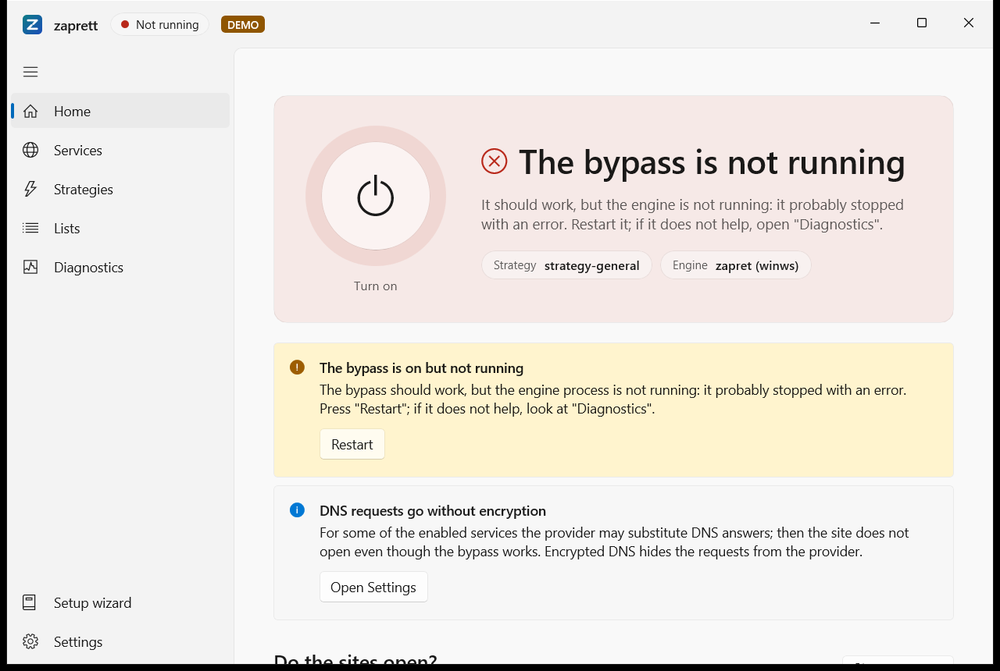</td>
    <td>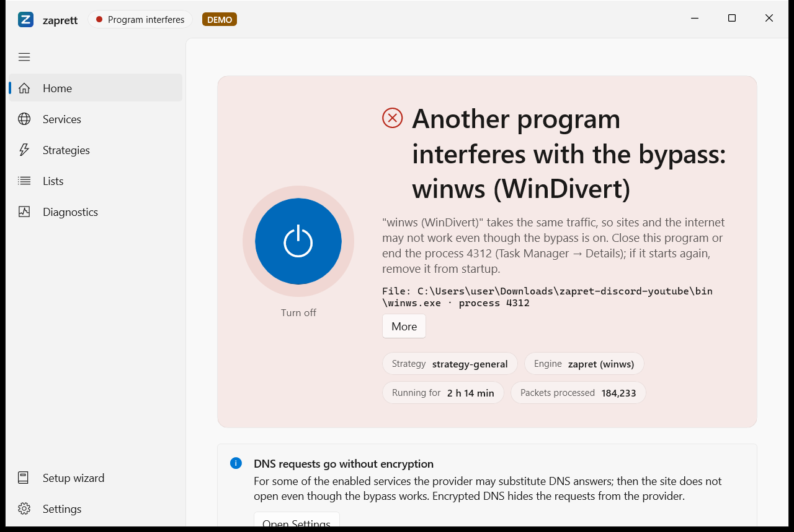</td>
  </tr>
  <tr>
    <td><b>The bypass is not running.</b> It should work, but the engine stopped with an error. Click "Restart"; if that does not help, open "Diagnostics".</td>
    <td><b>Another program interferes with the bypass.</b> zaprett shows which program it is (file, process or service) and how to stop it; "More" leads to "Diagnostics".</td>
  </tr>
</table>

Two more states: **"Looking for a working strategy"** — the monitor noticed a failure and started a quick selection by
itself (when "Repair automatically" is on); **"Waiting for the selected network"** — the bypass is on only for chosen
Wi-Fi networks and starts working by itself once the PC connects to one of them.

If the Windows service itself does not answer, the pages are replaced by the **"The zaprett service is not running"**
screen with a **"Start the service"** button (Windows asks for administrator confirmation):

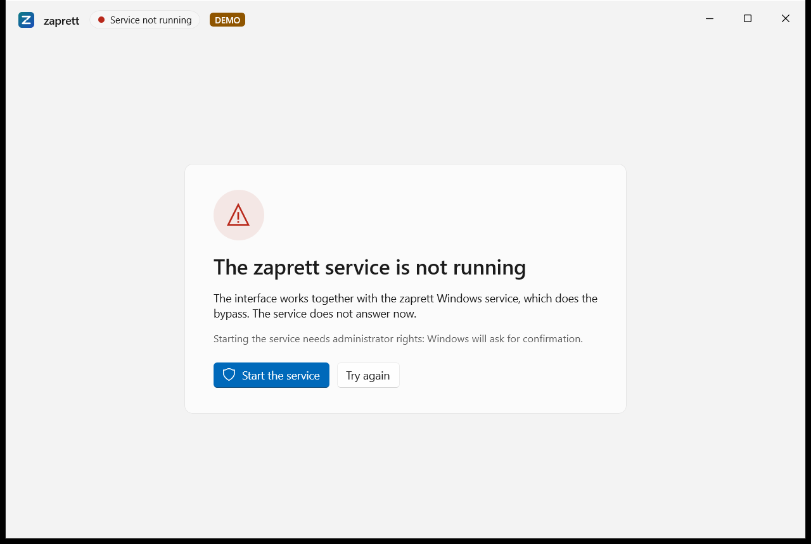

## 8. Services

The same choice of services as in the wizard: mark the ones you need and click **"Apply"**. zaprett turns on the
ready-made site lists of these services and the always-needed exclusions (government services, banks). For each
service you see:

- the mark **"Helps"**, **"Helps partially"** or **"Will not help"**;
- **"List set:"** — "Basic" or "Extended" (Discord also has "With voice servers");
- **"Turns on:"** — which lists and subscriptions will be turned on, and the **load**: light or heavy (large lists need
  more memory for the engine);
- the expandable **"What to expect"** block — what will work and what will not.

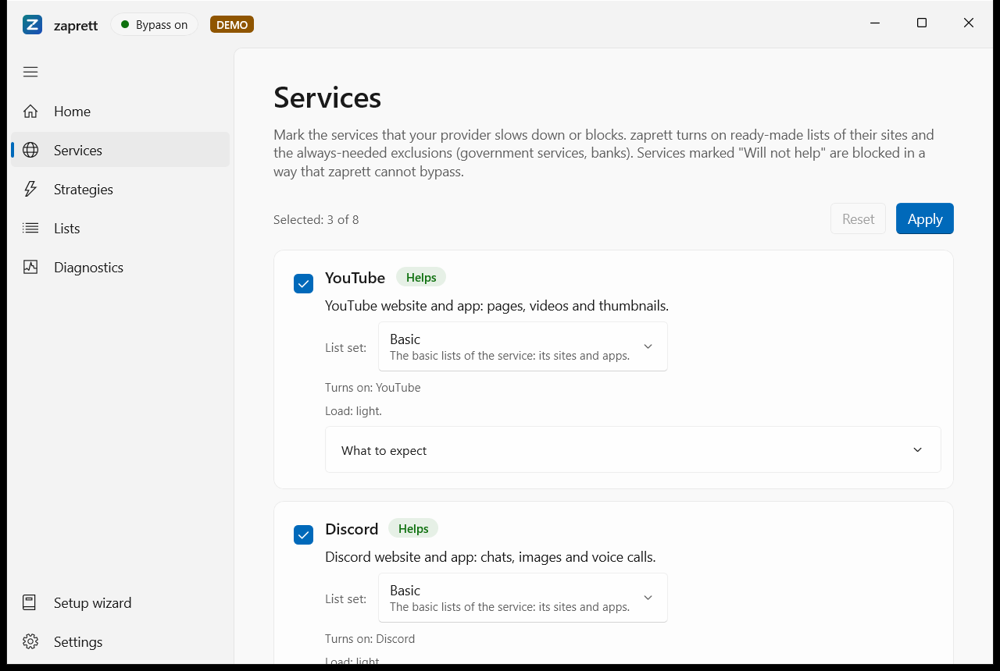

<details>
<summary><b>More screenshots of the Services page</b></summary>

<table>
  <tr>
    <td width="33%">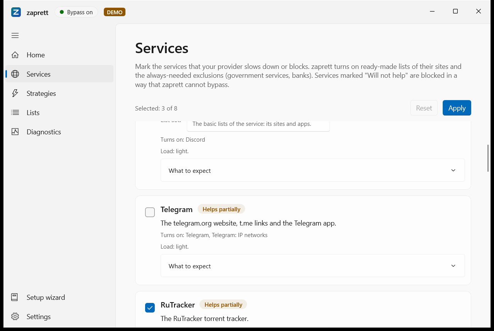</td>
    <td width="33%">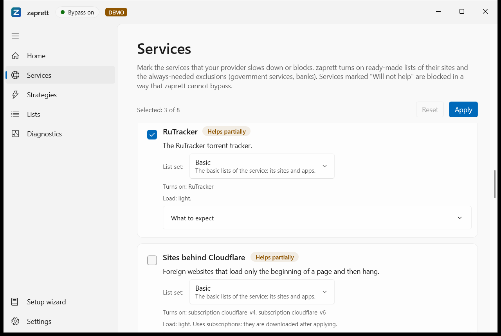</td>
    <td width="33%">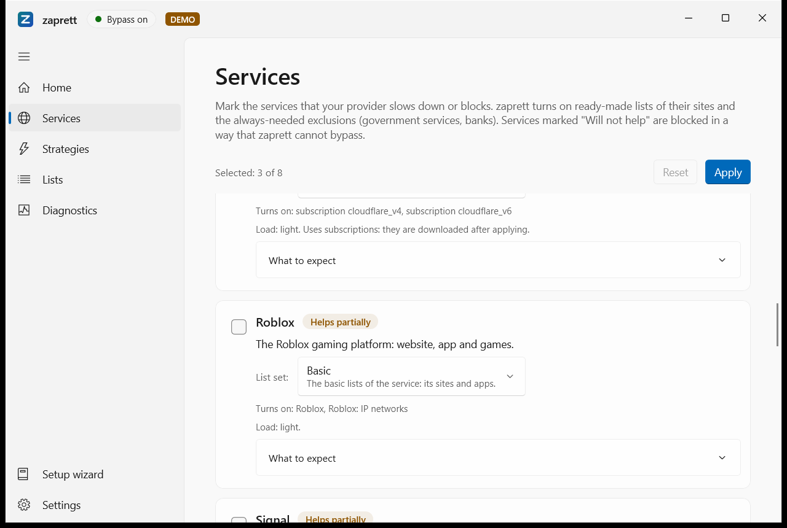</td>
  </tr>
</table>

</details>

**Available services** (the IDs are used for the [silent install](#16-for-administrators-silent-install) and the
[command line](#17-command-line-zaprettexe)):

| Mark | Services |
|---|---|
| Helps | YouTube (`youtube`), Discord (`discord`) |
| Helps partially | Telegram (`telegram`), RuTracker (`rutracker`), sites behind Cloudflare (`cloudflare`), Roblox (`roblox`), Signal (`signal`), other blocked websites (`rkn_full`) |
| Will not help | WhatsApp, Instagram and Facebook, X (Twitter), ChatGPT and Claude, Spotify — they are blocked by address or have closed access themselves; they are listed last and cannot be marked |

## 9. Strategies and automatic selection

A strategy is a set of tricks that hides the site name from the provider's equipment. Different providers need
different strategies.

**Automatic selection** tries strategies one by one on the check addresses of the enabled services and shows a table:
how many addresses opened with each strategy and how fast.

- **"Quick"** — about 12 proven strategies, a few minutes; **"Full"** — all installed strategies, may take 10–20
  minutes.
- **"Apply the best one if it is better than the current"** — apply the result automatically. Otherwise choose a
  strategy yourself with **"Apply"** in a table row or **"Apply the best"**.
- **The bypass is not interrupted during selection:** candidates are checked by a separate test engine while your
  bypass keeps working with the previous strategy. The **"Select with the bypass stopped"** check box is the old way,
  where the bypass is off during the check; use it only if the usual selection does not work.
- **"Stop"** interrupts the selection; the previous strategy stays.
- If an interfering program is found, zaprett warns you: the selection results would be wrong while it runs.

<table>
  <tr>
    <td width="50%">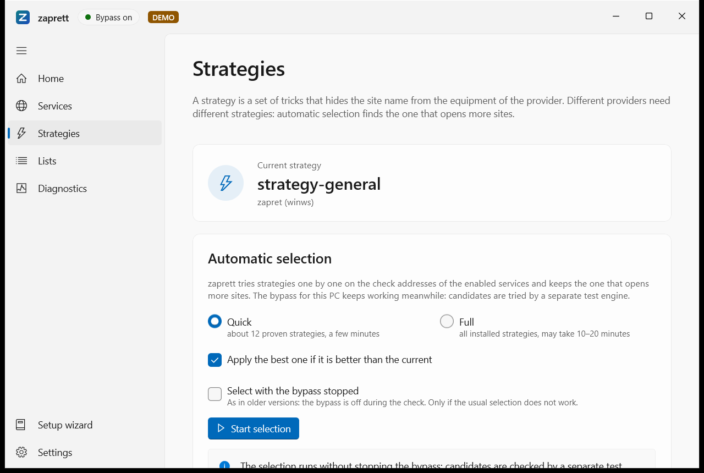</td>
    <td width="50%">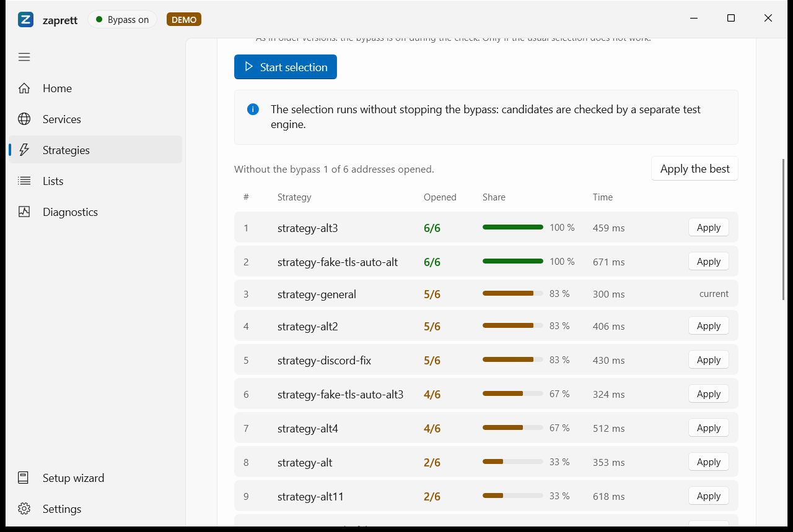</td>
  </tr>
  <tr>
    <td><sub>Current strategy and starting a selection</sub></td>
    <td><sub>Results: how many addresses opened and how fast</sub></td>
  </tr>
</table>

**Own strategies.** Below is the **"Installed"** list: open any strategy to view it and **"Make current"**. **"New"**
creates your own strategy (its name starts with `user-`). The text is shown with highlighting (filters, options,
placeholders, `--new`); **"Save and check"** immediately asks the engine whether it accepts the strategy and shows the
processed ports and the resulting engine arguments.

<details>
<summary><b>Screenshots: selection in progress and the strategy editor</b></summary>

<table>
  <tr>
    <td width="33%">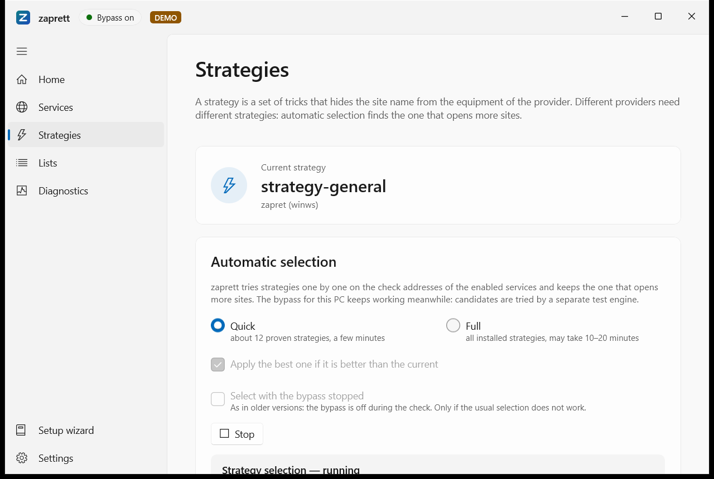</td>
    <td width="33%">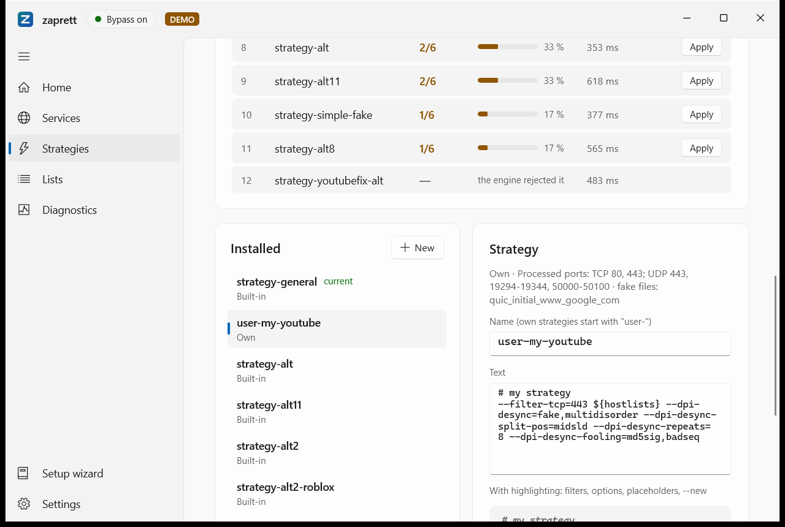</td>
    <td width="33%">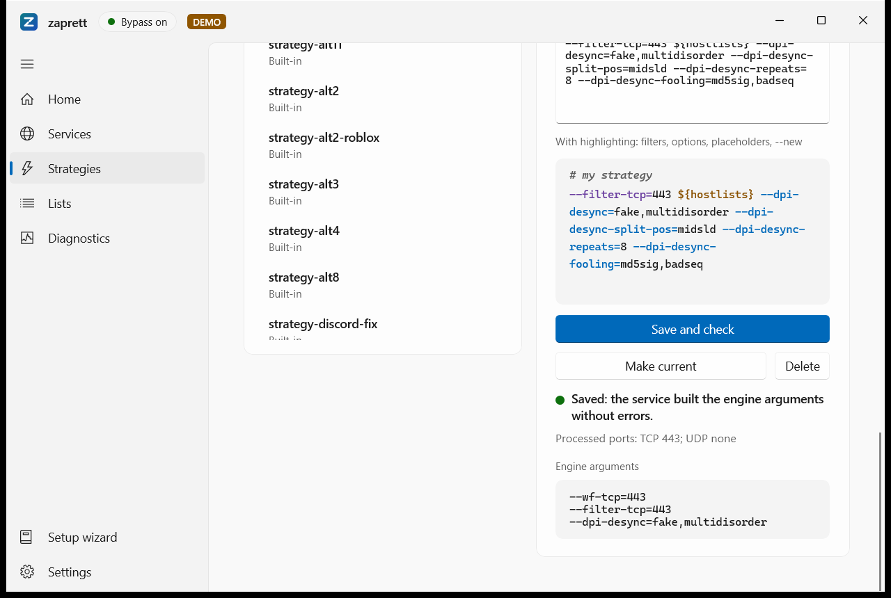</td>
  </tr>
</table>

</details>

## 10. Lists

**"Which sites are processed":**

- **"Only sites from the enabled lists (recommended)"** — everything else goes as usual, so banks, games and other
  programs are not affected;
- **"All sites except the exclusions"** — helps with sites that are not in any list, but more sites may break; add
  those to the exclusions.

Tabs:

| Tab | What is there |
|---|---|
| **Domains** | built-in lists of site names; a site is processed if its name or a parent domain is in an enabled list |
| **IP networks** | address lists for apps that connect without a site name (Telegram, voice chats, games) |
| **Exclusions** | sites and networks that are never processed: government services, banks, local networks |
| **Own lists** | "My sites", "My site exclusions", "My IP networks", "My IP network exclusions": one entry per line, `#` starts a comment, with **"Import from file…"** and **"Export to file…"** |
| **Subscriptions** | external lists by an https link that zaprett downloads and updates by itself: **"Update now"**, **"New subscription"** (name, address, check box "The list contains IP networks, not site names") |

<table>
  <tr>
    <td width="33%">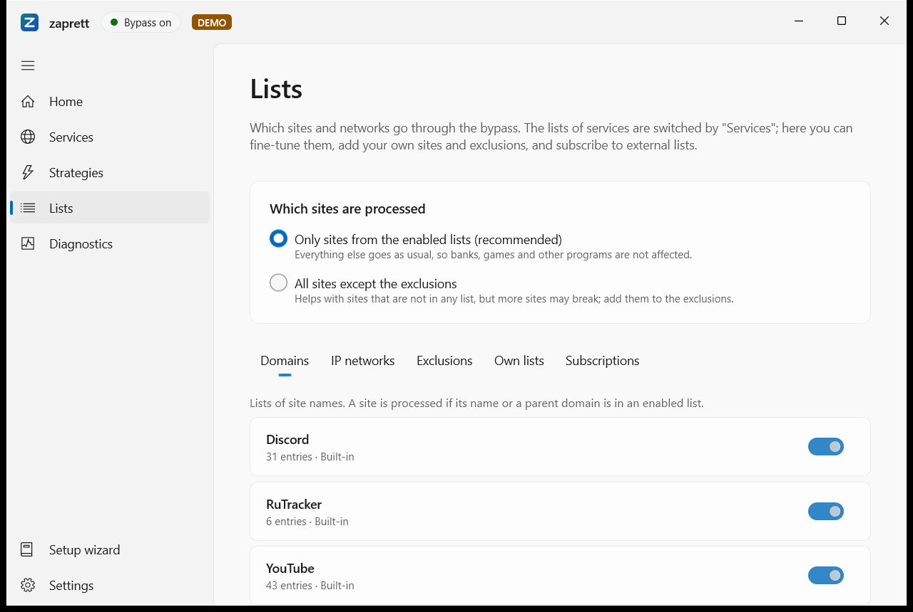</td>
    <td width="33%">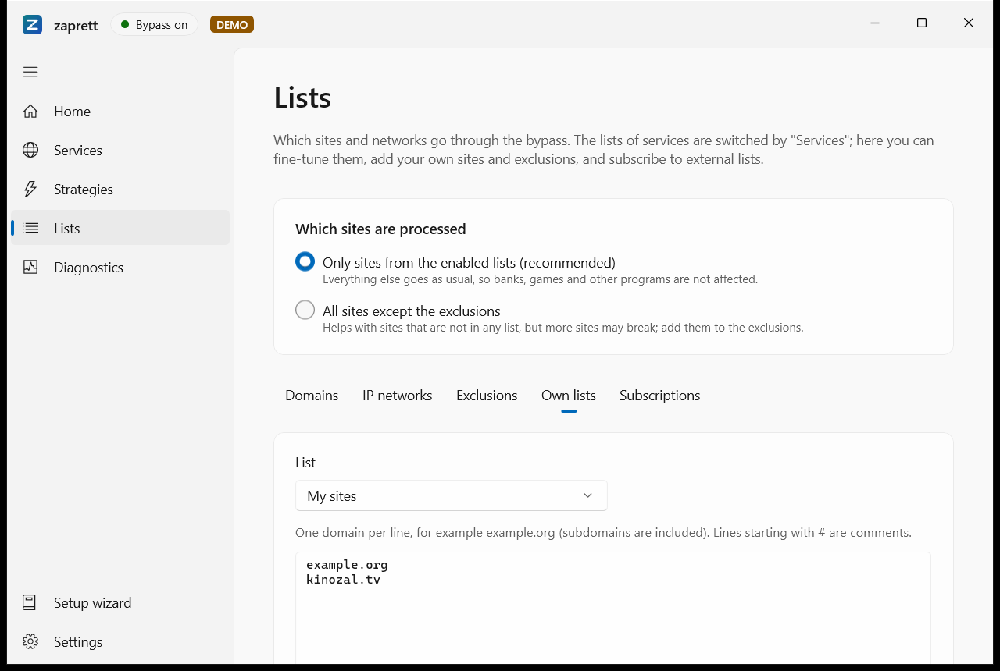</td>
    <td width="33%">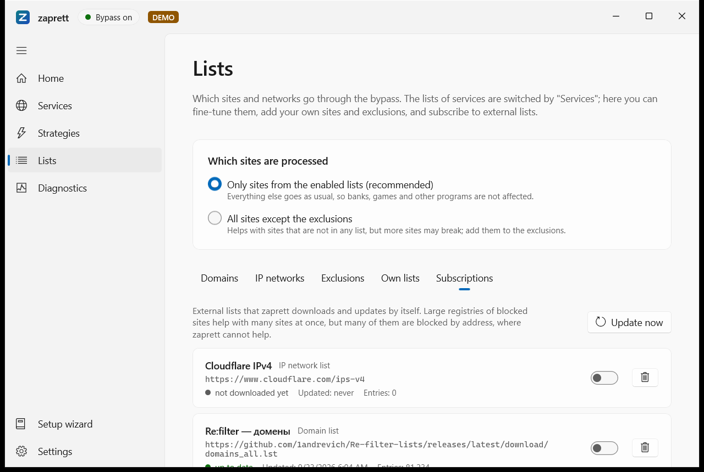</td>
  </tr>
  <tr>
    <td><sub>Mode and built-in lists</sub></td>
    <td><sub>Own lists</sub></td>
    <td><sub>Subscriptions</sub></td>
  </tr>
</table>

> [!TIP]
> Large registries of blocked sites help with many sites at once, but many of those sites are blocked by address,
> which zaprett cannot bypass. For one or two sites you need, it is simpler to add them to "My sites".

## 11. Diagnostics

- **"How the provider blocks"** → **"Find out"**: zaprett opens the check addresses of the enabled services, compares
  the system DNS answers with DNS over HTTPS and shows the result for each address: **Opens**, **DNS substitution**,
  **Blocked by IP address**, **Blocked by site name (TLS)**, **Slowed down**, **Stub page of the provider** — and a
  conclusion about what will help: a strategy, encrypted DNS or only a VPN. With DNS substitution a
  **"Turn on encrypted DNS"** button appears (Windows 11).
- **"Conflicting programs"** — the same checks as in the wizard, with a **"Check again"** button.
- **"Configuration check"** → **"Check"**: the engine checks the current settings without restarting anything and
  shows the processed ports, the engine output and its arguments.
- **"Log"** of the service and the engine; **"Detailed engine log"** — for hard cases (it turns itself off after
  30 minutes because it slows the engine down).
- **"Diagnostic report"** — versions, state, conflicts, the last check and the log, to copy or save to a file and
  attach to a question. Parameters are stripped from subscription addresses in the report.

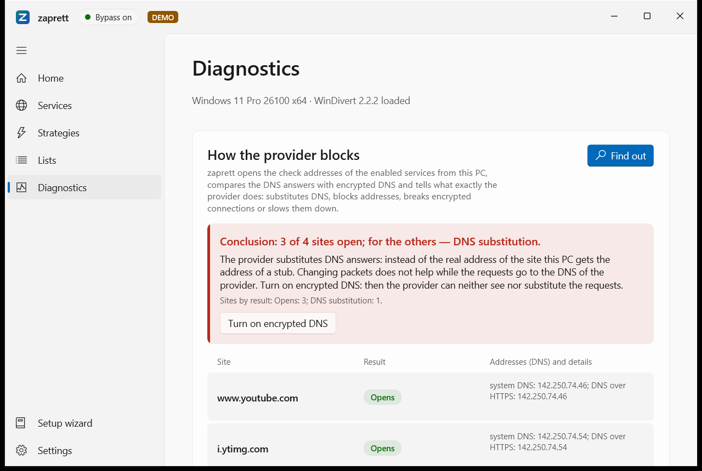

<details>
<summary><b>More screenshots of the Diagnostics page</b></summary>

<table>
  <tr>
    <td width="33%">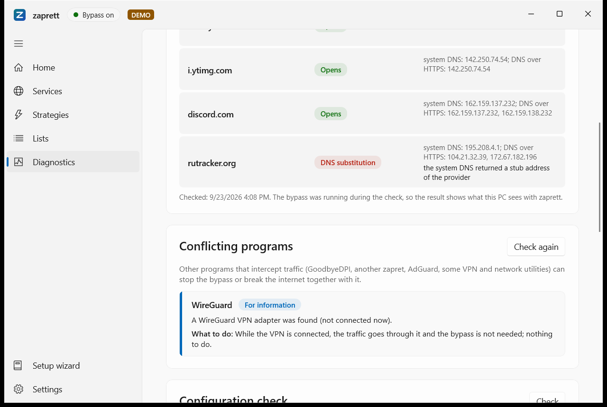</td>
    <td width="33%">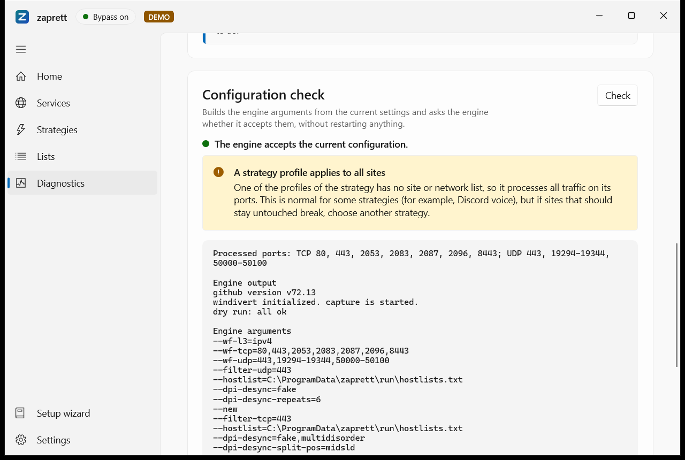</td>
    <td width="33%">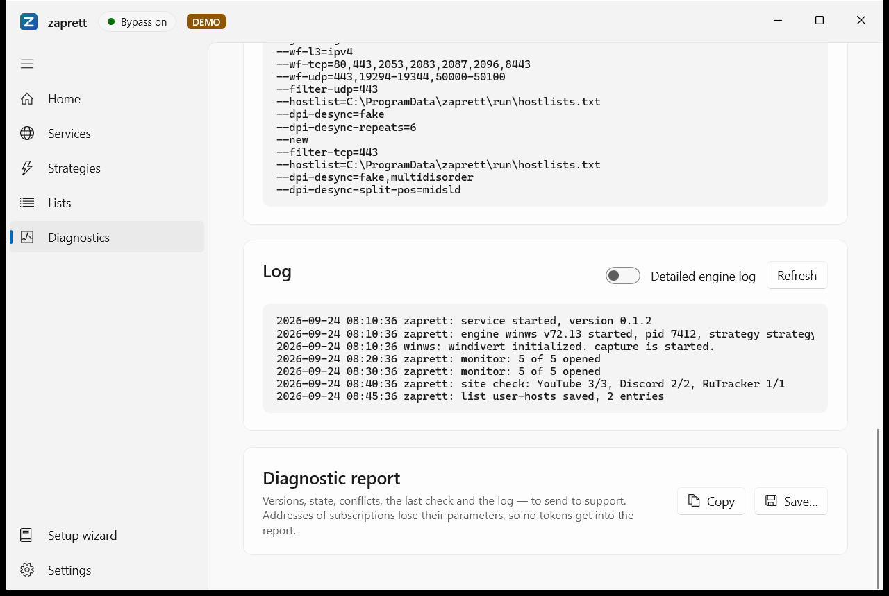</td>
  </tr>
</table>

</details>

## 12. Settings

| Group | What is there |
|---|---|
| **Bypass** | **"Turn the bypass on when Windows starts"** — only what happens after a restart; right now the bypass is turned on and off with the button on the home page. **"Show the zaprett icon at Windows sign-in"** — the icon in the notification area right after sign-in; the bypass works without it. **"Engine"** — zapret (winws) suits most providers, zapret2 (winws2) has its own set of built-in strategies. **"Watchdog"** — restarts the engine if it stops unexpectedly. **"Process IPv6"** — if your provider gives IPv6. |
| **DNS, QUIC and games** | **"Encrypted DNS"** (DNS over HTTPS — **Windows 11 only**; not available on Windows 10 in this version). **"Block QUIC"** — helps when YouTube works in one browser but not in another. **"Game filter"** with TCP/UDP ports — an extra rule for game servers from the enabled IP network lists. |
| **Networks** | **"Where the bypass works"**: in all networks or only in chosen Wi-Fi networks (for example, only at home). **"Do not work in a corporate network"** — in a domain (office) network the bypass switches off by itself. **Availability monitor**: "Check the sites on schedule", "How often", "Failed checks before a warning", "Repair automatically" (quick selection when sites stop opening, not more often than every 6 hours). |
| **Updates** | **"Update strategies and lists from the repository daily"** — once a day zaprett connects to GitHub, repository CherretGit/zaprett-repo, and updates the strategies and lists installed from it; when off, they stay as they are until you update them yourself (on by default). **"How to update zaprett"** — a note that automatic program updates will come in a later version and the **"Open the releases page"** button; how to update — [section 15](#15-updating-and-uninstalling). |
| **Interface** | **"Language"** (Russian, English, Chinese — the service and the command line use the same language), **"Theme"** (light, dark, as in Windows), **"Notifications"**, **"Keep in the notification area when closed"**, **"Setup wizard"**. |

> [!NOTE]
> **Autostart and the home page button are different things.** "Turn the bypass on when Windows starts" decides only
> what happens after Windows boots. To turn the bypass on or off now, use the button on the home page or in the icon
> menu.
>
> **Windows Fast Startup.** If Fast Startup is on in Windows (the default on Windows 10 and 11), "Shut down" is not a
> full boot: after you power the PC on, the bypass continues in the same state as before the shutdown, and the
> autostart setting takes effect at the next **restart**. Restarting the service (an update, a repair) does not change
> the state of the bypass either.

<table>
  <tr>
    <td width="50%">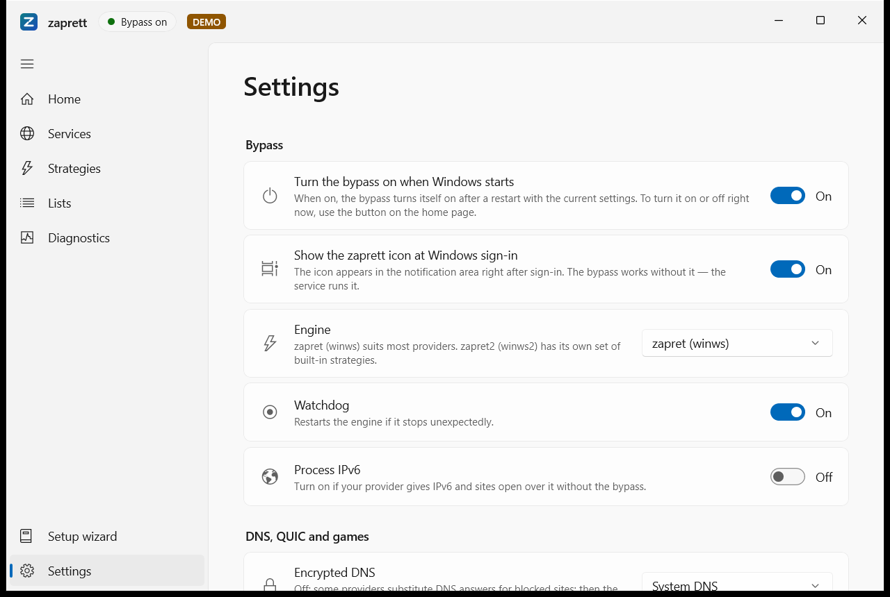</td>
    <td width="50%">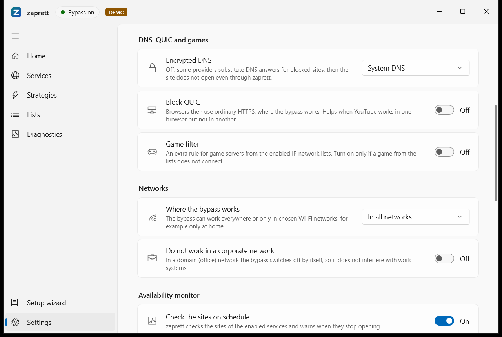</td>
  </tr>
  <tr>
    <td>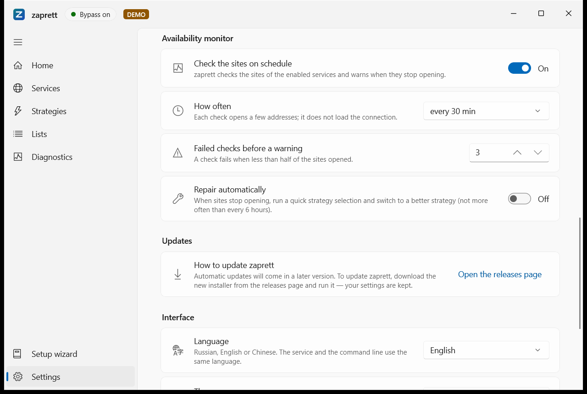</td>
    <td>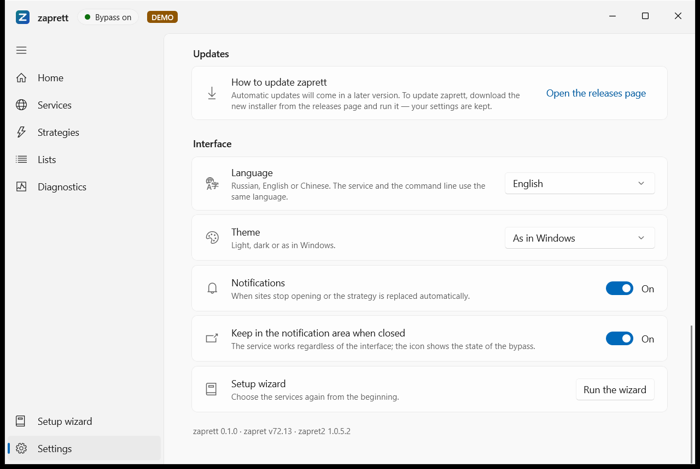</td>
  </tr>
</table>

**Dark theme** is set in "Settings" → "Theme" (or follows the Windows theme):

<table>
  <tr>
    <td width="50%">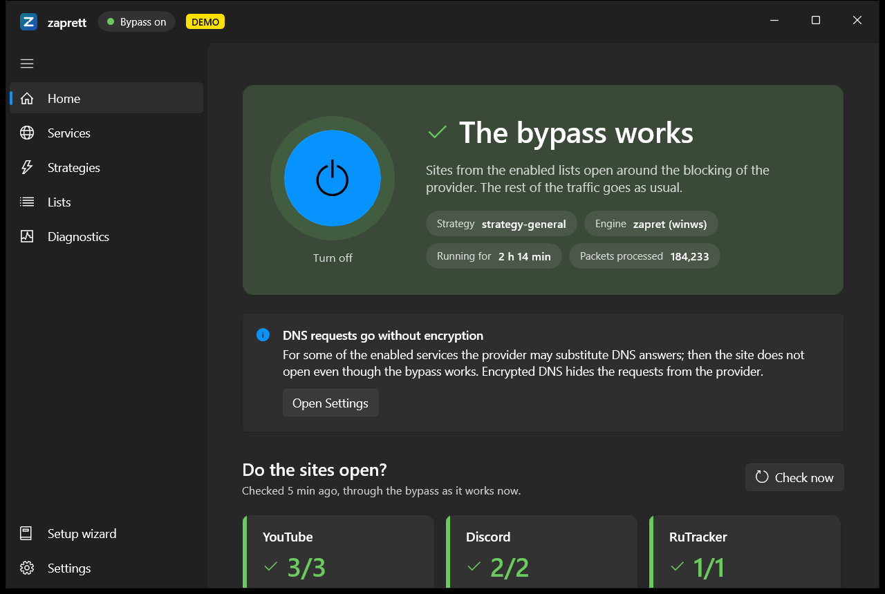</td>
    <td width="50%">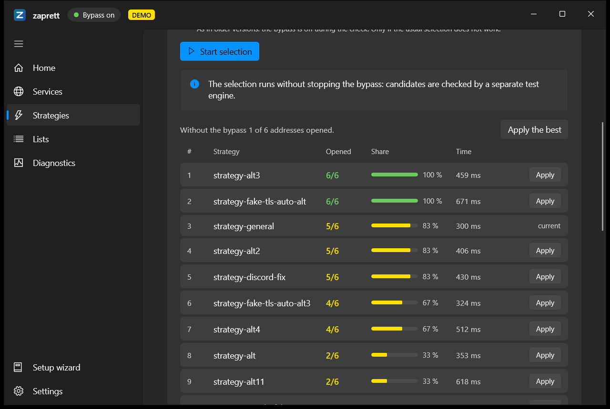</td>
  </tr>
  <tr>
    <td>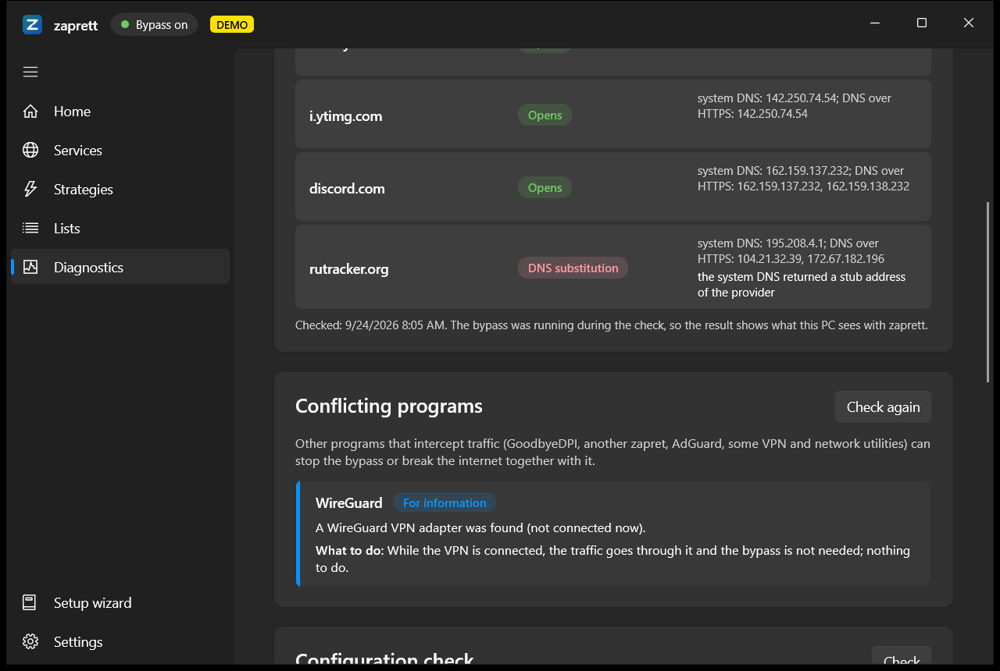</td>
    <td>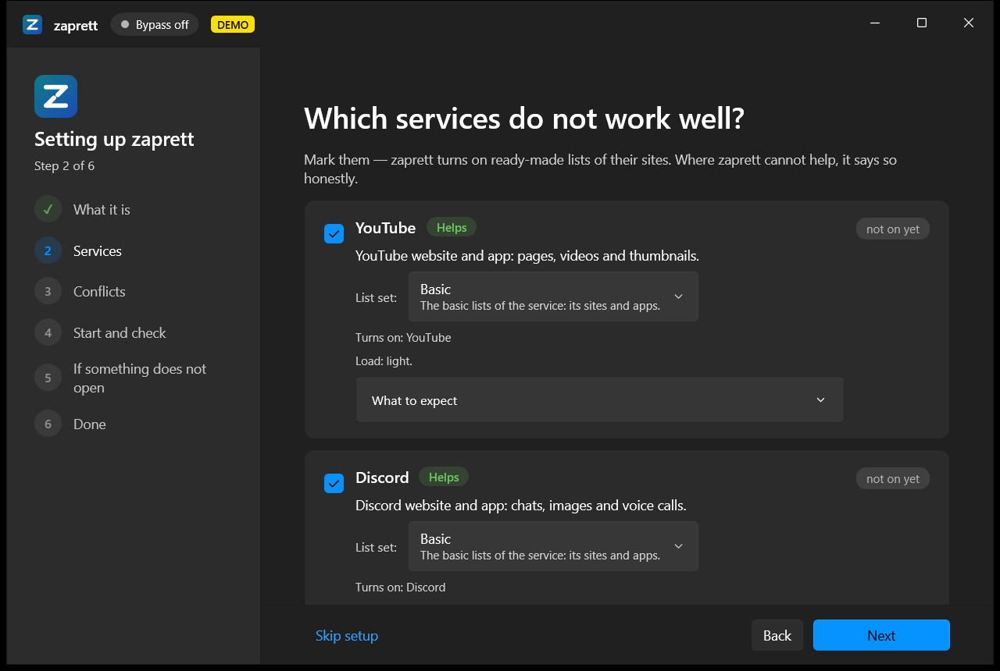</td>
  </tr>
</table>

## 13. Notification area icon

The zaprett icon next to the clock changes with the state of the bypass: on, off, needs attention, error.

- **Click** — open the zaprett window.
- **Right-click** — menu: **"Turn the bypass on"** / **"Turn the bypass off"**, **"Check the sites now"** (the result
  comes as a notification), **"Open zaprett"**, **"Exit the interface (the service keeps working)"**.

Closing the window or the interface **does not turn the bypass off**: the Windows service does the bypass. Turn the
bypass off with the button on the home page or in the icon menu. Whether the icon appears at Windows sign-in is
decided by the check box during installation; later you change it in "Settings" → "Show the zaprett icon at Windows
sign-in".

Windows notifications come when sites stop opening and when zaprett replaced the strategy by itself (you can turn them
off in "Settings" → "Notifications").

## 14. Who can control the bypass

Any user of the computer can view the state. Changing settings and turning the bypass on and off is allowed to
**administrators** and members of the local **"zaprett Operators"** group. The user who installed the program is
added to the group automatically.

Other users see the interface in **"View only"** mode: a note at the top of the window, the controls are disabled. The
interface language and theme are saved per user, and they can be changed in this mode too.

To add another user to the group (from an administrator command prompt):

```powershell
net localgroup "zaprett Operators" UserName /add
```

The rights take effect **from the next Windows sign-in**: after being added to the group, sign out and sign in again.
The same applies to the user who has just installed zaprett.

## 15. Updating and uninstalling

**What is new in 0.1.2:**

- the **"Update strategies and lists from the repository daily"** switch in "Settings" → "Updates" and on the last
  wizard step — the daily catalog update can now be turned off in the interface;
- when an extra check of the availability monitor is postponed (the engine is not running, waits for the selected
  network, or another background task is running), one entry about it appears in the log;
- the notification area icon appears more reliably right after start;
- updating from 0.1.1 needs no restart: the service, the bypass and the notification area icon work right after
  setup.

**Updating.** Version 0.1.2 has no automatic program updates — they will come in a later version. To update, download
the new MSI from the [Releases](https://github.com/RomanKern89/zaprett-openwrt/releases) page (in the program,
**"Settings" → "Open the releases page"** opens it) and run it over the installed version: the old version is
replaced, **settings, your own lists and strategies, and the icon-at-sign-in choice are kept**. This is also how
0.1.2 is installed over 0.1.1 and 0.1.0. An older version cannot
be installed over a newer one.

**Uninstalling.** Settings → Apps → **zaprett** → Uninstall (or Control Panel → Programs and Features). The uninstaller
stops the service and the engine, unloads the WinDivert driver (only if it was loaded by zaprett's own copy — a driver
of another program is left alone; no restart needed), removes zaprett's firewall rules, the "zaprett Operators" group
and the icon at sign-in, and restores the DNS servers of the network adapters if zaprett changed them.

Settings and lists in `C:\ProgramData\zaprett` are **kept** on a normal uninstall — in case you install again. To
remove them too (from an administrator command prompt):

```powershell
msiexec /x zaprett-0.1.2-x64.msi REMOVEDATA=1
```

## 16. For administrators: silent install

All commands are run from an administrator command prompt.

```powershell
# silent install: turn on YouTube and Discord and start the bypass right away, installer log to a file
msiexec /i zaprett-0.1.2-x64.msi /qn SERVICES=youtube,discord AUTOSTART=1 LANG=en /l*v install.log

# no notification area icon at user sign-in
msiexec /i zaprett-0.1.2-x64.msi /qn TRAYAUTOSTART=0

# custom install folder
msiexec /i zaprett-0.1.2-x64.msi /qn INSTALLFOLDER="D:\Apps\zaprett"

# English installer and English program language (Chinese — TRANSFORMS=:2052 LANG=zh-CN)
msiexec /i zaprett-0.1.2-x64.msi TRANSFORMS=:1033 LANG=en

# silent uninstall together with settings and lists
msiexec /x zaprett-0.1.2-x64.msi /qn REMOVEDATA=1
```

| Property | Value |
|---|---|
| `SERVICES` | comma-separated services, as in the wizard: `youtube`, `discord`, `telegram`, `rutracker`, `cloudflare`, `roblox`, `signal`, `rkn_full`; a list set after a colon, for example `discord:full` |
| `AUTOSTART` | `1` — turn the bypass on right away and at every Windows start; `0` by default |
| `LANG` | program language: `ru`, `en` or `zh-CN`; defaults to the installer language (`ru`, with `TRANSFORMS=:1033` — `en`, with `:2052` — `zh-CN`). The language of the installer itself is set by `TRANSFORMS=:1033` (English) or `TRANSFORMS=:2052` (Chinese) — pass it together with `LANG` |
| `TRAYAUTOSTART` | `0` — do not show the icon at user sign-in; `1` by default |
| `INSTALLFOLDER` | install folder; `C:\Program Files\zaprett` by default |
| `REMOVEDATA` | on uninstall: `1` — also delete `C:\ProgramData\zaprett` |

`SERVICES`, `AUTOSTART` and `LANG` apply only to the **first** install, and `TRAYAUTOSTART` is recorded at the first
install: an upgrade does not change the user's settings.

Rights to control the bypass — [section 14](#14-who-can-control-the-bypass).

## 17. Command line `zaprett.exe`

`zaprett.exe` is in the install folder and is not added to `PATH`. Call it by its full path:

```powershell
& "C:\Program Files\zaprett\zaprett.exe" status
```

<details>
<summary><b>Main commands</b> (full help — <code>zaprett.exe help</code>)</summary>

```text
Service
  status                          state
  start | stop | restart          the bypass now (autostart unchanged)
  enable | disable                turn on/off now and at Windows start
  autostart on|off                turn the bypass on at Windows start or not (now unchanged)
  check                           validate settings without starting

Lists and strategies
  items [--type <type>]           installed items
  list enable|disable <id>        turn a list on/off
  strategy set|show <id>          select / show a strategy
  strategy save <id> < file       save your own strategy (id starts with user-)
  strategy delete <id>            delete your strategy
  user get <id> | user set <id> < file   your own list
  mode whitelist|blacklist        list mode
  engine winws|winws2             engine

Catalog and subscriptions
  repo fetch | repo list | repo install <id>... | repo remove <id> | repo upgrade [--all | <id>...]
  sources list | sources update [<name>...] | sources save <name> < json | sources delete <name> | sources defaults

Quick setup and automatic selection
  presets | wizard apply <service>[:<variant>]...
  test start [--strategies id,id] [--quick] [--apply-if-better] [--exclusive]
  test status [--brief] | test stop | test apply <id>

Checks and monitoring
  probe [--services id,id] | probe status     check the sites now
  monitor run | monitor status                availability monitor
  diagnose [--services id,id] | diagnose status   how the provider blocks
  conflicts                       interfering software (WinDivert, GoodbyeDPI, VPN, proxy...)
  log [--tail N]                  service and engine log
  page overview|lists|strategies|diagnostics

DNS and settings
  dns status | dns setup | dns off    encrypted DNS (Windows 11): state / turn on / restore previous settings
  settings get | settings set < json

Background jobs and other
  job status | job log [--tail N] | job cancel
  version | diag [--full]
```

</details>

Flags: `--json` — JSON output, `--quiet` — print nothing on success, `--lang ru|en|zh-CN` — output language (the
language from the settings by default). Help — `help`, `--help`, `-h` or `/?`. Exit codes: `0` — success, `1` —
command failed, `2` — invalid arguments, `3` — service not available. In version 0.1.2 `update check` and
`update install` answer that program updates are not available ([section 15](#15-updating-and-uninstalling)).

**Data on standard input.** `settings set` and `sources save` take a JSON object; `strategy save <id>` and
`user set <id>` take text. In PowerShell:

```powershell
$z = "C:\Program Files\zaprett\zaprett.exe"
'{"main":{"quic_block":true}}' | & $z settings set                    # turn on QUIC blocking
'{"ui":{"language":"en"}}' | & $z settings set                        # change the language
Get-Content .\my-strategy.txt -Raw | & $z strategy save user-my        # own strategy (name starts with user-)
Get-Content .\sites.txt -Raw | & $z user set user-hosts                # the "My sites" list
& $z wizard apply youtube discord:full                                 # turn on services, as in the wizard
& $z test start --quick --apply-if-better                              # quick automatic selection
```

You do not need to pick an input encoding: UTF-8 (with or without BOM), UTF-16 and the console code page are
recognised automatically. Commands that change something need administrator rights or membership in the
"zaprett Operators" group.

## 18. FAQ and troubleshooting

<details>
<summary><b>A site does not open although the bypass is on</b></summary>

1. On the home page, click **"Check now"**.
2. Open **"Strategies"** and run automatic selection (**"Quick"**, then **"Full"** if needed). The bypass keeps working
   during the selection.
3. If no strategy helped — **"Diagnostics" → "How the provider blocks" → "Find out"**. With DNS substitution, turn on
   encrypted DNS (Windows 11); with blocking by IP address zaprett cannot help — you need a VPN.
4. If the site is not in any list, add it to **"Lists" → "Own lists" → "My sites"**.
5. YouTube works in one browser but not in another — turn on **"Settings" → "Block QUIC"**.
6. Your provider has IPv6 and zaprett warns "IPv6 connections go without the bypass" — turn on
   **"Settings" → "Process IPv6"**.

</details>

<details>
<summary><b>The antivirus flags WinDivert or <code>winws.exe</code>, or has removed them</b></summary>

The WinDivert driver can intercept traffic, so some antivirus products flag it as a "potentially unwanted
application" or a "hacking tool". The engine files come unchanged from the official zapret release. If the antivirus
has removed them (zaprett shows the warning "The bypass engine is not installed"), add the install folder
(`C:\Program Files\zaprett`) to the antivirus exclusions and reinstall zaprett.

</details>

<details>
<summary><b>Another program interferes with the bypass (GoodbyeDPI, zapret, AdGuard…)</b></summary>

**GoodbyeDPI**, another copy of **zapret** and other programs with their own WinDivert must not run at the same time as
zaprett: two interceptors get in each other's way. zaprett finds them by itself and shows them on the home page, in the
wizard and in **"Diagnostics" → "Conflicting programs"** — with the file, process or service and a **"What to do:"** tip.
Usually you need to stop the program or its service (`services.msc` → Stop, startup type Disabled); for GoodbyeDPI,
remove its service (`remove_service.cmd`) and restart the computer. AdGuard, Killer Network Service, Intel
Connectivity Network Service, the Check Point client and SmartByte can also interfere.

</details>

<details>
<summary><b>I use a VPN or a system proxy</b></summary>

While a VPN is connected, traffic goes through it and zaprett's bypass is not needed for that traffic; zaprett's check
results may differ while the VPN is on. Traffic through a system proxy goes to the proxy, not to the site, so the
bypass does not apply to it. zaprett lists the VPN adapters and proxies it finds under "Conflicting programs" marked
"For information". Working together with various VPNs has not been fully tested.

</details>

<details>
<summary><b>Work laptop: I do not want zaprett to work at the office</b></summary>

Turn on **"Settings" → "Networks" → "Do not work in a corporate network"**: in a domain (office) network the bypass
switches off by itself so that it does not interfere with work systems. Another option is **"Where the bypass works" →
"Only in chosen Wi-Fi networks"** listing, for example, your home network. If the computer belongs to an organisation,
agree on installing zaprett with its administrator.

</details>

<details>
<summary><b>"Not enough rights: administrator rights or membership in the "zaprett Operators" group are needed."</b></summary>

Your account is not in this group — ask an administrator to add it ([section 14](#14-who-can-control-the-bypass)). If
you have just been added or have just installed zaprett, sign out of Windows and sign in again.

</details>

<details>
<summary><b>"The zaprett service is not running"</b></summary>

Click **"Start the service"** in the zaprett window (Windows asks for administrator confirmation) or start the
"zaprett" service in the Services console (`services.msc`). If the service keeps stopping, reinstall zaprett.

</details>

<details>
<summary><b>After shutting down and powering on, the bypass is not in the state my autostart setting says</b></summary>

That is how Windows Fast Startup works: with it, "Shut down" is not a full boot, and the bypass stays in the state it
was in before the shutdown. The "Turn the bypass on when Windows starts" setting takes effect at the next **restart**
([section 12](#12-settings)).

</details>

<details>
<summary><b>How to share details when asking for help</b></summary>

**"Diagnostics" → "Diagnostic report"** → copy it or save it to a file. The service log is also in
`C:\ProgramData\zaprett\logs\zaprett.log`. The report is not sent anywhere by itself — you decide whom to give it to.

</details>

## 19. Privacy

- zaprett **sends nothing** about you or your computer: no telemetry, no accounts, no registration.
- The zaprett service goes online by itself only for the following:
  - **site checks** — it opens the check addresses of the enabled services: on "Check now", during automatic
    selection, during diagnostics, and on schedule when the availability monitor is on (on by default, every
    30 minutes; turn it off in "Settings" → "Check the sites on schedule");
  - **diagnostics** "How the provider blocks" additionally looks up the check sites through public DNS over HTTPS
    (`dns.google`, falling back to `cloudflare-dns.com`) to compare with the answer of the provider's DNS;
  - **subscriptions** — it downloads only the external lists that are enabled (by you or by a chosen service; all are
    off by default);
  - **the catalog of strategies and lists** — once a day (around 4:00) the service downloads the
    [zaprett-repo](https://github.com/CherretGit/zaprett-repo) catalog from GitHub and updates the items installed
    from it. Turn this off with the **"Update strategies and lists from the repository daily"** switch in
    "Settings" → "Updates" or on the last wizard step (from the command line —
    `'{"repo":{"autoupdate":false}}' | zaprett.exe settings set`).
- If you turn on **encrypted DNS**, the computer's DNS requests go to Cloudflare's DNS over HTTPS instead of the
  provider's DNS.
- Version 0.1.2 does not check for program updates.
- In the diagnostic report, parameters are stripped from subscription addresses, so tokens do not end up in the
  report. The report is not sent anywhere by itself.

## 20. What was tested and limitations

**Tested** on clean systems: **Windows 10 LTSC 2021 (build 19044)** and **Windows 11 24H2** — installation from a single
MSI with no extra components, the setup wizard, the bypass itself, isolated automatic selection (the main bypass is not
restarted), uninstallation.

**Limitations of version 0.1.2:**

- the installer is not yet signed with a code-signing certificate — SmartScreen shows a warning ([section 5](#5-install));
- no automatic program updates yet — install a new version with a new MSI ([section 15](#15-updating-and-uninstalling));
- encrypted DNS can be turned on from zaprett only on Windows 11;
- x64 only; ARM64, Windows 7/8.1 are not supported;
- no per-program filter: the bypass works for sites from the lists whichever program opens them;
- traffic this computer shares with other devices is not processed;
- working together with various VPNs and antivirus products has not been fully tested.

Building from source and releasing — [docs/BUILD-WIN.md](docs/BUILD-WIN.md); how the program is built —
[docs/ARCHITECTURE-WIN.md](docs/ARCHITECTURE-WIN.md).

## Credits and licenses

- [bol-van/zapret](https://github.com/bol-van/zapret) and [bol-van/zapret2](https://github.com/bol-van/zapret2) — the
  `winws` and `winws2` engines;
- [WinDivert](https://github.com/basil00/WinDivert) — the packet interception driver (LGPL v3 / GPL v2);
- [CherretGit/zaprett-app](https://github.com/CherretGit/zaprett-app) — the original manager and the model of strategies
  and lists; for strategies and lists see the [main README](../README.en.md#credits-and-licenses).

zaprett code is MIT licensed ([LICENSE](../LICENSE)).
