# zaprett для Windows

[English](README.en.md) · [简体中文](README.zh-CN.md) · [zaprett для роутеров OpenWrt](../README.md)

**Обход замедлений и блокировок по DPI на компьютере с Windows.** zaprett делает на одном ПК то же, что
[zaprett для OpenWrt](../README.md) делает на роутере: открывает YouTube, Discord и другие сайты, которые провайдер
замедляет или обрывает, анализируя трафик. Внутри — движок [zapret](https://github.com/bol-van/zapret) (`winws`) с
драйвером WinDivert, готовые списки сайтов и стратегии, мастер первой настройки, проверка сайтов, автоподбор
стратегии, монитор доступности и диагностика. Интерфейс — на русском, английском и упрощённом китайском.

<p align="center">
  
</p>

> [!IMPORTANT]
> **zaprett — не VPN и не прокси.** Ваш IP-адрес не меняется, трафик никуда не перенаправляется. zaprett меняет
> только первые пакеты соединений с выбранными сайтами. Сайты, заблокированные по IP-адресу, и сервисы, которые сами
> закрыли доступ для вашей страны, он не откроет.

> [!NOTE]
> **Скачать:** выпуск [**zaprett для Windows 0.1.3**](https://github.com/RomanKern89/zaprett-openwrt/releases/tag/win-v0.1.3)
> (тег `win-v0.1.3`), файл `zaprett-0.1.3-x64-setup.exe` (рекомендуется) или `zaprett-0.1.3-x64.msi` (для
> администраторов). Установщик пока не подписан сертификатом разработчика кода,
> поэтому Windows покажет предупреждение SmartScreen: как проверить файл и что нажать — в разделах
> [4](#4-скачивание-и-проверка-файла) и [5](#5-установка). Подробнее о подписи —
> [Политика подписи кода (Code signing policy)](#политика-подписи-кода-code-signing-policy).

Снимки экрана в этом руководстве сделаны в демонстрационном режиме интерфейса (пометка «ДЕМО» рядом с названием):
цифры, адреса и номер версии на них примерные, у вас будут свои.

---

## Содержание

1. [Что это и для кого](#1-что-это-и-для-кого)
   - [Как это работает](#как-это-работает)
2. [Возможности](#2-возможности)
3. [Требования](#3-требования)
4. [Скачивание и проверка файла](#4-скачивание-и-проверка-файла)
   - [Политика подписи кода (Code signing policy)](#политика-подписи-кода-code-signing-policy)
5. [Установка](#5-установка)
6. [Первый запуск: мастер настройки](#6-первый-запуск-мастер-настройки)
7. [Главная страница](#7-главная-страница)
8. [Сервисы](#8-сервисы)
9. [Стратегии и автоподбор](#9-стратегии-и-автоподбор)
10. [Списки](#10-списки)
11. [Диагностика](#11-диагностика)
12. [Настройки](#12-настройки)
13. [Значок в области уведомлений](#13-значок-в-области-уведомлений)
14. [Кто может управлять обходом](#14-кто-может-управлять-обходом)
15. [Обновление и удаление](#15-обновление-и-удаление)
16. [Для администраторов: тихая установка](#16-для-администраторов-тихая-установка)
17. [Командная строка `zaprett.exe`](#17-командная-строка-zaprettexe)
18. [Частые вопросы и решение проблем](#18-частые-вопросы-и-решение-проблем)
19. [Приватность](#19-приватность)
20. [Что проверено и ограничения](#20-что-проверено-и-ограничения)

---

## 1. Что это и для кого

Оборудование провайдера (DPI) читает имя сайта из первых пакетов соединения и по нему замедляет или обрывает
соединение. zaprett меняет **только первые пакеты соединений с выбранными сайтами** так, что оборудование провайдера
не может распознать имя, а сам сайт — может. Весь остальной трафик идёт как обычно.

**Для кого:** для тех, у кого провайдер замедляет или блокирует отдельные сервисы, и кто хочет вернуть их на одном
компьютере с Windows, не ставя VPN и не настраивая роутер. Разбираться в устройстве обхода не нужно: мастер сам
включит нужные списки, проверит сайты и подберёт стратегию.

**Что zaprett делает:**

- открывает сайты и приложения, которые провайдер замедляет или блокирует анализом трафика (DPI): YouTube, Discord
  и другие;
- работает только для выбранных вами сервисов; госуслуги, банки и другие обязательные исключения не затрагиваются;
- сам проверяет, открываются ли сайты, и подбирает стратегию, которая работает у вашего провайдера;
- объясняет, чем именно блокирует провайдер, и честно говорит, когда помочь не может.

**Чем zaprett не является:**

- **это не VPN и не прокси.** Ваш IP-адрес не меняется, трафик никуда не перенаправляется. Сервисы, которые сами
  закрыли доступ для вашей страны, останутся закрытыми;
- zaprett **не помогает** против блокировки по IP-адресу (для таких сайтов нужен VPN) и против одной только подмены
  DNS (от неё помогает шифрованный DNS — в Windows 11 он включается из zaprett);
- zaprett **не разблокирует трафик других устройств**, которым этот компьютер раздаёт интернет (точка доступа,
  общий доступ к подключению). Чтобы обход работал для всех устройств дома, используйте
  [zaprett для роутера с OpenWrt](../README.md).

### Как это работает

```
программы ──► Windows ──► WinDivert ──► движок winws ──► провайдер (DPI) ──► сайт
                          (перехват)    (меняет первые пакеты только
                                         для сайтов из включённых списков)
```

1. **Служба `zaprett`** — главная часть программы. Она запускается вместе с Windows от имени системы (LocalSystem),
   поэтому обход работает при закрытом окне, а с настройкой «Включать обход при запуске Windows» — и до входа
   пользователя. Служба хранит настройки и списки в
   `C:\ProgramData\zaprett`, по включённым сервисам, спискам и выбранной стратегии собирает команду для движка и
   запускает движок как свой дочерний процесс.
2. **Драйвер WinDivert** передаёт движку исходящие пакеты только на те порты, которые нужны выбранной стратегии
   (обычно веб-трафик: TCP 80/443 и UDP 443 для QUIC; при включённом игровом фильтре — ещё заданные порты игр).
   Остальной трафик компьютера драйвер не трогает.
3. **Движок `winws`** (zapret; по выбору — `winws2` из zapret2) сверяет имя сайта со списками. Если сайт есть во
   включённом списке и его нет в исключениях, движок меняет **форму первых пакетов** соединения по стратегии: делит
   запрос на части, отправляет поддельный пакет, который до сайта не доходит, меняет порядок сегментов и т. п.
   Оборудование провайдера не может собрать имя сайта и пропускает соединение, а сам сайт получает обычный запрос.
   Какой приём срабатывает, зависит от провайдера, поэтому стратегию подбирает автоподбор.
4. **Сторож** в службе перезапускает движок, если тот неожиданно остановился. **Монитор доступности** по расписанию
   проверяет сайты включённых сервисов и, если они перестали открываться, предупреждает или сам запускает быстрый
   автоподбор. Автоподбор проверяет стратегии отдельным проверочным движком, не прерывая ваш обход.
5. **Окно и значок** (`zaprett-ui.exe`) и **командная строка** (`zaprett.exe`) только управляют службой через
   локальный канал Windows. Служба проверяет, кто обращается: смотреть может любой пользователь, менять — только
   администраторы и участники группы «zaprett Operators» ([раздел 14](#14-кто-может-управлять-обходом)).

Своих серверов у zaprett нет: в сеть программа выходит только для проверки сайтов и загрузки списков и каталога
стратегий ([раздел 19](#19-приватность)).

## 2. Возможности

| | Что умеет zaprett для Windows |
|---|---|
| **Обход** | Служба Windows **zaprett** с движком **zapret** (`winws`, по умолчанию) или **zapret2** (`winws2`) и драйвером WinDivert. Обход продолжает работать при закрытом окне. **Сторож** перезапускает движок, если тот неожиданно остановился. Можно включать обход при запуске Windows, обрабатывать IPv6, блокировать QUIC, включить игровой фильтр по портам TCP/UDP. |
| **Готовые сервисы** | 13 сервисов с честной пометкой **«Помогает»**, **«Помогает частично»** или **«Не поможет»**: YouTube, Discord, Telegram, RuTracker, сайты за Cloudflare, Roblox, Signal, «Прочие заблокированные сайты» (большой реестр блокировок) — и WhatsApp, Instagram и Facebook, X (Twitter), ChatGPT и Claude, Spotify, которые zaprett честно помечает как «Не поможет». У части сервисов есть наборы списков: «Основной», «Расширенный», у Discord — ещё «С голосовыми серверами». Обязательные исключения (госуслуги, банки, локальные сети) включены всегда. |
| **Проверка сайтов** | Кнопка **«Проверить сейчас»** на главной и в меню значка; **монитор доступности** проверяет сайты по расписанию, предупреждает, когда они перестали открываться, и может сам **восстанавливать** работу быстрым автоподбором. |
| **Автоподбор стратегии** | **Быстрый** (около 12 проверенных стратегий, несколько минут) и **полный** (все установленные, 10–20 минут). Проверку ведёт отдельный проверочный движок, **ваш обход во время подбора не прерывается**. Лучшую стратегию можно применить автоматически. |
| **Свои стратегии** | Просмотр любой установленной стратегии, редактор своих (имя `user-…`) с подсветкой синтаксиса и проверкой: движок сразу говорит, принимает ли он стратегию. |
| **Списки** | Два режима: только сайты из включённых списков (рекомендуется) или все сайты, кроме исключений. Встроенные списки доменов, IP-сетей и исключений; свои списки с импортом и экспортом в файл; **подписки** на внешние списки по https-ссылке с автообновлением. |
| **Диагностика** | **«Чем блокирует провайдер»**: подмена DNS, блокировка по IP-адресу, по имени сайта, замедление или страница-заглушка — и что поможет. Поиск **конфликтующих программ** (GoodbyeDPI, другая копия zapret, AdGuard, чужой WinDivert, VPN, системный прокси и др.). Проверка настроек без перезапуска, журнал, подробный журнал движка, **диагностический отчёт** для обращения за помощью. |
| **Шифрованный DNS** | Включается одной кнопкой (DNS через HTTPS, Windows 11): провайдер больше не видит и не подменяет DNS-запросы. При удалении zaprett прежние настройки DNS возвращаются. |
| **Где работать** | Во всех сетях или только в выбранных сетях Wi-Fi; не работать в корпоративной (доменной) сети. |
| **Интерфейс** | Мастер первой настройки из 6 шагов; русский, английский и китайский язык; светлая, тёмная или системная тема; значок в области уведомлений с цветом по состоянию; уведомления Windows. |
| **Права** | Смотреть может любой пользователь; менять — администраторы и участники группы **«zaprett Operators»**. Для остальных интерфейс работает в режиме **«Только просмотр»**. |
| **Для администраторов** | Тихая установка MSI с параметрами (сервисы, автозапуск, язык, значок, ярлык на рабочем столе, папка), командная строка `zaprett.exe` с выводом в JSON. |

## 3. Требования

| Что | Требование |
|---|---|
| Система | Windows 10 версии 2004 (сборка 19041) и новее, включая **Windows 10 LTSC 2021**; Windows 11 |
| Разрядность | только x64 (64-разрядная Windows на процессорах Intel/AMD); ARM64 не поддерживается |
| Права | права администратора — **только для установки и удаления**; пользоваться программой можно без них ([раздел 14](#14-кто-может-управлять-обходом)) |
| Файл установщика | `zaprett-0.1.3-x64-setup.exe` или `zaprett-0.1.3-x64.msi`, каждый около 60 МБ |

**Отдельно ставить ничего не нужно** — всё внутри установщика (`setup.exe` содержит тот же MSI и использует
.NET Framework 4.8, который уже есть в Windows 10 2004 и новее и в Windows 11):

- среда .NET 10 и Windows App SDK (интерфейс WinUI 3) встроены в программу;
- библиотеки Visual C++ (Visual C++ Redistributable) не нужны;
- движок `winws` (zapret v72.13) и драйвер WinDivert — в комплекте; файлы взяты из официального релиза zapret без
  изменений, их контрольные суммы сверяются при сборке;
- второй движок `winws2` (zapret2 1.0.5.2) ставится вместе с первым и включается в «Настройках».

## 4. Скачивание и проверка файла

1. Откройте выпуск [**zaprett для Windows 0.1.3**](https://github.com/RomanKern89/zaprett-openwrt/releases/tag/win-v0.1.3)
   (тег `win-v0.1.3`). Выпуски для роутеров в том же разделе называются иначе (теги `v1.1.0-r1` и т. п.).
2. Скачайте установщик и файл `SHA256SUMS`. Установщик в выпуске есть в двух видах:

   | Файл | Кому |
   |---|---|
   | **`zaprett-0.1.3-x64-setup.exe`** | **рекомендуется для обычной установки.** Внутри — тот же MSI. Разрешение администратора Windows спрашивает сразу после двойного щелчка, ещё до окон установщика |
   | `zaprett-0.1.3-x64.msi` | для администраторов: тихая установка, развёртывание через групповые политики ([раздел 16](#16-для-администраторов-тихая-установка)) |

3. Проверьте, что файл не повреждён и не подменён. Откройте PowerShell в папке загрузок и выполните:

   ```powershell
   Get-FileHash .\zaprett-0.1.3-x64-setup.exe -Algorithm SHA256
   ```

   Строка `Hash` должна совпасть со строкой для этого файла в `SHA256SUMS` (регистр букв не важен); в `SHA256SUMS`
   перечислены оба файла. Для MSI — `Get-FileHash .\zaprett-0.1.3-x64.msi -Algorithm SHA256`. То же можно сделать в
   обычной командной строке: `certutil -hashfile zaprett-0.1.3-x64-setup.exe SHA256`.

Если суммы не совпадают — не запускайте файл, скачайте его заново.

## Политика подписи кода (Code signing policy)

Free code signing provided by [SignPath.io](https://about.signpath.io/), certificate by [SignPath Foundation](https://signpath.org/).
Выпуски для Windows подписываются после одобрения заявки в SignPath Foundation; до этого MSI и `setup.exe` не подписаны Authenticode.
Роли, что подписывается и конфиденциальность: [docs/CODE_SIGNING.ru.md](../docs/CODE_SIGNING.ru.md).

## 5. Установка

1. **Дважды щёлкните** `zaprett-0.1.3-x64-setup.exe`.
2. **Если появилось синее окно «Система Windows защитила ваш компьютер»** (SmartScreen), нажмите **«Подробнее»**,
   затем **«Выполнить в любом случае»**. Так Windows встречает установщики, которые не подписаны сертификатом
   разработчика кода и которые пока мало кто скачивал. Установщик zaprett 0.1.3 **пока не подписан**; подлинность файла
   вы проверили суммой SHA256 на предыдущем шаге.
3. **Windows спросит: «Разрешить этому приложению вносить изменения на вашем устройстве?»** — нажмите **«Да»**.
   Издатель будет показан как неизвестный — это то же следствие отсутствия подписи. Если нажать «Нет» или закрыть
   окно, `setup.exe` объяснит, что произошло, и предложит **«Повтор»** или **«Отмена»**.
4. **Язык установщика** выбирается по формату региона Windows («Параметры» → «Время и язык» → «Регион» →
   «Региональный формат»): английский формат — английский установщик, китайский — китайский, остальные —
   русский. На том же языке откроется и приложение; потом язык можно сменить в «Настройках» → «Язык». Выбрать
   язык явно можно из командной строки (параметры `setup.exe` передаёт установщику MSI без изменений):

   ```powershell
   .\zaprett-0.1.3-x64-setup.exe TRANSFORMS=:1033 LANG=en       # английский
   .\zaprett-0.1.3-x64-setup.exe TRANSFORMS=:2052 LANG=zh-CN    # китайский
   ```
5. Пройдите окна установщика:
   - **приветствие** и **лицензия** (MIT);
   - **«Перед установкой»** — объяснение, что zaprett перехватывает сетевые пакеты драйвером WinDivert и что
     некоторые антивирусы помечают WinDivert и `winws.exe` как «хакерский инструмент» или «потенциально опасное
     приложение» (драйвер умеет перехватывать трафик). Здесь же флажки
     **«Показывать значок zaprett в области уведомлений при входе в систему»** и
     **«Создать ярлык zaprett на рабочем столе»** (оба включены по умолчанию; ярлык появляется на рабочем столе всех
     пользователей);
   - **папка установки** — по умолчанию `C:\Program Files\zaprett`, можно выбрать другую (пробелы и русские буквы в
     пути допустимы);
   - **установка**;
   - **завершение** с флажком **«Запустить zaprett»**.
6. При первом запуске откроется мастер настройки. Позже zaprett открывается из меню «Пуск», ярлыком на рабочем столе
   или щелчком по значку в области уведомлений.

> [!TIP]
> **Если вы ставите из `.msi`**, разрешение администратора Windows спрашивает не сразу, а после кнопки
> **«Установить»** в конце окон установщика. Нажмите в этом окне **«Да»**. Если окна не видно, оно открылось позади
> других: щёлкните **мигающий значок щита на панели задач**. Без ответа окно закрывается само примерно через
> 2 минуты, и установщик сообщает «Работа мастера установки zaprett была прервана» — тогда запустите установку снова
> или воспользуйтесь `zaprett-0.1.3-x64-setup.exe`.

**Что делает установщик:** ставит службу Windows **zaprett** (она запускается вместе с Windows и выполняет обход;
окно zaprett — только пульт управления ею), создаёт локальную группу **«zaprett Operators»** и добавляет в неё
пользователя, который устанавливал программу, добавляет ярлык в меню «Пуск» и, если флажок не снят, на рабочий стол.
Настройки и списки хранятся в `C:\ProgramData\zaprett`.

## 6. Первый запуск: мастер настройки

Мастер открывается сам, пока обход ещё не настроен. Запустить его заново можно в любой момент: пункт
**«Мастер настройки»** в меню слева или **«Настройки» → «Мастер настройки» → «Запустить мастер»**. Кнопка
перехода к следующему шагу — внизу справа; **«Пропустить настройку»** закрывает мастер без изменений.

### Шаг 1 из 6. Что это

Коротко: что zaprett делает и чего не делает. Нажмите **«Начать»**.


### Шаг 2 из 6. Сервисы

Отметьте сервисы, которые у вас работают плохо. У каждого указано, поможет ли zaprett: **«Помогает»**,
**«Помогает частично»** или **«Не поможет»** (такие сервисы заблокированы по адресу или сами закрыли доступ, и включить
их нельзя). В поле **«Набор списков:»** можно выбрать основной или расширенный набор; блок **«Чего ждать»** объясняет,
что именно заработает. Нажмите **«Далее»**.


### Шаг 3 из 6. Конфликты

zaprett ищет программы, которые тоже перехватывают трафик и могут мешать обходу: GoodbyeDPI, другую копию zapret,
AdGuard, некоторые VPN и сетевые утилиты. У каждой находки — пометка **«Мешает обходу»**, **«Может мешать»** или
**«Для сведения»** и совет **«Что сделать:»**. Продолжить можно и с находками. Нажмите **«Применить и запустить»**.


### Шаг 4 из 6. Запуск и проверка

zaprett включает списки выбранных сервисов, запускает обход и сам проверяет, открываются ли сайты. Для каждого
сервиса видно, сколько проверочных адресов открылось. Если всё открылось — нажмите **«Далее»**. Если какой-то сервис
не открылся, нажмите **«Выяснить и исправить»**.


### Шаг 5 из 6. Если что-то не открылось

Провайдеры блокируют по-разному, и стратегия по умолчанию может вашему не подойти.

1. **«Выяснить»** — примерно за полминуты zaprett определит, **чем блокирует провайдер**: подменяет DNS, блокирует
   адрес, рвёт соединение по имени сайта или замедляет его — и скажет, что поможет. При подмене DNS появится кнопка
   **«Включить шифрованный DNS»** (Windows 11).
2. **«Подобрать стратегию»** — быстрый автоподбор: около 12 стратегий за несколько минут. Обход в это время
   продолжает работать, лучшая стратегия применится сама.
3. **«Проверить снова»** — повторная проверка сайтов.

<table>
  <tr>
    <td width="33%"></td>
    <td width="33%">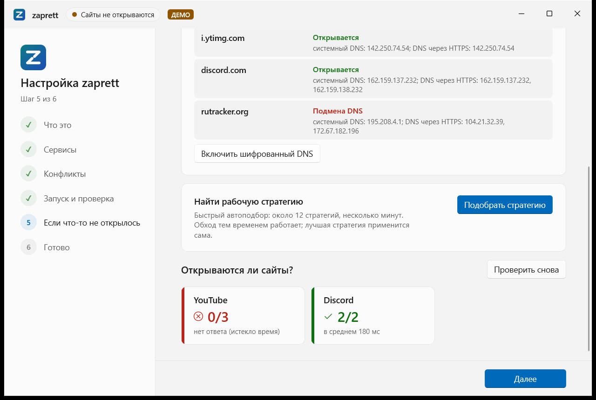</td>
    <td width="33%">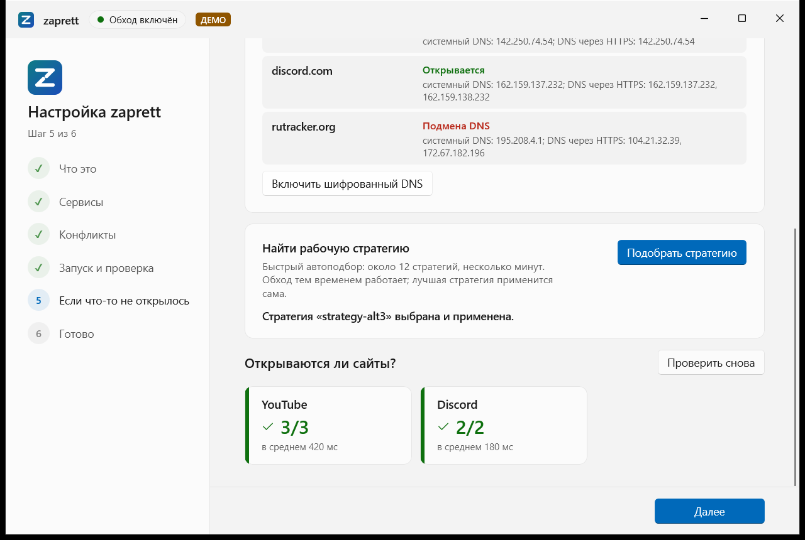</td>
  </tr>
  <tr>
    <td><sub>«Выяснить»: чем блокирует провайдер</sub></td>
    <td><sub>Результат: подмена DNS у одного адреса, YouTube не открылся</sub></td>
    <td><sub>После «Подобрать стратегию»: всё открывается</sub></td>
  </tr>
</table>

### Шаг 6 из 6. Готово

Здесь два переключателя:

- **«Включать обход при запуске Windows»** (рекомендуется) решает, будет ли обход включён после перезагрузки: если он
  включён, обход включится сам с текущими настройками. Работающий сейчас обход этот переключатель не выключает — для
  этого кнопка на главной;
- **«Обновлять стратегии и списки из репозитория ежедневно»** (по умолчанию включён) — раз в сутки zaprett обращается к
  GitHub, репозиторий CherretGit/zaprett-repo, и обновляет установленные из него стратегии и списки. Тот же
  переключатель есть в «Настройки» → «Обновления».

Нажмите **«Готово»**.


## 7. Главная страница

Большая кнопка включает и выключает обход **прямо сейчас**. Рядом — состояние, текущая стратегия, движок, время
работы и число обработанных пакетов. Ниже:

- **«Открываются ли сайты?»** и кнопка **«Проверить сейчас»** — проверка адресов включённых сервисов через работающий
  обход; для каждого сервиса видно, сколько адресов открылось и за какое время;
- **«Монитор доступности»** — история проверок по расписанию (зелёный — сайты открылись, красный — открылось меньше
  половины, серый — нечего проверять);
- **«Что обрабатывается»** — режим списков и ссылки на сервисы, списки и стратегии;
- предупреждения, если что-то требует внимания (например, «DNS-запросы идут без шифрования»), с кнопкой перехода туда,
  где это исправляется.


**Состояния обхода.** Цвет карточки и надпись в заголовке окна подсказывают, всё ли в порядке:

<table>
  <tr>
    <td width="50%"></td>
    <td width="50%">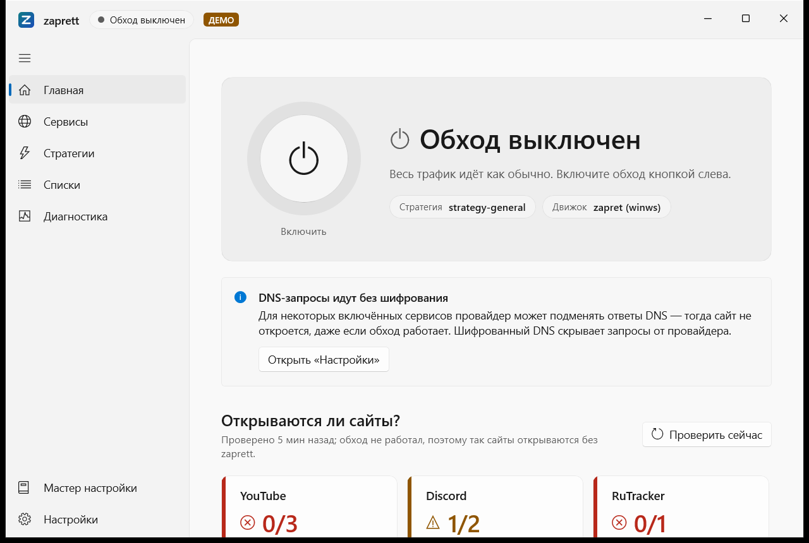</td>
  </tr>
  <tr>
    <td><b>Обход работает.</b> Сайты из включённых списков открываются, остальной трафик идёт как обычно.</td>
    <td><b>Обход выключен.</b> Весь трафик идёт как обычно; включить — большой кнопкой.</td>
  </tr>
  <tr>
    <td>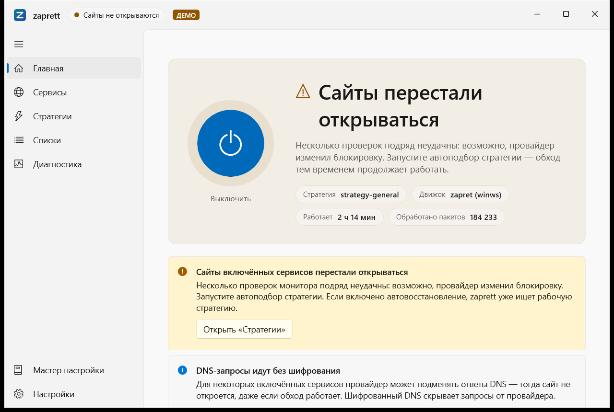</td>
    <td>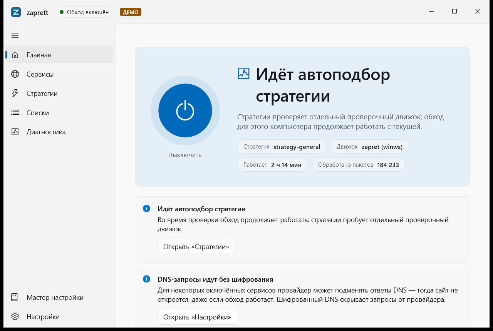</td>
  </tr>
  <tr>
    <td><b>Сайты перестали открываться.</b> Несколько проверок монитора подряд неудачны — вероятно, провайдер изменил блокировку. Запустите автоподбор (или включите «Восстанавливать автоматически»).</td>
    <td><b>Идёт автоподбор стратегии.</b> Стратегии пробует отдельный проверочный движок, обход этого компьютера продолжает работать.</td>
  </tr>
  <tr>
    <td>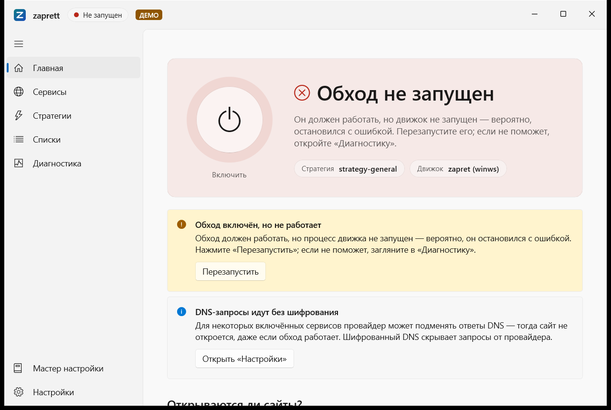</td>
    <td>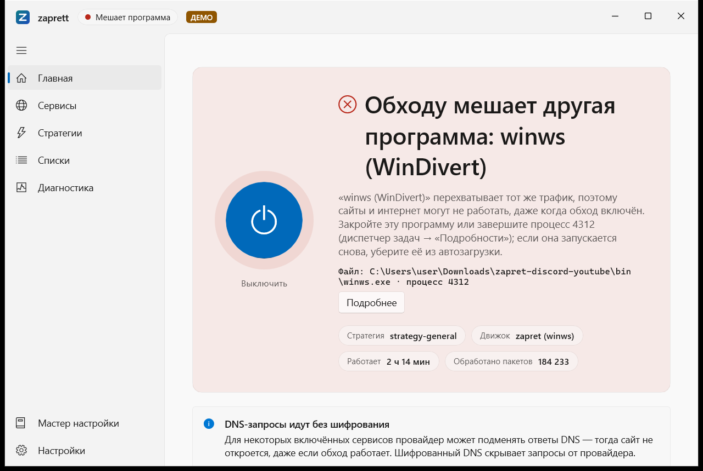</td>
  </tr>
  <tr>
    <td><b>Обход не запущен.</b> Обход должен работать, но движок остановился с ошибкой. Нажмите «Перезапустить»; если не поможет — откройте «Диагностику».</td>
    <td><b>Обходу мешает другая программа.</b> zaprett показывает, какая программа (файл, процесс или служба), и как её остановить; кнопка «Подробнее» ведёт в «Диагностику».</td>
  </tr>
</table>

Ещё два состояния: **«Ищем рабочую стратегию»** — монитор заметил сбой и сам запустил быстрый автоподбор (если включено
«Восстанавливать автоматически»); **«Обход ждёт выбранную сеть»** — обход включён только для выбранных сетей Wi-Fi и
заработает сам, когда компьютер к одной из них подключится.

Если не отвечает сама служба Windows, вместо страниц появляется экран **«Служба zaprett не запущена»** с кнопкой
**«Запустить службу»** (Windows попросит подтверждение администратора):

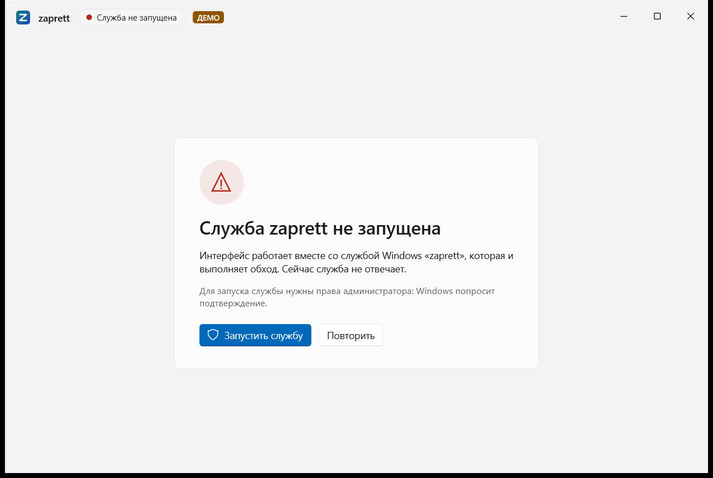

## 8. Сервисы

Тот же выбор сервисов, что в мастере: отметьте нужные и нажмите **«Применить»**. zaprett включит готовые списки сайтов
этих сервисов и обязательные исключения (госуслуги, банки). У каждого сервиса видно:

- пометку **«Помогает»**, **«Помогает частично»** или **«Не поможет»**;
- **«Набор списков:»** — «Основной» или «Расширенный» (у Discord есть ещё «С голосовыми серверами»);
- **«Включает:»** — какие списки и подписки будут включены, и **нагрузку**: лёгкую или тяжёлую (большим спискам движку
  нужно больше памяти);
- раскрывающийся блок **«Чего ждать»** — что заработает, а что нет.


<details>
<summary><b>Ещё снимки страницы «Сервисы»</b></summary>

<table>
  <tr>
    <td width="33%">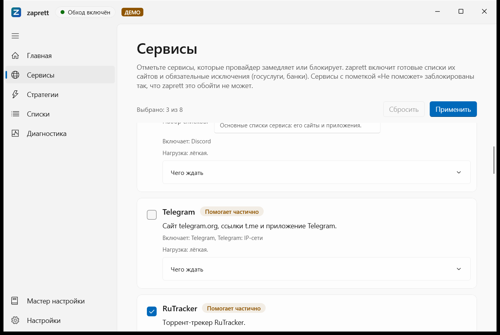</td>
    <td width="33%">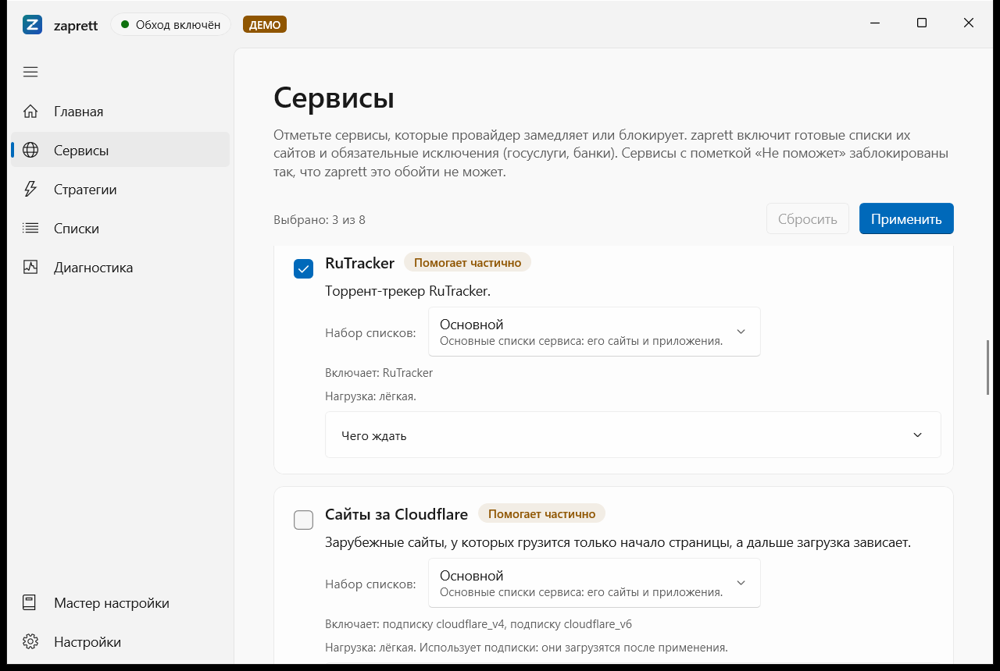</td>
    <td width="33%">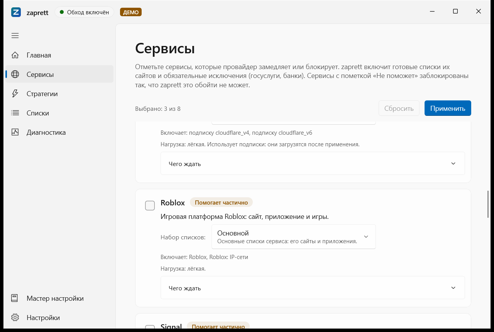</td>
  </tr>
</table>

</details>

**Какие сервисы есть** (идентификаторы пригодятся для [тихой установки](#16-для-администраторов-тихая-установка) и
[командной строки](#17-командная-строка-zaprettexe)):

| Пометка | Сервисы |
|---|---|
| Помогает | YouTube (`youtube`), Discord (`discord`) |
| Помогает частично | Telegram (`telegram`), RuTracker (`rutracker`), сайты за Cloudflare (`cloudflare`), Roblox (`roblox`), Signal (`signal`), прочие заблокированные сайты (`rkn_full`) |
| Не поможет | WhatsApp, Instagram и Facebook, X (Twitter), ChatGPT и Claude, Spotify — они заблокированы по адресу или сами закрыли доступ; в списке они стоят последними, и отметить их нельзя |

## 9. Стратегии и автоподбор

Стратегия — набор приёмов, которые скрывают имя сайта от оборудования провайдера. Разным провайдерам нужны разные
стратегии.

**Автоподбор** по очереди пробует стратегии на проверочных адресах включённых сервисов и показывает таблицу: сколько
адресов открылось с каждой стратегией и за какое время.

- **«Быстрый»** — около 12 проверенных стратегий, несколько минут; **«Полный»** — все установленные, может занять
  10–20 минут.
- **«Применить лучшую, если она лучше текущей»** — применить результат автоматически. Иначе выберите стратегию сами
  кнопкой **«Применить»** в строке таблицы или **«Применить лучшую»**.
- **Обход во время подбора не прерывается:** кандидатов проверяет отдельный проверочный движок, а ваш обход продолжает
  работать с прежней стратегией. Флажок **«Подбор с остановкой обхода»** — прежний способ, при котором обход на время
  проверки выключается; включайте его, только если обычный подбор не работает.
- **«Остановить»** прерывает подбор; прежняя стратегия остаётся.
- Если найдена мешающая программа, zaprett предупредит: результаты подбора при ней будут неверными.

<table>
  <tr>
    <td width="50%">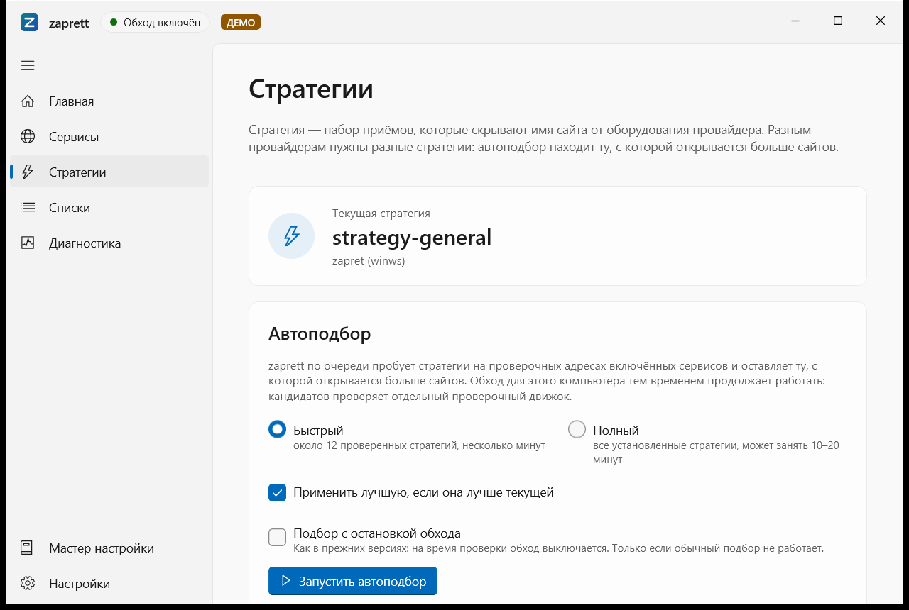</td>
    <td width="50%"></td>
  </tr>
  <tr>
    <td><sub>Текущая стратегия и запуск автоподбора</sub></td>
    <td><sub>Результаты: сколько адресов открылось и за какое время</sub></td>
  </tr>
</table>

**Свои стратегии.** Ниже — список **«Установленные»**: любую стратегию можно открыть, посмотреть и
**«Сделать текущей»**. Кнопка **«Новая»** создаёт свою стратегию (имя начинается с `user-`). Текст показывается с
подсветкой (фильтры, параметры, подстановки, `--new`); **«Сохранить и проверить»** сразу спрашивает движок, принимает
ли он стратегию, и показывает обрабатываемые порты и итоговые аргументы движка.

<details>
<summary><b>Снимки: автоподбор в работе и редактор стратегий</b></summary>

<table>
  <tr>
    <td width="33%">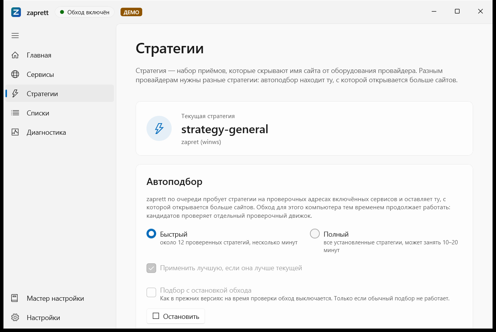</td>
    <td width="33%">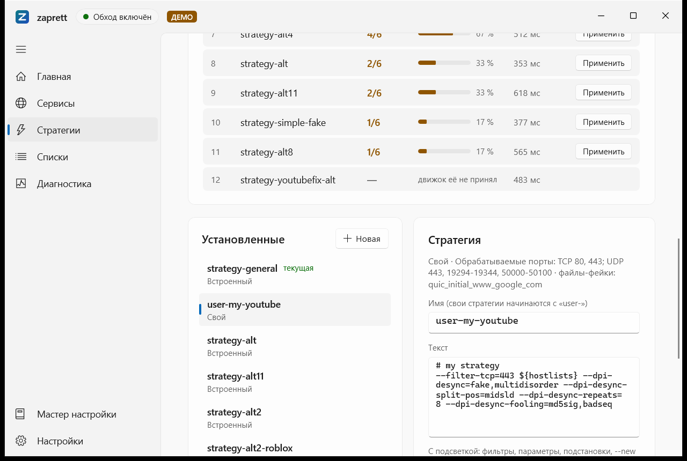</td>
    <td width="33%">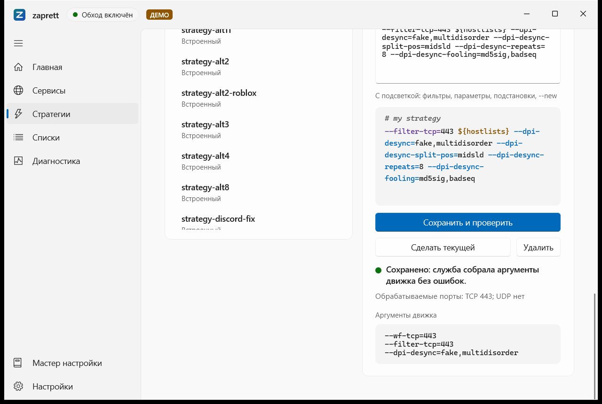</td>
  </tr>
</table>

</details>

## 10. Списки

**«Какие сайты обрабатываются»:**

- **«Только сайты из включённых списков (рекомендуется)»** — всё остальное идёт как обычно, банки, игры и другие
  программы не затрагиваются;
- **«Все сайты, кроме исключений»** — помогает с сайтами, которых нет ни в одном списке, но может ломаться больше
  сайтов; такие сайты добавляйте в исключения.

Вкладки:

| Вкладка | Что там |
|---|---|
| **Домены** | встроенные списки имён сайтов; сайт обрабатывается, если его имя или родительский домен есть во включённом списке |
| **IP-сети** | списки адресов для приложений, которые подключаются без имени сайта (Telegram, голосовые чаты, игры) |
| **Исключения** | сайты и сети, которые не обрабатываются никогда: госуслуги, банки, локальные сети |
| **Свои списки** | «Мои сайты», «Мои исключения сайтов», «Мои IP-сети», «Мои исключения IP-сетей»: по одной записи в строке, `#` — комментарий, есть **«Импорт из файла…»** и **«Экспорт в файл…»** |
| **Подписки** | внешние списки по https-ссылке, которые zaprett сам загружает и обновляет: **«Обновить сейчас»**, **«Новая подписка»** (имя, адрес, флажок «В списке IP-сети, а не имена сайтов») |

<table>
  <tr>
    <td width="33%">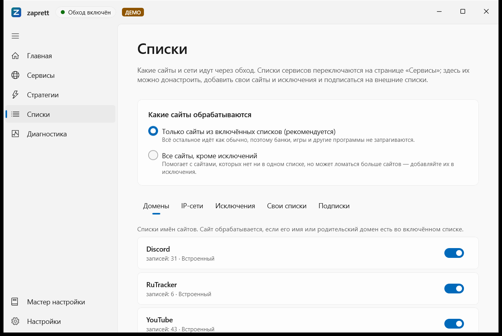</td>
    <td width="33%"></td>
    <td width="33%"></td>
  </tr>
  <tr>
    <td><sub>Режим и встроенные списки</sub></td>
    <td><sub>Свои списки</sub></td>
    <td><sub>Подписки</sub></td>
  </tr>
</table>

> [!TIP]
> Большие реестры заблокированных сайтов помогают со многими сайтами сразу, но многие сайты из них заблокированы по
> адресу, а с этим zaprett не справится. Для одного-двух нужных сайтов проще добавить их в «Мои сайты».

## 11. Диагностика

- **«Чем блокирует провайдер»** → **«Выяснить»**: zaprett открывает проверочные адреса включённых сервисов, сравнивает
  ответы системного DNS с DNS через HTTPS и для каждого адреса показывает результат: **открывается**, **подмена DNS**,
  **блокировка по IP-адресу**, **блокировка по имени сайта (TLS)**, **замедление**, **страница-заглушка провайдера** — и
  вывод, что поможет: стратегия, шифрованный DNS или только VPN. При подмене DNS рядом появится кнопка
  **«Включить шифрованный DNS»** (Windows 11).
- **«Конфликтующие программы»** — те же проверки, что в мастере, кнопка **«Проверить снова»**.
- **«Проверка настроек»** → **«Проверить»**: движок проверяет текущие настройки, ничего не перезапуская, и показывает
  обрабатываемые порты, вывод и аргументы движка.
- **«Журнал»** службы и движка; **«Подробный журнал движка»** — для разбора сложных случаев (сам выключается через
  30 минут: он замедляет движок).
- **«Диагностический отчёт»** — версии, состояние, конфликты, последняя проверка и журнал, чтобы скопировать или
  сохранить в файл и приложить к вопросу. Параметры в адресах подписок из отчёта убираются.


<details>
<summary><b>Ещё снимки страницы «Диагностика»</b></summary>

<table>
  <tr>
    <td width="33%">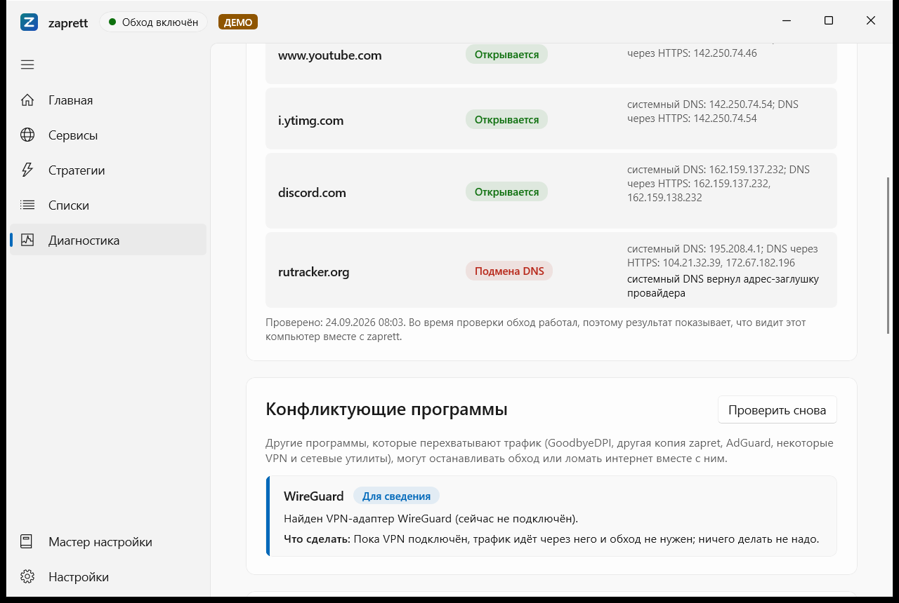</td>
    <td width="33%">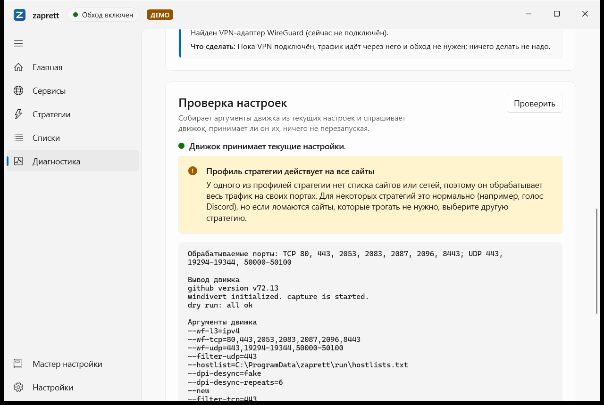</td>
    <td width="33%">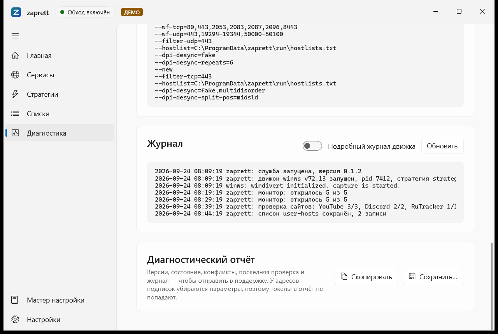</td>
  </tr>
</table>

</details>

## 12. Настройки

| Группа | Что там |
|---|---|
| **Обход** | **«Включать обход при запуске Windows»** — только то, что будет после перезагрузки; сейчас обход включается и выключается кнопкой на главной. **«Показывать значок zaprett при входе в Windows»** — значок в области уведомлений сразу после входа; обход работает и без него. **«Движок»** — zapret (winws) подходит большинству провайдеров, у zapret2 (winws2) свой набор встроенных стратегий. **«Сторож»** — перезапускает движок, если он неожиданно остановился. **«Обрабатывать IPv6»** — если провайдер даёт IPv6. |
| **DNS, QUIC и игры** | **«Шифрованный DNS»** (DNS через HTTPS — **только Windows 11**; в Windows 10 в этой версии недоступен). **«Блокировать QUIC»** — помогает, когда YouTube работает в одном браузере и не работает в другом. **«Игровой фильтр»** с портами TCP/UDP — дополнительное правило для игровых серверов из включённых списков IP-сетей. |
| **Сети** | **«Где работает обход»**: во всех сетях или только в выбранных сетях Wi-Fi (например, только дома). **«Не работать в корпоративной сети»** — в доменной (офисной) сети обход сам отключается. **Монитор доступности**: «Проверять сайты по расписанию», «Как часто», «Неудачных проверок до предупреждения», «Восстанавливать автоматически» (быстрый автоподбор, когда сайты перестали открываться, не чаще раза в 6 часов). |
| **Обновления** | **«Обновлять стратегии и списки из репозитория ежедневно»** — раз в сутки zaprett обращается к GitHub, репозиторий CherretGit/zaprett-repo, и обновляет установленные из него стратегии и списки; если выключить, они останутся как есть до ручного обновления (по умолчанию включено). **«Как обновить zaprett»** — пояснение, что автообновление программы появится в следующих версиях, и кнопка **«Открыть страницу релизов»**; как обновиться — [раздел 15](#15-обновление-и-удаление). |
| **Интерфейс** | **«Язык»** (русский, английский, китайский — служба и командная строка говорят на том же языке), **«Тема»** (светлая, тёмная, как в Windows), **«Уведомления»**, **«При закрытии оставаться в области уведомлений»**, **«Мастер настройки»**. |

> [!NOTE]
> **Автозапуск и кнопка на главной — разные вещи.** «Включать обход при запуске Windows» решает только, что будет
> после загрузки Windows. Включить или выключить обход сейчас — кнопкой на главной или в меню значка.
>
> **Быстрый запуск Windows.** Если в Windows включён быстрый запуск (так по умолчанию в Windows 10 и 11),
> «Завершение работы» — не полная загрузка: после включения компьютера обход продолжает работу в том же состоянии,
> что до выключения, а настройка автозапуска применится при следующей **перезагрузке**. Перезапуск службы
> (обновление, исправление) тоже не меняет состояние обхода.

<table>
  <tr>
    <td width="50%"></td>
    <td width="50%">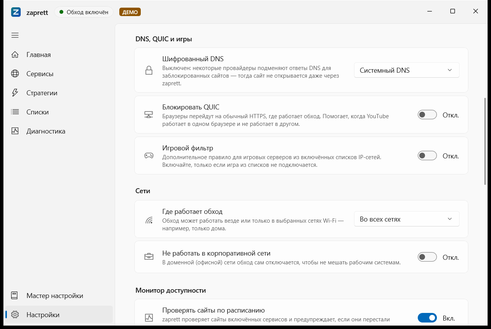</td>
  </tr>
  <tr>
    <td>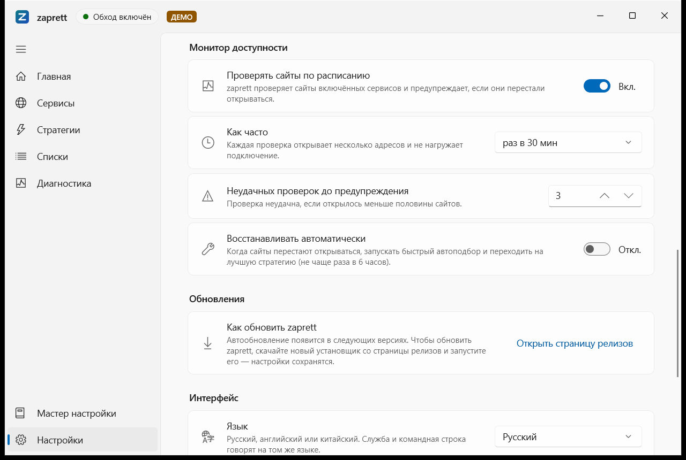</td>
    <td></td>
  </tr>
</table>

**Тёмная тема** включается в «Настройки» → «Тема» (или следует теме Windows):

<table>
  <tr>
    <td width="50%"></td>
    <td width="50%">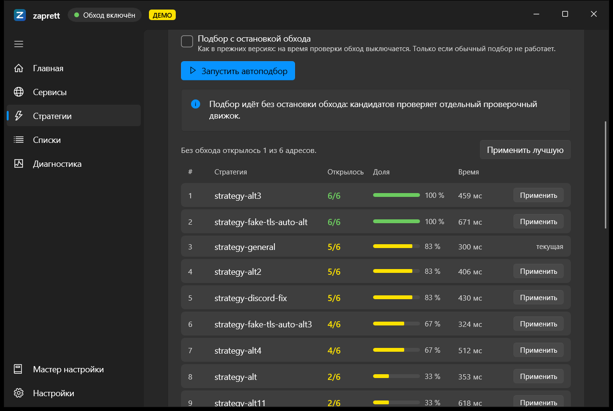</td>
  </tr>
  <tr>
    <td>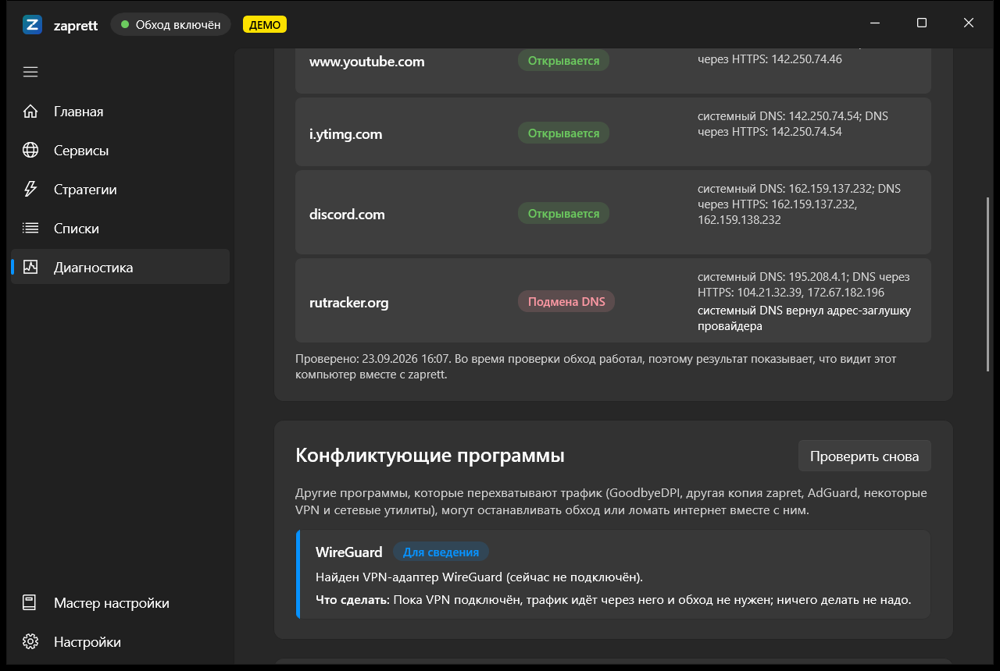</td>
    <td>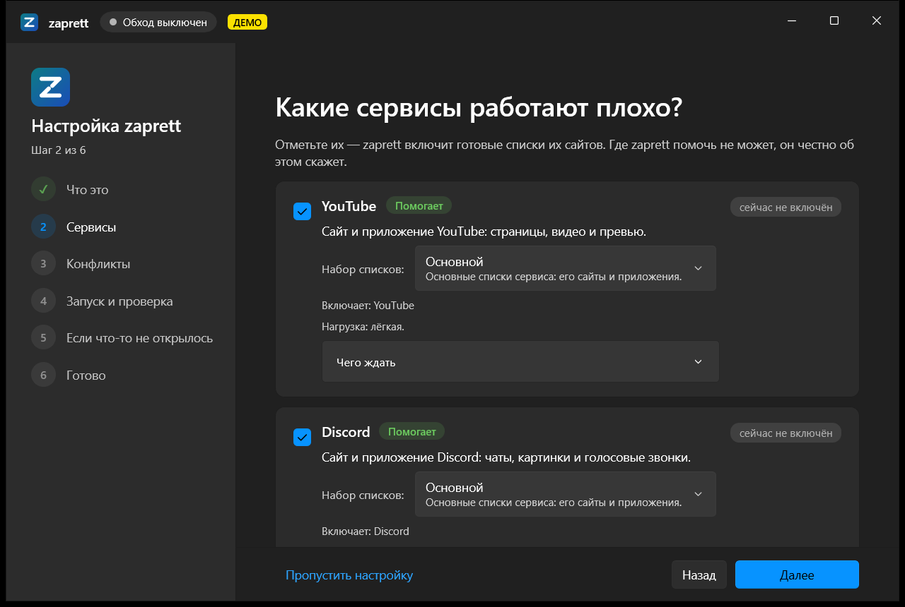</td>
  </tr>
</table>

## 13. Значок в области уведомлений

Значок zaprett рядом с часами меняет вид по состоянию обхода: включён, выключен, требует внимания, ошибка.

- **Щелчок** — открыть окно zaprett.
- **Правый щелчок** — меню: **«Включить обход»** / **«Выключить обход»**, **«Проверить сайты сейчас»** (результат
  придёт уведомлением), **«Открыть zaprett»**, **«Закрыть интерфейс (служба продолжит работу)»**.

Закрытие окна или интерфейса обход **не выключает**: его выполняет служба Windows. Выключить обход можно кнопкой на
главной странице или в меню значка. Появится ли значок при входе в Windows, решает флажок при установке; позже это
меняется в «Настройки» → «Показывать значок zaprett при входе в Windows».

Уведомления Windows приходят, когда сайты перестали открываться и когда zaprett сам заменил стратегию (их можно
выключить в «Настройки» → «Уведомления»).

## 14. Кто может управлять обходом

Смотреть состояние может любой пользователь компьютера. Менять настройки, включать и выключать обход —
**администраторы** и участники локальной группы **«zaprett Operators»**. В группу автоматически попадает пользователь,
установивший программу.

Остальные пользователи видят интерфейс в режиме **«Только просмотр»**: вверху окна — пояснение, элементы управления
неактивны. Язык и тема интерфейса сохраняются для каждого пользователя отдельно, их можно менять и в этом режиме.

Добавить другого пользователя в группу (из командной строки администратора):

```powershell
net localgroup "zaprett Operators" ИмяПользователя /add
```

Права вступают в силу **со следующего входа в Windows**: после добавления в группу выйдите из системы и войдите снова.
Это же относится к пользователю, который только что установил zaprett.

## 15. Обновление и удаление

**Что нового в 0.1.3:**

- новый файл **`zaprett-0.1.3-x64-setup.exe`** — рекомендуемый способ установки. Внутри тот же MSI; разрешение
  администратора Windows спрашивает сразу после двойного щелчка, а если окно запроса отклонено или закрыто — объясняет,
  что произошло, и предлагает повторить. Файл `.msi` по-прежнему в выпуске — для администраторов;
- флажок **«Создать ярлык zaprett на рабочем столе»** на странице «Перед установкой» (включён по умолчанию). Выбор
  запоминается при обновлении и исправлении; при обновлении с 0.1.0–0.1.2 флажок тоже включён, и его можно снять —
  тогда ярлык будет удалён. При удалении программы ярлык удаляется;
- на странице «Готово к установке» установщик подсказывает, что в окне Windows нужно нажать «Да» (или щёлкнуть
  мигающий значок щита на панели задач), а на странице «установка прервана» — вероятную причину и что сделать.

**Что было в 0.1.2:**

- переключатель **«Обновлять стратегии и списки из репозитория ежедневно»** в «Настройки» → «Обновления» и на последнем
  шаге мастера — ежедневное обновление каталога теперь выключается в интерфейсе;
- если внеочередная проверка монитора доступности откладывается (движок не работает, ждёт выбранную сеть или идёт
  другая фоновая задача), об этом появляется одна запись в журнале;
- значок в области уведомлений надёжнее появляется сразу после запуска;
- обновление с 0.1.1 проходит без перезагрузки: служба, обход и значок в области уведомлений работают сразу
  после установки.

**Обновление.** Автообновления программы в версии 0.1.3 нет — оно появится в следующих версиях. Чтобы обновиться,
скачайте новый установщик (`setup.exe` или MSI) со страницы
[Releases](https://github.com/RomanKern89/zaprett-openwrt/releases) (в программе её
открывает кнопка **«Настройки» → «Открыть страницу релизов»**) и запустите его поверх установленного: старая версия
заменится, **настройки, свои списки и стратегии, выбор значка при входе сохранятся**. Так же ставится 0.1.3 поверх
0.1.2, 0.1.1 и 0.1.0. Поставить более старую версию
поверх новой нельзя.

**Удаление.** «Параметры» → «Приложения» → **zaprett** → «Удалить» (или «Панель управления» → «Программы и
компоненты»). Установщик остановит службу и движок, выгрузит драйвер WinDivert (если он загружен именно копией
zaprett — чужой драйвер не трогается; перезагрузка не нужна), удалит правила брандмауэра zaprett, группу
«zaprett Operators», значок при входе, ярлыки в меню «Пуск» и на рабочем столе, сохранённую копию установщика и вернёт DNS-серверы адаптеров, если
zaprett их менял.

Настройки и списки в `C:\ProgramData\zaprett` при обычном удалении **остаются** — на случай повторной установки.
Удалить и их (из командной строки администратора):

```powershell
msiexec /x zaprett-0.1.3-x64.msi REMOVEDATA=1
```

## 16. Для администраторов: тихая установка

Все команды — из командной строки администратора.

```powershell
# тихая установка: включить YouTube и Discord и сразу включить обход, журнал установки в файл
msiexec /i zaprett-0.1.3-x64.msi /qn SERVICES=youtube,discord AUTOSTART=1 LANG=ru /l*v install.log

# то же через setup.exe: параметры передаются msiexec без изменений, код возврата — код msiexec
.\zaprett-0.1.3-x64-setup.exe /qn SERVICES=youtube,discord AUTOSTART=1 LANG=ru /l*v install.log

# без значка в области уведомлений при входе пользователей
msiexec /i zaprett-0.1.3-x64.msi /qn TRAYAUTOSTART=0

# без ярлыка на рабочем столе
msiexec /i zaprett-0.1.3-x64.msi /qn DESKTOPSHORTCUT=0

# своя папка установки
msiexec /i zaprett-0.1.3-x64.msi /qn INSTALLFOLDER="D:\Apps\zaprett"

# китайский установщик и китайский язык программы (английский — TRANSFORMS=:1033 LANG=en)
msiexec /i zaprett-0.1.3-x64.msi TRANSFORMS=:2052 LANG=zh-CN

# тихое удаление вместе с настройками и списками
msiexec /x zaprett-0.1.3-x64.msi /qn REMOVEDATA=1
```

Для развёртывания через групповые политики используйте `.msi`; `setup.exe` удобен в сценариях и для ручного запуска.

| Свойство | Значение |
|---|---|
| `SERVICES` | сервисы через запятую, как в мастере: `youtube`, `discord`, `telegram`, `rutracker`, `cloudflare`, `roblox`, `signal`, `rkn_full`; набор списков — через двоеточие, например `discord:full` |
| `AUTOSTART` | `1` — включить обход сразу и при каждом запуске Windows; по умолчанию `0` |
| `LANG` | язык программы: `ru`, `en` или `zh-CN`; по умолчанию — язык установщика (`ru`, при `TRANSFORMS=:1033` — `en`, при `:2052` — `zh-CN`). Язык самого установщика задаёт `TRANSFORMS=:1033` (английский) или `TRANSFORMS=:2052` (китайский) — указывайте его вместе с `LANG` |
| `TRAYAUTOSTART` | `0` — не показывать значок при входе пользователей; по умолчанию `1` |
| `DESKTOPSHORTCUT` | `0` — не создавать ярлык zaprett на рабочем столе всех пользователей; по умолчанию `1` |
| `INSTALLFOLDER` | папка установки; по умолчанию `C:\Program Files\zaprett` |
| `REMOVEDATA` | при удалении: `1` — удалить и `C:\ProgramData\zaprett` |

`SERVICES`, `AUTOSTART` и `LANG` применяются только при **первой** установке, а `TRAYAUTOSTART` запоминается при
первой установке: при обновлении настройки пользователя не меняются. `DESKTOPSHORTCUT` запоминается при установке и
сохраняется при обновлении и исправлении; указанный явно, он меняет прежний выбор.

Права на управление обходом — [раздел 14](#14-кто-может-управлять-обходом).

## 17. Командная строка `zaprett.exe`

`zaprett.exe` лежит в папке установки и в `PATH` не добавляется. Вызывайте его полным путём:

```powershell
& "C:\Program Files\zaprett\zaprett.exe" status
```

<details>
<summary><b>Основные команды</b> (полная справка — <code>zaprett.exe help</code>)</summary>

```text
Служба
  status                          состояние
  start | stop | restart          обход сейчас (автозапуск не меняется)
  enable | disable                включить/выключить сейчас и после загрузки Windows
  autostart on|off                включать ли обход после загрузки Windows (сейчас не меняется)
  check                           проверить настройки без запуска

Списки и стратегии
  items [--type <тип>]            установленные элементы
  list enable|disable <id>        включить/выключить список
  strategy set|show <id>          выбрать / показать стратегию
  strategy save <id> < файл       сохранить свою стратегию (имя с user-)
  strategy delete <id>            удалить свою стратегию
  user get <id> | user set <id> < файл   свой список
  mode whitelist|blacklist        режим списков
  engine winws|winws2             движок

Каталог и подписки
  repo fetch | repo list | repo install <id>... | repo remove <id> | repo upgrade [--all | <id>...]
  sources list | sources update [<имя>...] | sources save <имя> < json | sources delete <имя> | sources defaults

Быстрая настройка и автоподбор
  presets | wizard apply <сервис>[:<набор>]...
  test start [--strategies id,id] [--quick] [--apply-if-better] [--exclusive]
  test status [--brief] | test stop | test apply <id>

Проверки и монитор
  probe [--services id,id] | probe status     проверить сайты сейчас
  monitor run | monitor status                монитор доступности
  diagnose [--services id,id] | diagnose status   чем блокирует провайдер
  conflicts                       мешающие программы (WinDivert, GoodbyeDPI, VPN, прокси…)
  log [--tail N]                  журнал службы и движка
  page overview|lists|strategies|diagnostics

DNS и настройки
  dns status | dns setup | dns off    шифрованный DNS (Windows 11): состояние / включить / вернуть прежний
  settings get | settings set < json

Фоновые задачи и прочее
  job status | job log [--tail N] | job cancel
  version | diag [--full]
```

</details>

Флаги: `--json` — вывод в JSON, `--quiet` — ничего не печатать при успехе, `--lang ru|en|zh-CN` — язык вывода
(по умолчанию — язык из настроек). Справка — `help`, `--help`, `-h` или `/?`. Коды возврата: `0` — успешно,
`1` — ошибка команды, `2` — неверные аргументы, `3` — служба недоступна. Команды `update check` и `update install`
в версии 0.1.3 отвечают, что обновление программы недоступно ([раздел 15](#15-обновление-и-удаление)).

**Данные через стандартный ввод.** Команды `settings set` и `sources save` принимают JSON-объект, а
`strategy save <id>` и `user set <id>` — текст. В PowerShell:

```powershell
$z = "C:\Program Files\zaprett\zaprett.exe"
'{"main":{"quic_block":true}}' | & $z settings set                    # включить блокировку QUIC
'{"ui":{"language":"en"}}' | & $z settings set                        # сменить язык
Get-Content .\my-strategy.txt -Raw | & $z strategy save user-my        # своя стратегия (имя с user-)
Get-Content .\sites.txt -Raw | & $z user set user-hosts                # список «Мои сайты»
& $z wizard apply youtube discord:full                                 # включить сервисы, как в мастере
& $z test start --quick --apply-if-better                              # быстрый автоподбор
```

Кодировку ввода подбирать не нужно: UTF-8 (с BOM и без), UTF-16 и кодовая страница консоли распознаются сами.
Команды, которые что-то меняют, требуют прав администратора или членства в группе «zaprett Operators».

## 18. Частые вопросы и решение проблем

<details>
<summary><b>Установщик пишет «Работа мастера установки zaprett была прервана», программы нет в «Установке и удалении»</b></summary>

Чаще всего это значит, что Windows спросила разрешение администратора («Разрешить этому приложению вносить изменения
на вашем устройстве?»), а ответа «Да» не получила. При установке из `.msi` это окно появляется после кнопки
**«Установить»** и иногда открывается позади других окон — на панели задач тогда мигает значок щита. Без ответа окно
закрывается само примерно через 2 минуты, и установка завершается без изменений на компьютере.

Что сделать: запустите установку снова и в окне Windows нажмите **«Да»** (если окна не видно — щёлкните мигающий
значок щита на панели задач). Проще всего поставить через **`zaprett-0.1.3-x64-setup.exe`**: он спрашивает разрешение
сразу после запуска, до окон установщика ([раздел 5](#5-установка)).

</details>

<details>
<summary><b>Сайт не открывается, хотя обход включён</b></summary>

1. На главной нажмите **«Проверить сейчас»**.
2. Откройте **«Стратегии»** и запустите автоподбор (**«Быстрый»**, затем при необходимости **«Полный»**). Обход во
   время подбора работает.
3. Если ни одна стратегия не помогла — **«Диагностика» → «Чем блокирует провайдер» → «Выяснить»**. При подмене DNS
   включите шифрованный DNS (Windows 11); при блокировке по IP-адресу zaprett не поможет — нужен VPN.
4. Если сайта нет в списках — добавьте его в **«Списки» → «Свои списки» → «Мои сайты»**.
5. YouTube открывается в одном браузере и не открывается в другом — включите **«Настройки» → «Блокировать QUIC»**.
6. У провайдера есть IPv6, а zaprett предупреждает «IPv6-соединения идут без обхода» — включите
   **«Настройки» → «Обрабатывать IPv6»**.

</details>

<details>
<summary><b>Антивирус ругается на WinDivert или <code>winws.exe</code> или удалил их</b></summary>

Драйвер WinDivert умеет перехватывать трафик, поэтому некоторые антивирусы помечают его как «потенциально опасное
приложение» или «хакерский инструмент». Файлы движка взяты из официального релиза zapret без изменений. Если антивирус
их удалил (zaprett покажет предупреждение «Движок обхода не установлен»), добавьте папку установки
(`C:\Program Files\zaprett`) в исключения антивируса и переустановите zaprett.

</details>

<details>
<summary><b>Обходу мешает другая программа (GoodbyeDPI, zapret, AdGuard…)</b></summary>

Одновременно с zaprett не должны работать **GoodbyeDPI**, другая копия **zapret** и другие программы, использующие свой
WinDivert: два перехватчика мешают друг другу. zaprett находит их сам и показывает на главной, в мастере и в
**«Диагностика» → «Конфликтующие программы»** — с файлом, процессом или службой и советом **«Что сделать:»**.
Обычно нужно остановить программу или её службу (`services.msc` → «Остановить», тип запуска «Отключена»), для
GoodbyeDPI — удалить её службу (`remove_service.cmd`) и перезагрузить компьютер. Мешать могут также AdGuard,
Killer Network Service, Intel Connectivity Network Service, клиент Check Point и SmartByte.

</details>

<details>
<summary><b>У меня включён VPN или системный прокси</b></summary>

Пока VPN подключён, трафик идёт через него, и обход zaprett для этого трафика не нужен; результаты проверок zaprett
при включённом VPN могут отличаться от обычных. Трафик через системный прокси идёт на прокси, а не на сайт, поэтому
обход к нему не применяется. zaprett показывает найденные VPN-адаптеры и прокси в «Конфликтующих программах» с
пометкой «Для сведения». Совместная работа с разными VPN проверялась не полностью.

</details>

<details>
<summary><b>Рабочий ноутбук: не хочу, чтобы zaprett работал в офисе</b></summary>

Включите **«Настройки» → «Сети» → «Не работать в корпоративной сети»**: в доменной (офисной) сети обход сам
отключается, чтобы не мешать рабочим системам. Другой вариант — **«Где работает обход» → «Только в выбранных сетях
Wi-Fi»** и перечислить, например, домашнюю сеть. Если компьютер принадлежит организации, согласуйте установку с её
администратором.

</details>

<details>
<summary><b>«Недостаточно прав: нужны права администратора или членство в группе «zaprett Operators».»</b></summary>

Ваша учётная запись не входит в эту группу — попросите администратора добавить её
([раздел 14](#14-кто-может-управлять-обходом)). Если вас только что добавили или вы только что установили zaprett,
выйдите из Windows и войдите снова.

</details>

<details>
<summary><b>«Служба zaprett не запущена»</b></summary>

Нажмите **«Запустить службу»** в окне zaprett (Windows попросит подтверждение администратора) или запустите службу
«zaprett» в оснастке «Службы» (`services.msc`). Если служба постоянно останавливается, переустановите zaprett.

</details>

<details>
<summary><b>После выключения и включения компьютера обход в другом состоянии, чем я выбрал в автозапуске</b></summary>

Так работает быстрый запуск Windows: «Завершение работы» при нём не полная загрузка, и обход остаётся в том
состоянии, что был до выключения. Настройка «Включать обход при запуске Windows» применится при следующей
**перезагрузке** ([раздел 12](#12-настройки)).

</details>

<details>
<summary><b>Как передать сведения для разбора проблемы</b></summary>

**«Диагностика» → «Диагностический отчёт»** → скопировать или сохранить в файл. Журнал службы также лежит в
`C:\ProgramData\zaprett\logs\zaprett.log`. Сам отчёт никуда не отправляется — вы решаете, кому его передать.

</details>

## 19. Приватность

- zaprett **ничего не отправляет** о вас и о компьютере: нет телеметрии, учётных записей и регистрации.
- Служба zaprett сама выходит в сеть только для следующего:
  - **проверка сайтов** — открывает проверочные адреса включённых сервисов: по кнопке «Проверить сейчас», при
    автоподборе, при диагностике и по расписанию, если включён монитор доступности (по умолчанию включён, раз в
    30 минут; выключается в «Настройки» → «Проверять сайты по расписанию»);
  - **диагностика** «Чем блокирует провайдер» дополнительно узнаёт адреса проверочных сайтов через публичный DNS через
    HTTPS (`dns.google`, при неудаче — `cloudflare-dns.com`), чтобы сравнить их с ответом DNS провайдера;
  - **подписки** — загружает только те внешние списки, которые включены (вами или выбранным сервисом; по умолчанию
    все выключены);
  - **каталог стратегий и списков** — раз в сутки (около 4:00) служба загружает с GitHub каталог
    [zaprett-repo](https://github.com/CherretGit/zaprett-repo) и обновляет установленные из него элементы. Это
    выключается переключателем **«Обновлять стратегии и списки из репозитория ежедневно»** в «Настройки» →
    «Обновления» или на последнем шаге мастера (из командной строки —
    `'{"repo":{"autoupdate":false}}' | zaprett.exe settings set`).
- Если вы включили **шифрованный DNS**, DNS-запросы компьютера идут на DNS через HTTPS Cloudflare вместо DNS провайдера.
- Проверку обновлений самой программы версия 0.1.3 не выполняет.
- В диагностическом отчёте у адресов подписок убираются параметры, поэтому токены в отчёт не попадают. Отчёт никуда
  не отправляется сам.

## 20. Что проверено и ограничения

**Проверено** на чистых системах: **Windows 10 LTSC 2021 (сборка 19044)** и **Windows 11 24H2** — установка из одного
MSI без дополнительных компонентов, мастер настройки, работа обхода, изолированный автоподбор (основной обход не
перезапускается), удаление.

Установщик 0.1.3 на тех же системах: `setup.exe` — окно разрешения Windows сразу после запуска, отказ с понятным
окном «Повтор / Отмена» и повторный запрос, первая установка с нуля (программа запускается без прав администратора),
обновление с 0.1.2 при работающих программе и значке, ярлык на рабочем столе (создаётся, снимается при обновлении с
`DESKTOPSHORTCUT=0`, выбор сохраняется при следующем обновлении, удаляется вместе с программой), тихая установка через
`setup.exe` с передачей параметров и кода возврата; `.msi` — подсказки на страницах «Готово к установке» и «прервана».

**Ограничения версии 0.1.3:**

- установщик (и `zaprett-0.1.3-x64-setup.exe`, и `zaprett-0.1.3-x64.msi`) пока не подписан сертификатом разработчика
  кода — SmartScreen покажет предупреждение, а окно разрешения Windows — «неизвестный издатель» ([раздел 5](#5-установка));
- автообновления программы пока нет — новую версию ставьте новым установщиком ([раздел 15](#15-обновление-и-удаление));
- шифрованный DNS из zaprett включается только в Windows 11;
- только x64; ARM64, Windows 7/8.1 не поддерживаются;
- нет фильтра по программам: обход работает для сайтов из списков, какой бы программой они ни открывались;
- трафик, раздаваемый этим компьютером другим устройствам, не обрабатывается;
- совместная работа с разными VPN и антивирусами проверялась не полностью.

Сборка из исходников и выпуск — [docs/BUILD-WIN.md](docs/BUILD-WIN.md); устройство программы —
[docs/ARCHITECTURE-WIN.md](docs/ARCHITECTURE-WIN.md).

## Благодарности и лицензии

- [bol-van/zapret](https://github.com/bol-van/zapret) и [bol-van/zapret2](https://github.com/bol-van/zapret2) —
  движки `winws` и `winws2`;
- [WinDivert](https://github.com/basil00/WinDivert) — драйвер перехвата пакетов (LGPL v3 / GPL v2);
- [CherretGit/zaprett-app](https://github.com/CherretGit/zaprett-app) — оригинальный менеджер и модель стратегий и
  списков; стратегии и списки — см. [корневой README](../README.md#благодарности-и-лицензии).

Код zaprett — лицензия MIT ([LICENSE](../LICENSE)).
