# zaprett для Windows (бета)

[English](README.en.md) · [简体中文](README.zh-CN.md) · [zaprett для роутеров OpenWrt](../README.md)

Обход замедлений и блокировок по DPI на компьютере с Windows: то же, что делает
[zaprett для OpenWrt](../README.md) на роутере, но для одного ПК. Внутри — движок
[zapret](https://github.com/bol-van/zapret) (`winws`) с драйвером WinDivert, готовые списки сайтов и стратегии,
мастер первой настройки, проверка сайтов, автоподбор стратегии, монитор и диагностика. Интерфейс — на русском,
английском и упрощённом китайском.

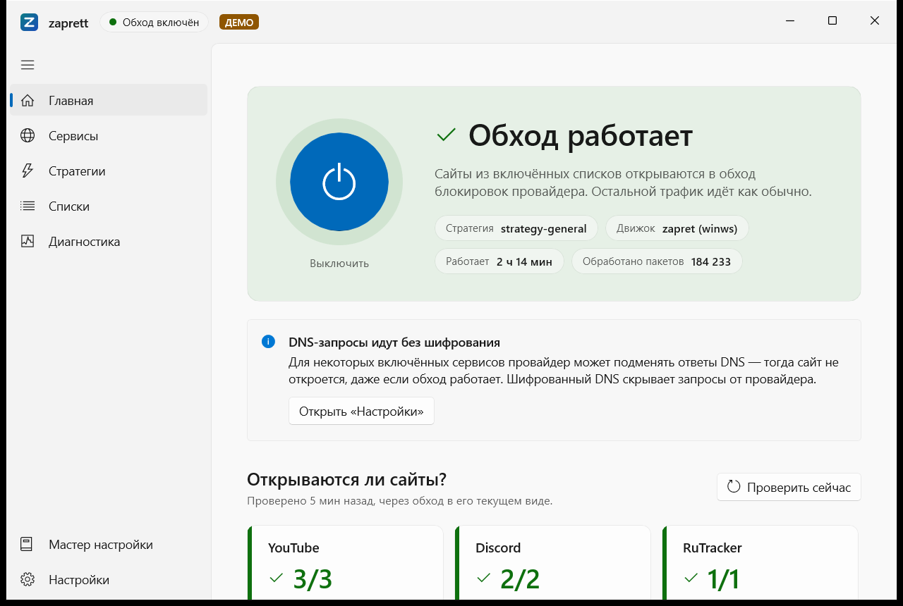

> **Версия 0.1.1 — бета.** Установщик (MSI) не подписан сертификатом разработчика кода, поэтому Windows при запуске
> покажет предупреждение SmartScreen — ниже написано, как проверить файл и что нажать.
>
> Снимки экрана в этом руководстве сделаны в демонстрационном режиме интерфейса (пометка «ДЕМО» рядом с названием):
> цифры на них примерные, у вас будут свои.

---

## Содержание

1. [Что это и чем это не является](#1-что-это-и-чем-это-не-является)
2. [Требования](#2-требования)
3. [Скачивание и проверка файла](#3-скачивание-и-проверка-файла)
4. [Установка](#4-установка)
5. [Первый запуск: мастер настройки](#5-первый-запуск-мастер-настройки)
6. [Страницы приложения](#6-страницы-приложения)
7. [Значок в области уведомлений](#7-значок-в-области-уведомлений)
8. [Обновление и удаление](#8-обновление-и-удаление)
9. [Для администраторов: тихая установка](#9-для-администраторов-тихая-установка)
10. [Командная строка `zaprett.exe`](#10-командная-строка-zaprettexe)
11. [Частые проблемы](#11-частые-проблемы)
12. [Приватность](#12-приватность)
13. [Что проверено и известные ограничения](#13-что-проверено-и-известные-ограничения)

---

## 1. Что это и чем это не является

Провайдерское оборудование DPI читает имя сайта из первых пакетов соединения и по нему замедляет или обрывает
соединение. zaprett меняет **только первые пакеты соединений с выбранными сайтами** так, что оборудование провайдера
не может распознать имя, а сам сайт — может. Весь остальной трафик идёт как обычно.

**Что zaprett делает:**

- открывает сайты и приложения, которые провайдер замедляет или блокирует анализом трафика (DPI): YouTube, Discord
  и другие;
- работает только для выбранных вами сервисов; госуслуги, банки и другие обязательные исключения не затрагиваются;
- сам проверяет, открываются ли сайты, и подбирает стратегию, которая работает у вашего провайдера.

**Чем zaprett не является:**

- **это не VPN и не прокси.** Ваш IP-адрес не меняется, трафик никуда не перенаправляется. Сервисы, которые сами
  закрыли доступ для вашей страны, останутся закрытыми;
- zaprett **не помогает** против блокировки по IP-адресу (для таких сайтов нужен VPN) и против одной только подмены
  DNS (от неё помогает шифрованный DNS — в Windows 11 он включается из zaprett);
- zaprett **не разблокирует трафик других устройств**, которым этот компьютер раздаёт интернет (точка доступа,
  общий доступ к подключению). Чтобы обход работал для всех устройств дома, используйте
  [zaprett для роутера с OpenWrt](../README.md).

## 2. Требования

| Что | Требование |
|---|---|
| Система | Windows 10 версии 2004 (сборка 19041) и новее, включая **Windows 10 LTSC 2021**; Windows 11 |
| Разрядность | только x64 (64-разрядная Windows на процессорах Intel/AMD); ARM64 не поддерживается |
| Права | права администратора — **только для установки и удаления**; пользоваться программой можно без них (раздел 11) |
| Файл установщика | один MSI около 55 МБ |

**Отдельно ставить ничего не нужно** — всё внутри MSI:

- среда .NET 10 и Windows App SDK (интерфейс WinUI 3) — встроены в программу;
- библиотеки Visual C++ (Visual C++ Redistributable) не нужны;
- движок `winws` (zapret v72.13) и драйвер WinDivert — в комплекте, файлы взяты из официального релиза zapret без
  изменений, их контрольные суммы сверяются при сборке;
- второй движок `winws2` (zapret2 1.0.5.2) ставится по умолчанию, переключается в «Настройках».

## 3. Скачивание и проверка файла

1. Откройте раздел [Releases](https://github.com/RomanKern89/zaprett-openwrt/releases) и найдите выпуск
   **zaprett для Windows 0.1.1** (тег `win-v0.1.1`). Выпуски для роутеров называются иначе (теги `v1.1.0-r1` и т. п.).
2. Скачайте `zaprett-0.1.1-x64.msi` и файл `SHA256SUMS`.
3. Проверьте, что файл не повреждён и не подменён. Откройте PowerShell в папке загрузок и выполните:

   ```powershell
   Get-FileHash .\zaprett-0.1.1-x64.msi -Algorithm SHA256
   ```

   Строка `Hash` должна совпасть со строкой для `zaprett-0.1.1-x64.msi` в `SHA256SUMS` (регистр букв не важен).
   То же можно сделать в обычной командной строке: `certutil -hashfile zaprett-0.1.1-x64.msi SHA256`.

Если суммы не совпадают — не запускайте файл, скачайте его заново.

## 4. Установка

1. **Дважды щёлкните** `zaprett-0.1.1-x64.msi`.
2. **Если появилось синее окно «Система Windows защитила ваш компьютер»** (SmartScreen), нажмите **«Подробнее»**,
   затем **«Выполнить в любом случае»**. Так Windows реагирует на любой установщик, у которого нет подписи
   сертификатом разработчика кода и пока мало скачиваний. У zaprett 0.1.1 такой подписи нет: сертификат стоит денег,
   а проект некоммерческий. Подлинность файла вы проверили суммой SHA256 на предыдущем шаге.
3. **Язык установщика** выбирается по формату региона Windows («Параметры» → «Время и язык» → «Регион» →
   «Региональный формат»): английский формат — английский установщик, китайский — китайский, остальные —
   русский. На том же языке откроется и приложение; потом его можно сменить в «Настройках» → «Язык». Выбрать
   язык явно можно из командной строки:

   ```powershell
   msiexec /i zaprett-0.1.1-x64.msi TRANSFORMS=:1033 LANG=en       # английский
   msiexec /i zaprett-0.1.1-x64.msi TRANSFORMS=:2052 LANG=zh-CN    # китайский
   ```
4. Пройдите окна установщика:
   - **приветствие** и **лицензия** (MIT);
   - **«Перед установкой»** — объяснение, что zaprett перехватывает сетевые пакеты драйвером WinDivert, и что
     некоторые антивирусы помечают WinDivert и `winws.exe` как «хакерский инструмент» или «потенциально опасное
     приложение» (драйвер умеет перехватывать трафик). Здесь же флажок
     **«Показывать значок zaprett в области уведомлений при входе в систему»**;
   - **папка установки** — по умолчанию `C:\Program Files\zaprett`, можно выбрать другую (допустимы пробелы и русские
     буквы в пути);
   - **установка**. Windows спросит подтверждение администратора (UAC); издатель будет показан как неизвестный — это
     то же следствие отсутствия подписи.
5. После установки откройте **zaprett** из меню «Пуск». При первом запуске откроется мастер настройки.

Что делает установщик: ставит службу Windows **zaprett** (запускается вместе с Windows и выполняет обход; интерфейс —
только окно управления ею), создаёт локальную группу **«zaprett Operators»** и добавляет в неё пользователя, который
устанавливал программу, добавляет ярлык в меню «Пуск». Настройки и списки хранятся в `C:\ProgramData\zaprett`.

## 5. Первый запуск: мастер настройки

Мастер открывается сам, пока обход ещё не настроен. Запустить его заново можно в любой момент: пункт
**«Мастер настройки»** в меню слева или **«Настройки» → «Мастер настройки» → «Запустить мастер»**. Каждый шаг
переходит к следующему кнопкой внизу справа; **«Пропустить настройку»** закрывает мастер без изменений.

### Шаг 1 из 6. Что это

Короткое объяснение, что zaprett делает и чего не делает. Нажмите **«Начать»**.

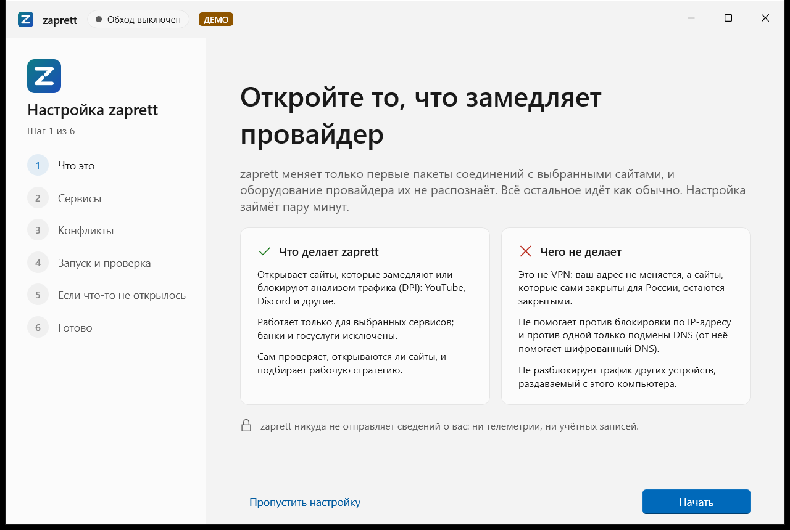

### Шаг 2 из 6. Сервисы

Отметьте сервисы, которые у вас работают плохо. У каждого указано, поможет ли zaprett: **«Помогает»**,
**«Помогает частично»** или **«Не поможет»** (такие сервисы заблокированы по адресу или сами закрыли доступ, и включить
их нельзя). В поле **«Набор списков:»** можно выбрать основной или расширенный набор, а в блоке **«Чего ждать»** —
прочитать, что именно заработает. Нажмите **«Далее»**.

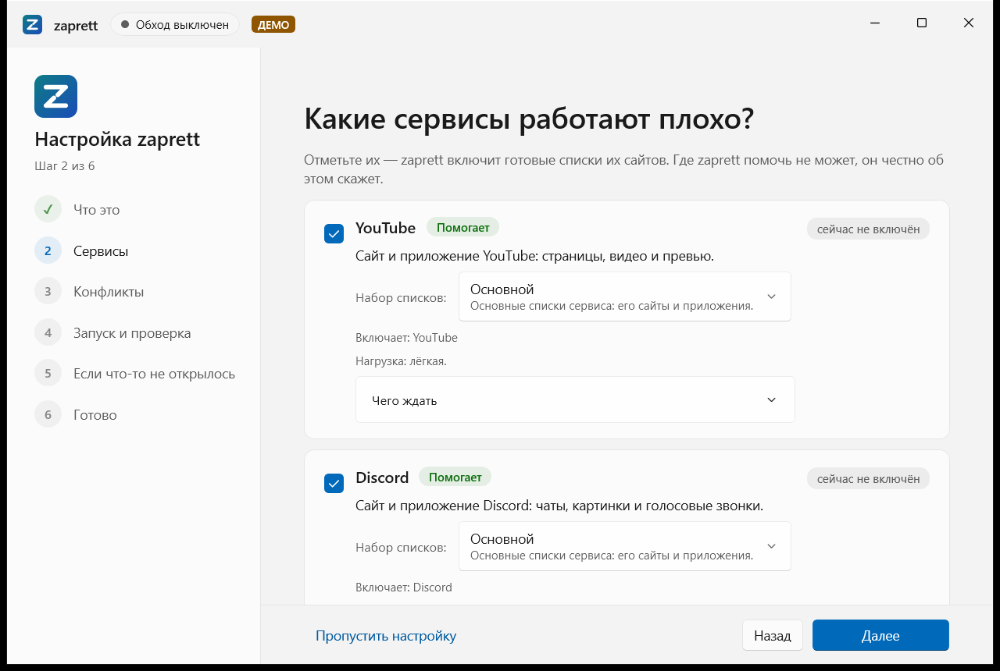

### Шаг 3 из 6. Конфликты

zaprett ищет программы, которые тоже перехватывают трафик и могут мешать обходу: GoodbyeDPI, другую копию zapret,
AdGuard, некоторые VPN и сетевые утилиты. У каждой находки — пометка **«Мешает обходу»**, **«Может мешать»** или
**«Для сведения»** и совет **«Что сделать:»**. Продолжить можно и с находками. Нажмите
**«Применить и запустить»**.

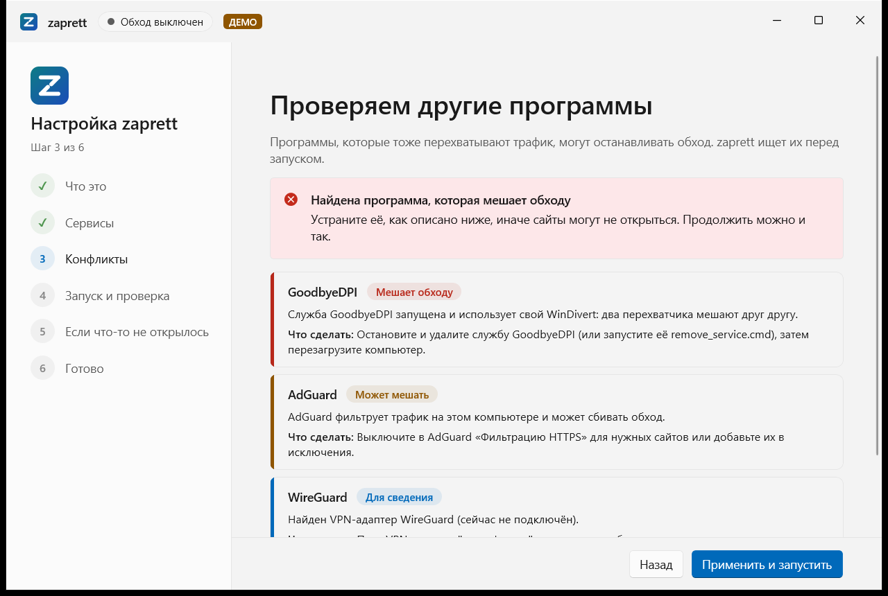

### Шаг 4 из 6. Запуск и проверка

zaprett включает списки выбранных сервисов, запускает обход и сам проверяет, открываются ли сайты. Для каждого
сервиса видно, сколько проверочных адресов открылось. Если всё открылось — нажмите **«Далее»**. Если какой-то сервис
не открылся, нажмите **«Выяснить и исправить»**.

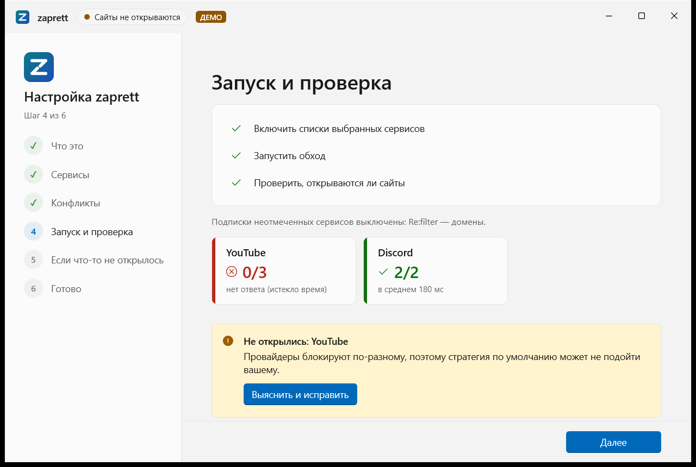

### Шаг 5 из 6. Если что-то не открылось

Провайдеры блокируют по-разному, и стратегия по умолчанию может вашему не подойти.

1. **«Выяснить»** — за полминуты zaprett определит, **чем блокирует провайдер**: подменяет DNS, блокирует адрес,
   рвёт соединение по имени сайта или замедляет его — и скажет, что поможет.
2. **«Подобрать стратегию»** — быстрый автоподбор: около 12 стратегий за несколько минут. Обход в это время
   продолжает работать, лучшая стратегия применится сама.
3. **«Проверить снова»** — повторная проверка сайтов.

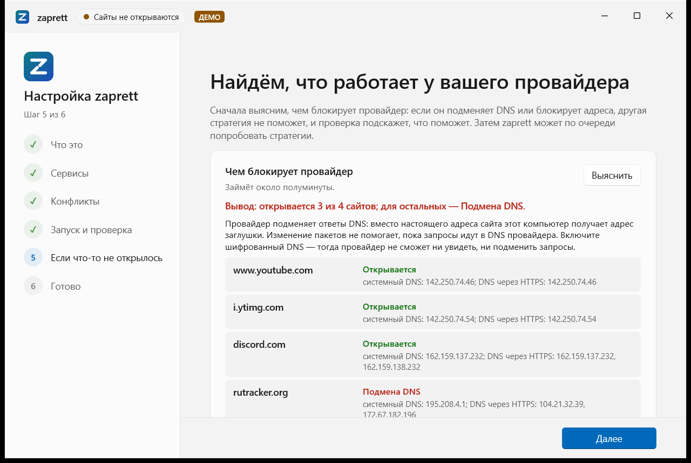

### Шаг 6 из 6. Готово

Переключатель **«Включать обход при запуске Windows»** (рекомендуется) решает, будет ли обход включён после
перезагрузки: если он включён, обход включится сам с текущими настройками. Работающий сейчас обход этот переключатель
не выключает — для этого кнопка на главной. Нажмите **«Готово»**.

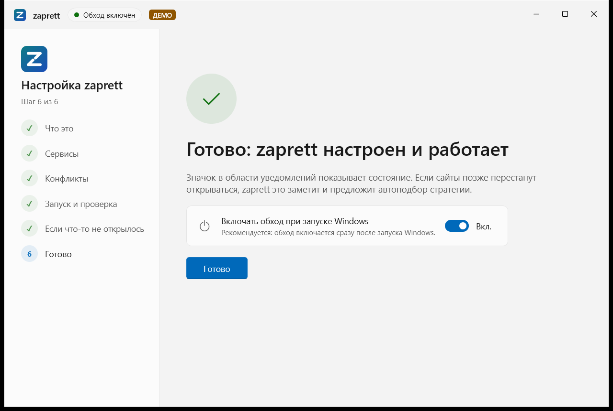

## 6. Страницы приложения

### Главная

Большая кнопка включает и выключает обход. Рядом — состояние («Обход работает», «Обход выключен», «Сайты перестали
открываться» и т. п.), текущая стратегия, движок, время работы и число обработанных пакетов. Ниже:

- **«Открываются ли сайты?»** и кнопка **«Проверить сейчас»** — проверка адресов включённых сервисов через работающий
  обход;
- **«Монитор доступности»** — история проверок по расписанию (зелёный — сайты открылись, красный — открылось меньше
  половины);
- **«Что обрабатывается»** — режим списков и ссылки на сервисы, списки и стратегии;
- предупреждения, если что-то требует внимания (например, «DNS-запросы идут без шифрования»), с кнопкой перехода туда,
  где это исправляется.

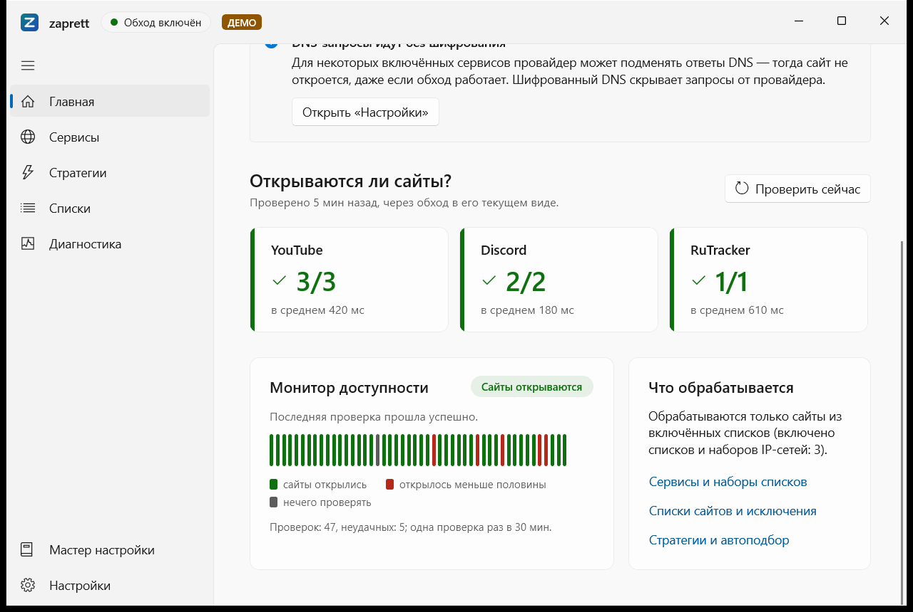

### Сервисы

Тот же выбор сервисов, что в мастере: отметьте нужные и нажмите **«Применить»**. zaprett включит готовые списки сайтов
этих сервисов и обязательные исключения.

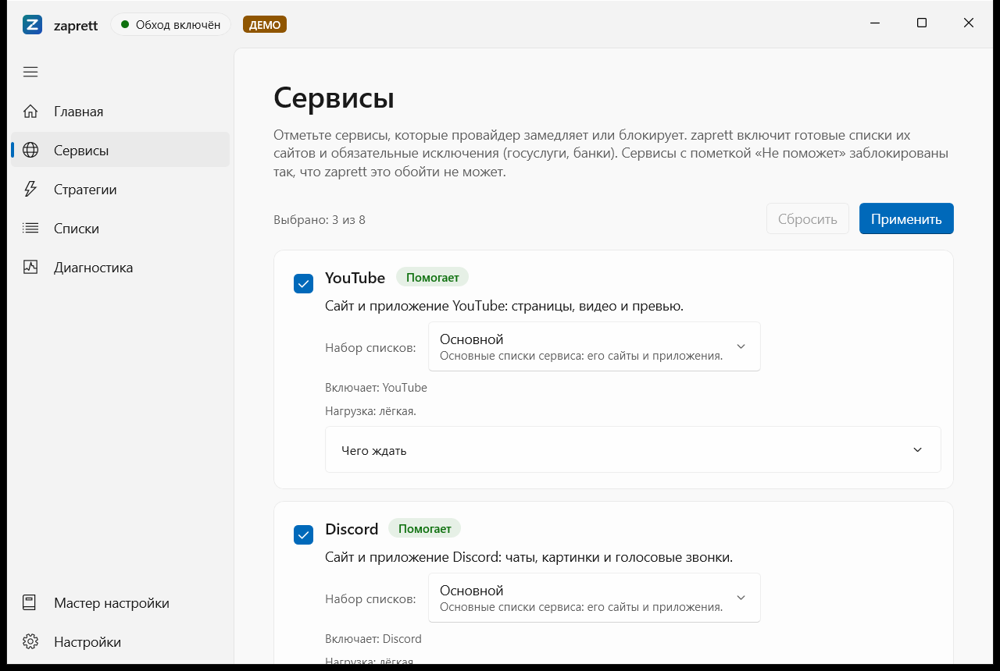

### Стратегии и автоподбор

Стратегия — набор приёмов, которые скрывают имя сайта от оборудования провайдера. Разным провайдерам нужны разные
стратегии.

**Автоподбор** по очереди пробует стратегии на проверочных адресах включённых сервисов и показывает таблицу: сколько
адресов открылось с каждой стратегией и за какое время.

- **«Быстрый»** — около 12 стратегий, несколько минут; **«Полный»** — все установленные, может занять 10–20 минут.
- **«Применить лучшую, если она лучше текущей»** — применить результат автоматически. Иначе выберите стратегию сами
  кнопкой **«Применить»** в строке таблицы или **«Применить лучшую»**.
- **Обход во время подбора не прерывается:** кандидатов проверяет отдельный проверочный движок, а ваш текущий обход
  продолжает работать с прежней стратегией. Флажок **«Подбор с остановкой обхода»** — прежний способ, когда на время
  проверки обход выключается; включайте его, только если обычный подбор не работает.
- **«Остановить»** прерывает подбор; прежняя стратегия остаётся.

Ниже — список **«Установленные»** стратегии: любую можно открыть, посмотреть и **«Сделать текущей»**. Кнопка
**«Новая»** создаёт свою стратегию (имя начинается с `user-`); **«Сохранить и проверить»** сразу спрашивает движок,
принимает ли он её.

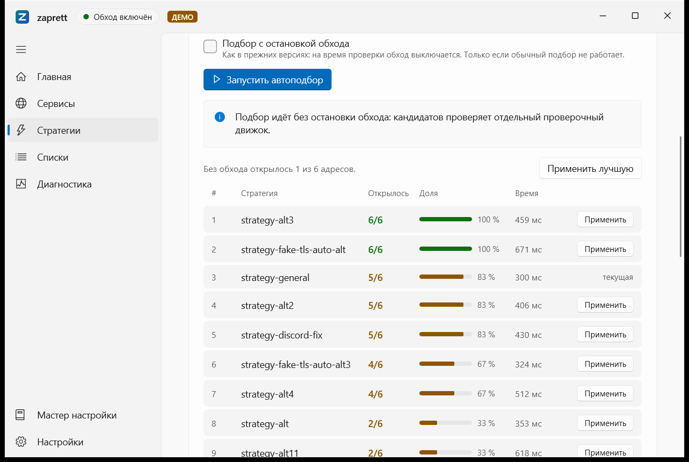

### Списки

**«Какие сайты обрабатываются»:**

- **«Только сайты из включённых списков (рекомендуется)»** — всё остальное идёт как обычно, банки, игры и другие
  программы не затрагиваются;
- **«Все сайты, кроме исключений»** — помогает с сайтами, которых нет ни в одном списке, но может ломаться больше
  сайтов.

Вкладки: **«Домены»**, **«IP-сети»**, **«Исключения»** — встроенные списки, их можно включать и выключать;
**«Свои списки»** — редактор списков «Мои сайты», «Мои исключения сайтов», «Мои IP-сети», «Мои исключения IP-сетей»
(по одной записи в строке, есть импорт и экспорт в файл); **«Подписки»** — внешние списки по https-ссылке, которые
zaprett сам загружает и обновляет (кнопки **«Обновить сейчас»** и **«Новая подписка»**).

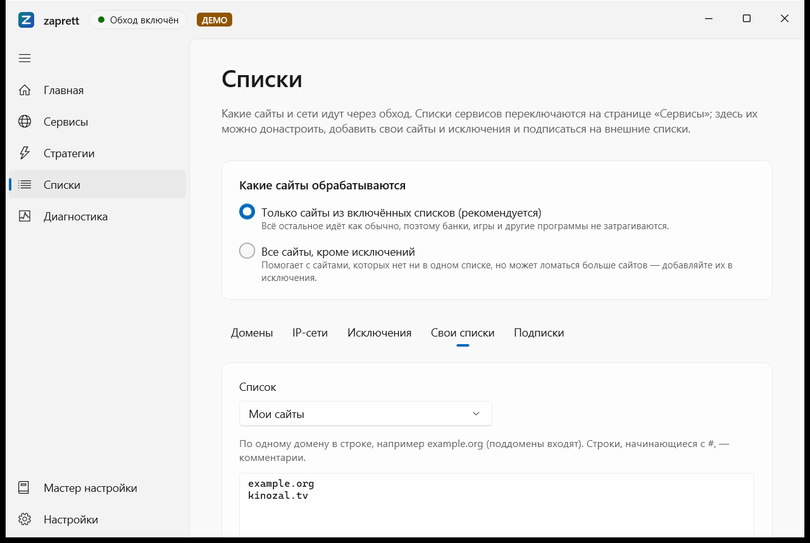

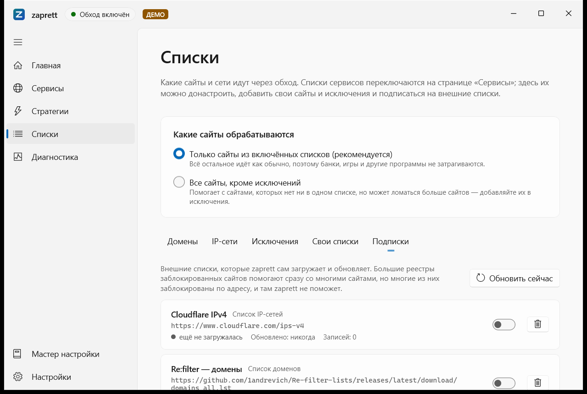

### Диагностика

- **«Чем блокирует провайдер»** → **«Выяснить»**: для каждого проверочного адреса — результат (открывается, подмена
  DNS, блокировка по IP-адресу, блокировка по имени сайта, замедление, страница-заглушка) и вывод, что поможет:
  стратегия, шифрованный DNS или только VPN. При подмене DNS рядом появится кнопка
  **«Включить шифрованный DNS»** (Windows 11).
- **«Конфликтующие программы»** — те же проверки, что в мастере, кнопка **«Проверить снова»**.
- **«Проверка настроек»** → **«Проверить»**: движок проверяет текущие настройки, ничего не перезапуская.
- **«Журнал»** службы и движка; **«Подробный журнал движка»** — для разбора сложных случаев.
- **«Диагностический отчёт»** — версии, состояние, конфликты, последняя проверка и журнал, чтобы скопировать или
  сохранить в файл и приложить к вопросу. Параметры в адресах подписок из отчёта убираются.

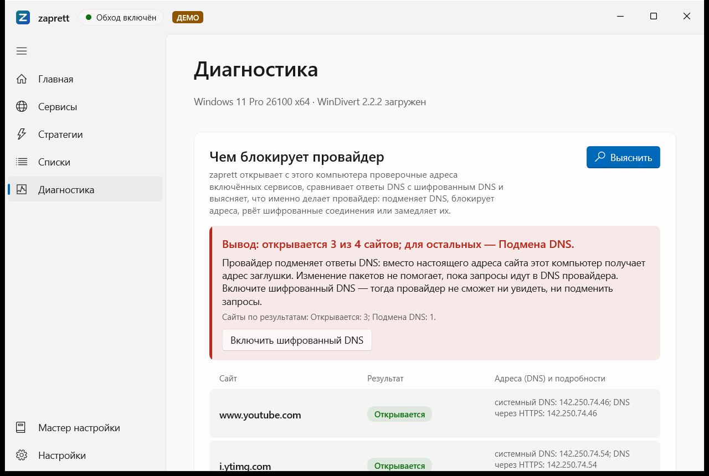

### Настройки

| Группа | Что там |
|---|---|
| **Обход** | «Включать обход при запуске Windows» (только то, что будет после перезагрузки; сейчас обход включается и выключается кнопкой на главной), «Движок» (zapret (winws) или zapret2 (winws2)), «Сторож» (перезапускает движок, если он неожиданно остановился), «Обрабатывать IPv6» |
| **DNS, QUIC и игры** | «Шифрованный DNS» (DNS через HTTPS — **только Windows 11**; в Windows 10 в этой версии недоступен), «Блокировать QUIC» (помогает, когда YouTube работает в одном браузере и не работает в другом), «Игровой фильтр» с портами TCP/UDP |
| **Сети** | «Где работает обход»: во всех сетях или только в выбранных сетях Wi-Fi; «Не работать в корпоративной сети»; монитор — «Проверять сайты по расписанию», «Как часто», «Неудачных проверок до предупреждения», «Восстанавливать автоматически» (быстрый автоподбор, когда сайты перестали открываться, не чаще раза в 6 часов) |
| **Обновления** | в версии 0.1.1 — пояснение, что автообновление появится в следующих версиях, и кнопка **«Открыть страницу релизов»**; как обновиться — раздел 8 |
| **Интерфейс** | «Язык» (русский, английский, китайский — служба и командная строка говорят на том же языке), «Тема» (светлая, тёмная, как в Windows), «Уведомления», «При закрытии оставаться в области уведомлений», «Мастер настройки» |

> **Быстрый запуск Windows.** «Включать обход при запуске Windows» применяется при загрузке Windows. Если в Windows включён быстрый запуск (так по умолчанию в Windows 10 и 11), «Завершение работы» — не полная загрузка: после включения компьютера обход продолжает работу в том же состоянии, что до выключения, а настройка применится при следующей **перезагрузке**. Перезапуск службы (обновление, исправление) тоже не меняет состояние обхода.

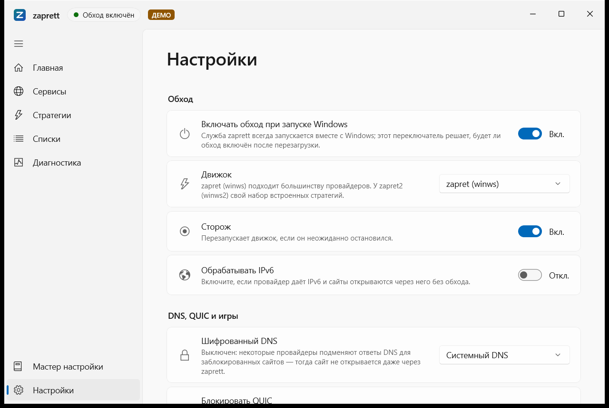

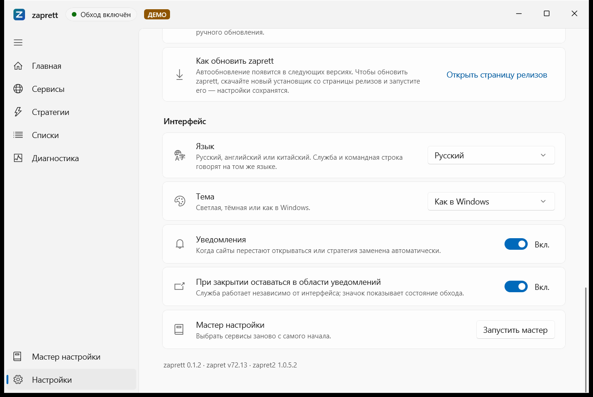

Тёмная тема выглядит так:

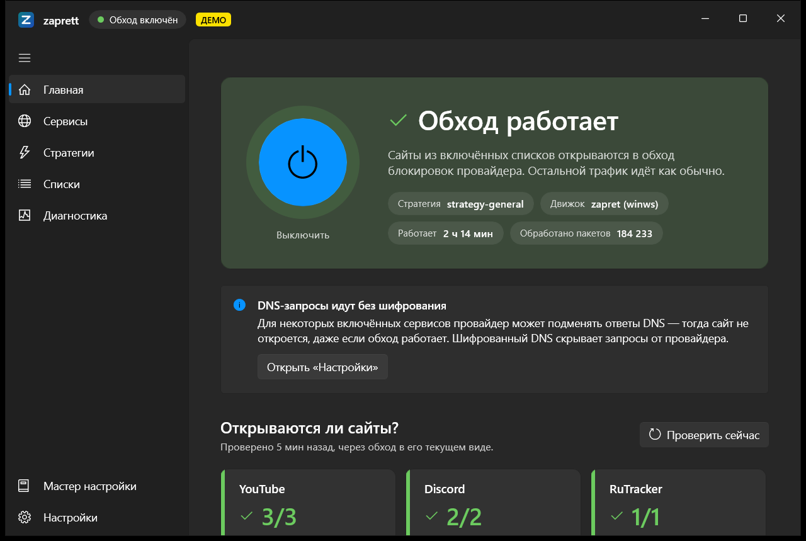

## 7. Значок в области уведомлений

Значок zaprett рядом с часами меняет вид по состоянию обхода: включён, выключен, требует внимания, ошибка.

- **Щелчок** — открыть окно zaprett.
- **Правый щелчок** — меню: **«Включить обход»** / **«Выключить обход»**, **«Проверить сайты сейчас»** (результат
  придёт уведомлением), **«Открыть zaprett»**, **«Закрыть интерфейс (служба продолжит работу)»**.

Закрытие окна или интерфейса обход **не выключает**: его выполняет служба Windows. Выключить обход — кнопкой на
главной странице или в меню значка. Значок запускается при входе в Windows, если при установке стоял соответствующий
флажок.

## 8. Обновление и удаление

**Обновление.** Автообновления в версии 0.1.1 нет — оно появится в следующих версиях. Чтобы обновиться, скачайте
новый MSI со страницы [Releases](https://github.com/RomanKern89/zaprett-openwrt/releases) (в программе её открывает
кнопка **«Настройки» → «Открыть страницу релизов»**) и запустите его: старая
версия заменится, настройки, свои списки и стратегии сохранятся. Поставить более старую версию поверх новой нельзя.

**Удаление.** «Параметры» → «Приложения» → **zaprett** → «Удалить» (или «Панель управления» → «Программы и
компоненты»). Установщик остановит службу и движок, выгрузит драйвер WinDivert (если он загружен именно копией
zaprett — чужой драйвер не трогается; перезагрузка не нужна), удалит правила брандмауэра zaprett, группу
«zaprett Operators» и вернёт DNS-серверы адаптеров, если zaprett их менял.

Настройки и списки в `C:\ProgramData\zaprett` при обычном удалении **остаются** — на случай повторной установки.
Удалить и их:

```powershell
msiexec /x zaprett-0.1.1-x64.msi REMOVEDATA=1
```

## 9. Для администраторов: тихая установка

Все команды — из командной строки администратора.

```powershell
# тихая установка: включить YouTube и Discord и сразу включить обход, журнал установки в файл
msiexec /i zaprett-0.1.1-x64.msi /qn SERVICES=youtube,discord AUTOSTART=1 LANG=ru /l*v install.log

# без значка в области уведомлений при входе пользователей
msiexec /i zaprett-0.1.1-x64.msi /qn TRAYAUTOSTART=0

# китайский установщик и китайский язык программы (английский — TRANSFORMS=:1033 LANG=en)
msiexec /i zaprett-0.1.1-x64.msi TRANSFORMS=:2052 LANG=zh-CN

# тихое удаление вместе с настройками и списками
msiexec /x zaprett-0.1.1-x64.msi /qn REMOVEDATA=1
```

| Свойство | Значение |
|---|---|
| `SERVICES` | сервисы через запятую, как в мастере: `youtube`, `discord`, `telegram`, `rutracker`, `cloudflare`, `roblox`, `signal`, `rkn_full`; набор списков — через двоеточие, например `discord:full` |
| `AUTOSTART` | `1` — включить обход сразу и при каждом запуске Windows; по умолчанию `0` |
| `LANG` | язык программы: `ru`, `en` или `zh-CN`; по умолчанию — язык установщика (`ru`, при `TRANSFORMS=:1033` — `en`, при `:2052` — `zh-CN`). Язык самого установщика задаёт `TRANSFORMS=:1033` (английский) или `TRANSFORMS=:2052` (китайский) — указывайте его вместе с `LANG` |
| `TRAYAUTOSTART` | `0` — не запускать значок при входе пользователей; по умолчанию `1` |
| `INSTALLFOLDER` | папка установки; по умолчанию `C:\Program Files\zaprett` |
| `REMOVEDATA` | при удалении: `1` — удалить и `C:\ProgramData\zaprett` |

`SERVICES`, `AUTOSTART` и `LANG` применяются только при **первой** установке: при обновлении настройки пользователя не
меняются.

**Кто может управлять обходом.** Смотреть состояние может любой пользователь компьютера, а менять настройки,
включать и выключать обход — администраторы и члены локальной группы «zaprett Operators» (в неё автоматически
попадает пользователь, установивший программу). Добавить другого пользователя:

```powershell
net localgroup "zaprett Operators" ИмяПользователя /add
```

## 10. Командная строка `zaprett.exe`

`zaprett.exe` лежит в папке установки и в `PATH` не добавляется. Вызывайте его полным путём:

```powershell
& "C:\Program Files\zaprett\zaprett.exe" status
```

Основные команды (полная справка — `zaprett.exe help`):

```text
status                          состояние
start | stop | restart          обход сейчас (автозапуск не меняется)
enable | disable                включить/выключить сейчас и после загрузки Windows
autostart on|off                включать ли обход после загрузки Windows (сейчас не меняется)
check                           проверить настройки без запуска
wizard apply youtube discord    включить сервисы, как в мастере
list enable|disable <id>        включить/выключить список
strategy set|show <id>          выбрать / показать стратегию
mode whitelist|blacklist        режим списков
engine winws|winws2             движок
test start --quick [--apply-if-better]   автоподбор;  test status — ход и результаты
probe | probe status            проверить сайты сейчас
diagnose | diagnose status      чем блокирует провайдер
conflicts                       мешающие программы
dns status | dns setup | dns off   шифрованный DNS (Windows 11)
log --tail 50                   журнал службы и движка
diag [--full]                   диагностический отчёт
settings get | settings set < json
```

Флаги: `--json` — вывод в JSON, `--quiet` — ничего не печатать при успехе, `--lang ru|en|zh-CN` — язык вывода
(по умолчанию — язык из настроек). Коды возврата: `0` — успешно, `1` — ошибка команды, `2` — неверные аргументы,
`3` — служба недоступна.

**Данные через стандартный ввод.** Команды `settings set` и `sources save` принимают JSON-объект, а
`strategy save <id>` и `user set <id>` — текст. В PowerShell:

```powershell
$z = "C:\Program Files\zaprett\zaprett.exe"
'{"main":{"quic_block":true}}' | & $z settings set                    # включить блокировку QUIC
'{"ui":{"language":"en"}}' | & $z settings set                        # сменить язык
Get-Content .\my-strategy.txt -Raw | & $z strategy save user-my        # своя стратегия (имя с user-)
Get-Content .\sites.txt -Raw | & $z user set user-hosts                # список «Мои сайты»
```

Кодировку ввода подбирать не нужно: UTF-8 (с BOM и без), UTF-16 и кодовая страница консоли распознаются сами.
Команды, которые что-то меняют, требуют прав администратора или членства в группе «zaprett Operators».

## 11. Частые проблемы

**Сайт не открывается, хотя обход включён.**

1. На главной нажмите **«Проверить сейчас»**.
2. Откройте **«Стратегии»** и запустите автоподбор (**«Быстрый»**, затем при необходимости **«Полный»**). Обход во
   время подбора работает.
3. Если ни одна стратегия не помогла — **«Диагностика» → «Чем блокирует провайдер» → «Выяснить»**. При подмене DNS
   включите шифрованный DNS (Windows 11); при блокировке по IP-адресу zaprett не поможет — нужен VPN.
4. Если сайта нет в списках — добавьте его в **«Списки» → «Свои списки» → «Мои сайты»**.

**«Недостаточно прав: нужны права администратора или членство в группе «zaprett Operators».»** Ваша учётная запись не
входит в эту группу — попросите администратора добавить её (раздел 9). Если вас только что добавили и сообщение
осталось, выйдите из Windows и войдите снова.

**«Служба zaprett не запущена».** Нажмите **«Запустить службу»** в окне zaprett (Windows попросит подтверждение
администратора) или запустите службу «zaprett» в оснастке «Службы» (`services.msc`). Если служба постоянно
останавливается, переустановите zaprett.

**Антивирус ругается на WinDivert или `winws.exe` или удалил их.** Драйвер WinDivert умеет перехватывать трафик,
поэтому некоторые антивирусы помечают его как «потенциально опасное приложение» или «хакерский инструмент». Файлы
движка взяты из официального релиза zapret без изменений. Если антивирус их удалил (zaprett покажет предупреждение
«Движок обхода не установлен»), добавьте папку установки (`C:\Program Files\zaprett`) в исключения антивируса и
переустановите zaprett.

**Конфликтующие программы.** Одновременно с zaprett не должны работать **GoodbyeDPI**, другая копия **zapret** и
другие программы, использующие свой WinDivert: два перехватчика мешают друг другу. Остановите и удалите их службы
(для GoodbyeDPI — её `remove_service.cmd`) и перезагрузите компьютер. **VPN** может направлять трафик мимо обхода или
сам обходить блокировки — при включённом VPN результат проверок zaprett может отличаться. Список найденного — в
**«Диагностика» → «Конфликтующие программы»**.

**YouTube открывается в одном браузере и не открывается в другом.** Включите **«Настройки» → «Блокировать QUIC»**.

**Нужно передать сведения для разбора.** **«Диагностика» → «Диагностический отчёт»** → скопировать или сохранить.
Журнал службы также лежит в `C:\ProgramData\zaprett\logs\zaprett.log`.

## 12. Приватность

- zaprett **ничего не отправляет** о вас и о компьютере: нет телеметрии, учётных записей и регистрации.
- Программа сама выходит в сеть только чтобы: открыть проверочные адреса включённых сервисов (проверка сайтов,
  монитор, автоподбор, диагностика), загрузить подписки, которые вы включили, и обновить каталог стратегий и списков
  zaprett на GitHub.
- В диагностическом отчёте у адресов подписок убираются параметры, поэтому токены в отчёт не попадают. Отчёт никуда
  не отправляется сам — вы решаете, кому его передать.

## 13. Что проверено и известные ограничения

**Проверено** на чистых системах: **Windows 10 LTSC 2021 (сборка 19044)** и **Windows 11 24H2** — установка из одного
MSI без дополнительных компонентов, мастер настройки, работа обхода, изолированный автоподбор (основной обход не
перезапускается), удаление.

**Ограничения версии 0.1.1 (бета):**

- MSI не подписан сертификатом разработчика кода — SmartScreen покажет предупреждение (раздел 4);
- автообновления пока нет — новую версию ставьте новым MSI (раздел 8);
- шифрованный DNS из zaprett включается только в Windows 11;
- только x64; ARM64, Windows 7/8.1 не поддерживаются;
- нет фильтра по программам: обход работает для сайтов из списков, какой бы программой они ни открывались;
- трафик, раздаваемый этим компьютером другим устройствам, не обрабатывается;
- совместная работа с разными VPN и антивирусами проверялась не полностью.

Сборка из исходников и выпуск — [docs/BUILD-WIN.md](docs/BUILD-WIN.md); устройство программы —
[docs/ARCHITECTURE-WIN.md](docs/ARCHITECTURE-WIN.md).

## Благодарности и лицензии

- [bol-van/zapret](https://github.com/bol-van/zapret) и [bol-van/zapret2](https://github.com/bol-van/zapret2) —
  движки `winws` и `winws2`;
- [WinDivert](https://github.com/basil00/WinDivert) — драйвер перехвата пакетов (LGPL v3 / GPL v2);
- [CherretGit/zaprett-app](https://github.com/CherretGit/zaprett-app) — оригинальный менеджер и модель стратегий и
  списков; стратегии и списки — см. [корневой README](../README.md#благодарности-и-лицензии).

Код zaprett — лицензия MIT ([LICENSE](../LICENSE)).
