# zaprett Windows 版

[Русский](README.md) · [English](README.en.md) · [OpenWrt 路由器版（英文）](../README.en.md)

在 Windows 电脑上绕过运营商的 DPI（深度包检测）限速和封锁：功能与路由器上的 zaprett 相同，但只作用于这一台电脑。
程序内置 [zapret](https://github.com/bol-van/zapret) 引擎（`winws`）和 WinDivert 驱动、现成的网站列表和策略、
首次设置向导、网站检查、自动选择策略、可用性监控和诊断。界面支持俄语、英语和简体中文。

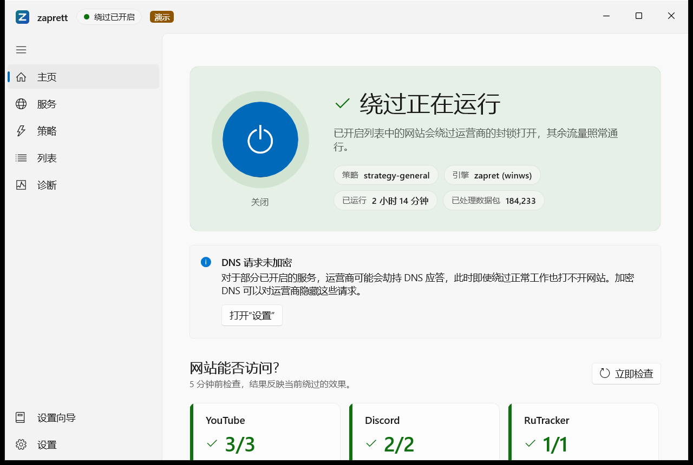

> **版本 0.1.4。** 推荐下载 `zaprett-0.1.4-x64-setup.exe`；`zaprett-0.1.4-x64.msi` 供管理员使用。安装程序没有代码签名证书，
> 运行时 Windows 会显示 SmartScreen 警告——下文说明如何校验文件以及该点击哪里。
>
> 本文截图均在界面的演示模式下拍摄（名称旁有“演示”标记），其中的数字仅为示例。

---

## 1. 它是什么，不是什么

运营商的 DPI 设备会从连接的最初几个数据包中读取网站名称，然后对该连接限速或中断。zaprett **只修改与所选网站连接的最初几个
数据包**，让运营商的设备识别不出网站名称，而网站本身仍能正常识别。其余流量照常通行。

**zaprett 能做什么：**

- 打开因流量分析（DPI）而被限速或封锁的网站和应用：YouTube、Discord 等；
- 只对所选服务生效，银行和政务服务等必需的排除项不受影响；
- 自动检查网站能否打开，并找出适合您运营商的策略。

**它不是什么：**

- **它不是 VPN，也不是代理。** 您的 IP 地址不变，流量不会被转发到任何地方。服务本身拒绝向您所在国家提供的内容仍然无法访问；
- 无法应对按 IP 地址封锁（需要 VPN），也无法单独应对 DNS 劫持（加密 DNS 可以解决，Windows 11 上可在 zaprett 中开启）；
- 不会为这台电脑共享网络给其他设备（移动热点、Internet 连接共享）的流量解除封锁。

### 工作原理

```
程序 ──► Windows ──► WinDivert ──► winws 引擎 ──► 运营商（DPI）──► 网站
                     （截获）      （只修改已开启列表中网站
                                    连接的最初几个数据包）
```

1. **`zaprett` 服务**是程序的核心。它随 Windows 以系统账户（LocalSystem）启动，因此关闭窗口后绕过仍然有效；开启
   “Windows 启动时开启绕过”后，在用户登录之前也有效。服务把设置和列表保存在 `C:\ProgramData\zaprett`，根据已开启的
   服务、列表和所选策略生成引擎命令行，并把引擎作为自己的子进程运行。
2. **WinDivert 驱动**只把发往所选策略需要的端口的出站数据包交给引擎（通常是网页流量：TCP 80/443 和 QUIC 使用的
   UDP 443；开启游戏过滤后还包括您设置的游戏端口）。电脑的其他流量不受影响。
3. **`winws` 引擎**（zapret；也可选用 zapret2 的 `winws2`）把网站名称与列表比对。如果网站在已开启的列表中且不在
   排除项中，引擎按策略修改连接**最初几个数据包的形式**：把请求拆成几部分、发送到达不了网站的伪造数据包、调整分段顺序等。
   运营商的设备无法拼出网站名称，于是放行连接，而网站本身收到的是正常请求。哪种方法有效取决于运营商，因此由自动选择来挑选策略。
4. 服务中的**看门狗**会在引擎意外停止时重启它。**可用性监控**按计划检查已开启服务的网站，网站打不开时发出提醒，或自动运行快速
   自动选择。自动选择使用单独的测试引擎检查策略，不会中断您正在使用的绕过。
5. **窗口和托盘图标**（`zaprett-ui.exe`）以及**命令行**（`zaprett.exe`）只通过 Windows 本地管道控制服务。服务会检查请求者：
   任何用户都可以查看，只有管理员和“zaprett Operators”组的成员可以更改。

zaprett 没有自己的服务器：程序只在检查网站、下载列表和策略目录时联网（见[第 12 节](#12-隐私)）。

## 2. 系统要求

| 项目 | 要求 |
|---|---|
| 系统 | Windows 10 2004 版（内部版本 19041）或更高版本，包括 **Windows 10 LTSC 2021**；Windows 11 |
| 架构 | 仅 x64（Intel/AMD 上的 64 位 Windows）；不支持 ARM64 |
| 权限 | **仅安装和卸载**需要管理员权限，日常使用不需要（见第 9 节） |
| 安装程序 | `zaprett-0.1.4-x64-setup.exe` 或 `zaprett-0.1.4-x64.msi`，各约 60 MB |

**无需另外安装任何组件**——全部包含在安装程序中（`setup.exe` 内含同一个 MSI，使用 Windows 10 2004 及更高版本和 Windows 11 自带的 .NET Framework 4.8）：.NET 10 运行时和 Windows App SDK（WinUI 3 界面）随程序一起提供；
不需要 Visual C++ 运行库；`winws` 引擎（zapret v72.13）和 WinDivert 驱动取自 zapret 官方发布版，未做修改，构建时会校验
其校验和；第二个引擎 `winws2`（zapret2 1.0.5.2）默认安装，可在“设置”中切换。

## 3. 下载与校验

1. 打开 [zaprett for Windows 0.1.4](https://github.com/RomanKern89/zaprett-openwrt/releases/tag/win-v0.1.4)
   （标签 `win-v0.1.4`）。路由器版本使用其他标签（如 `v1.1.0-r1`）。
2. 下载安装程序和 `SHA256SUMS`。安装程序有两种形式：
   - **`zaprett-0.1.4-x64-setup.exe`**——**普通安装推荐使用**。内含同一个 MSI；双击后 Windows 会立即请求管理员许可，
     在任何安装页面出现之前；
   - `zaprett-0.1.4-x64.msi`——供管理员使用：静默安装、通过组策略部署（见第 9 节）。
3. 在下载文件夹中打开 PowerShell，运行：

   ```powershell
   Get-FileHash .\zaprett-0.1.4-x64-setup.exe -Algorithm SHA256
   ```

   `Hash` 的值必须与 `SHA256SUMS` 中该文件那一行一致（不区分大小写）；`SHA256SUMS` 列出了两个文件。MSI 请用
   `Get-FileHash .\zaprett-0.1.4-x64.msi -Algorithm SHA256`。也可以在命令提示符中运行：
   `certutil -hashfile zaprett-0.1.4-x64-setup.exe SHA256`。

校验和不一致时，请不要运行该文件，重新下载。

## 4. 安装

1. **双击** `zaprett-0.1.4-x64-setup.exe`。
2. **如果出现蓝色窗口“Windows 已保护你的电脑”**（SmartScreen），点击 **“更多信息”**，再点击 **“仍要运行”**。
   对于没有代码签名证书、下载量还不多的安装程序，Windows 都会这样提示。zaprett 0.1.4 没有这样的签名：证书需要付费，
   而本项目是非商业项目。上一步您已经用 SHA256 校验和确认了文件的真实性。
3. **Windows 会询问“你要允许此应用对你的设备进行更改吗？”**——点击 **“是”**。发布者显示为未知——这同样是因为没有签名。
   如果点击“否”或关闭该窗口，`setup.exe` 会说明发生了什么，并提供 **“重试”** 或 **“取消”**。
4. **安装程序的语言取决于 Windows 的区域格式**（“设置” → “时间和语言” → “区域” → “区域格式”）：中文格式使用中文
   安装程序，英文格式使用英文，其他格式使用俄语。程序界面也会使用同一语言，之后可在“设置” → “语言”中更改。
   如需明确指定语言，请在命令行中运行（`setup.exe` 会把参数原样传给 MSI 安装程序）：

   ```powershell
   .\zaprett-0.1.4-x64-setup.exe TRANSFORMS=:2052 LANG=zh-CN    # 中文
   .\zaprett-0.1.4-x64-setup.exe TRANSFORMS=:1033 LANG=en       # 英文
   ```
5. 依次完成安装程序的各页：欢迎页、许可协议（MIT）、**“安装前须知”**（说明 zaprett 使用 WinDivert 驱动拦截网络数据包，
   部分杀毒软件会把 WinDivert 和 `winws.exe` 标记为“黑客工具”或“潜在有害应用”；同一页有复选框
   **“登录时在通知区域显示 zaprett 图标”** 和 **“在桌面创建 zaprett 快捷方式”**，默认均已勾选，快捷方式创建在所有用户的
   桌面上）、安装文件夹（默认 `C:\Program Files\zaprett`）、安装。
6. 安装完成后，从“开始”菜单或桌面快捷方式打开 **zaprett**。首次运行会打开设置向导。

> **如果使用 `.msi` 安装：** Windows 不会立即请求管理员许可，而是在安装页面最后点击 **“安装”** 之后才询问。请在该窗口中点击
> **“是”**。如果看不到该窗口，它可能出现在其他窗口后面：请点击**任务栏上闪烁的盾牌图标**。无人回答时，窗口会在大约 2 分钟后
> 自动关闭，安装程序会提示安装已中断——此时请重新运行安装，或改用 `zaprett-0.1.4-x64-setup.exe`。

安装程序会添加 Windows 服务 **zaprett**（随 Windows 启动并执行绕过，窗口只是它的控制面板），创建本地组
**“zaprett Operators”** 并把安装用户加入其中，还会在“开始”菜单添加快捷方式，并在未取消勾选时在桌面添加快捷方式。
设置和列表保存在 `C:\ProgramData\zaprett`。

## 5. 首次运行：设置向导

在绕过尚未配置时，向导会自动打开。之后可随时通过左侧菜单的 **“设置向导”** 或 **“设置” → “设置向导” → “运行向导”**
再次运行。右下角的按钮进入下一步；**“跳过设置”** 会关闭向导且不做任何更改。

**第 1 步（共 6 步）：简介。** zaprett 能做什么、不能做什么。点击 **“开始”**。

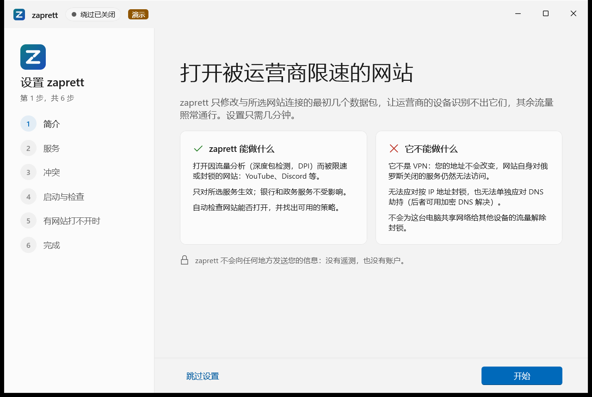

**第 2 步：服务。** 勾选使用不畅的服务。每个服务都标明 zaprett 是否有效：**“有效”**、**“部分有效”** 或 **“无效”**
（这类服务按地址封锁或自行关闭了访问，无法开启）。在 **“列表集：”** 中可选择基本或扩展列表，**“效果说明”** 介绍具体能解决
什么。点击 **“下一步”**。


**第 3 步：冲突。** zaprett 查找同样会拦截流量、可能干扰绕过的程序：GoodbyeDPI、另一份 zapret、AdGuard、部分 VPN 和
网络工具。每项结果标有 **“阻碍绕过”**、**“可能干扰”** 或 **“仅供参考”**，并附 **“处理方法：”**。有冲突也可以继续。
点击 **“应用并启动”**。

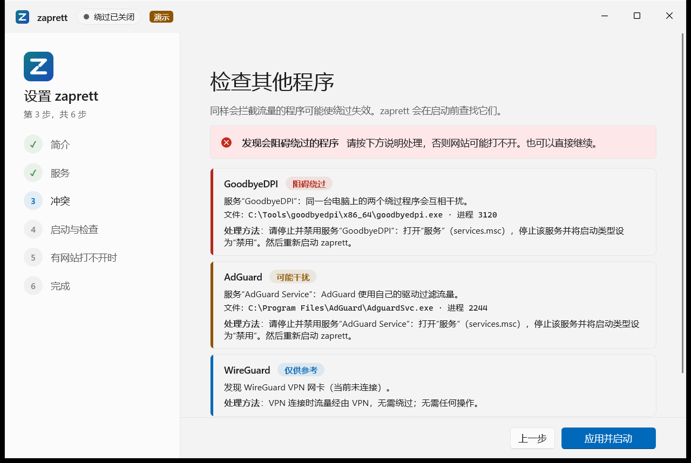

**第 4 步：启动与检查。** zaprett 开启所选服务的列表，启动绕过，并检查网站能否打开。如果全部打开，点击 **“下一步”**；
如果某个服务没有打开，点击 **“检测并修复”**。

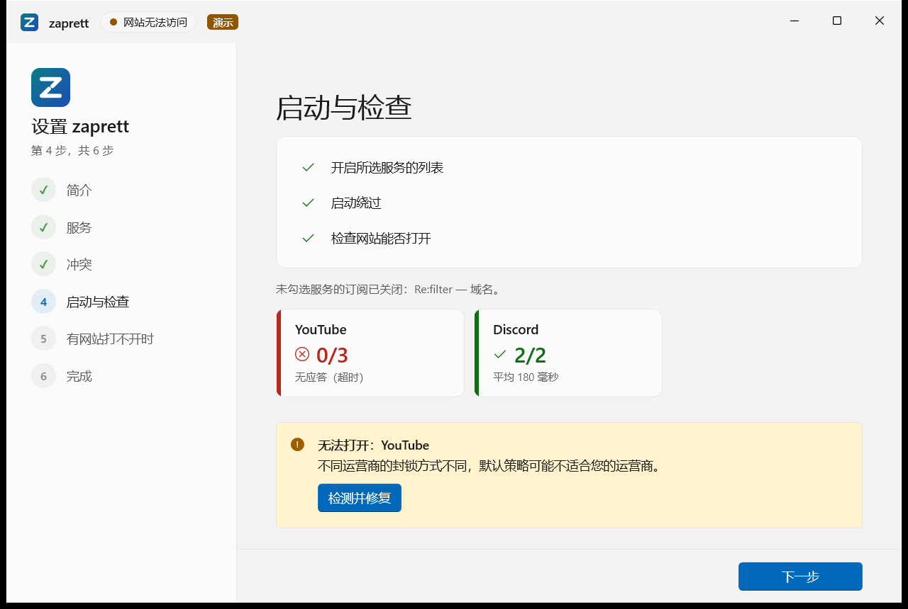

**第 5 步：有网站打不开时。** **“开始检测”** 约用半分钟判断运营商如何封锁（DNS 劫持、封锁地址、按网站名称中断连接或限速），
并给出解决办法；**“寻找策略”** 进行快速自动选择（约 12 个策略，几分钟），期间绕过继续运行，最佳策略会自动应用；
**“重新检查”** 再次检查网站。

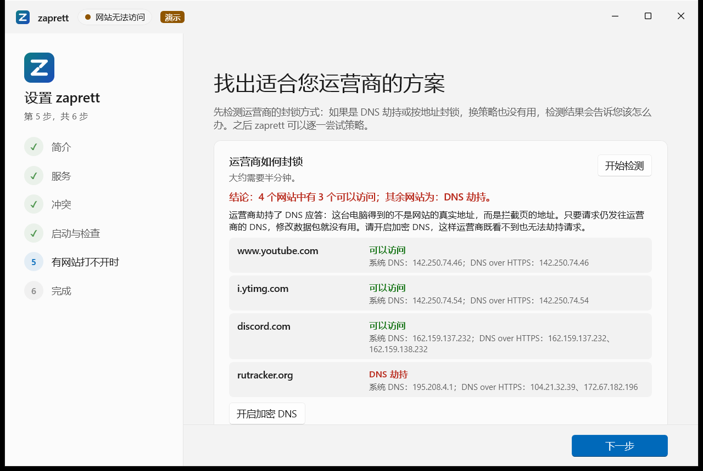

**第 6 步：完成。** 开关 **“Windows 启动时开启绕过”**（推荐）决定重启后是否开启绕过：开启时，重启后绕过会按当前设置自动开启。它不会关闭正在运行的绕过——要立即开启或关闭绕过，请使用主页上的按钮。点击 **“完成”**。

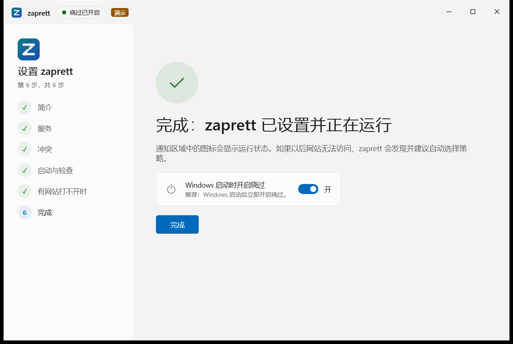

## 6. 程序各页面

- **主页：** 大按钮开启或关闭绕过；显示状态、当前策略、引擎、运行时长和已处理的数据包数。**“网站能否访问？”** 和
  **“立即检查”** 通过正在运行的绕过检查已开启服务的测试地址；**“可用性监控”** 显示定时检查的历史；需要注意的问题会以提示显示。
- **服务：** 与向导中相同的服务选择，勾选后点击 **“应用”**。
- **策略：** **“自动选择”** 逐个测试策略并显示结果表（每个策略打开了多少地址、用时多少）。**“快速”** 约 12 个策略，
  **“完整”** 测试全部已安装策略（10–20 分钟）。**自动选择期间绕过不会中断**：候选策略由单独的测试引擎检查。
  **“停止绕过后再选择”** 是旧方式，仅在普通选择无效时使用。还可以查看已安装的策略、 **“设为当前策略”**，或 **“新建”**
  自己的策略（名称以 `user-` 开头）。
- **列表：** 选择处理范围（**“只处理已开启列表中的网站（推荐）”** 或 **“处理除排除项以外的所有网站”**）；选项卡
  **“域名”**、**“IP 网段”**、**“排除项”**、**“自定义列表”**（我的网站、我的 IP 网段及其排除项，支持从文件导入和导出到文件）、
  **“订阅”**（通过 https 链接自动下载和更新的外部列表）。
- **诊断：** **“运营商如何封锁”** → **“开始检测”**；**“冲突程序”**；**“配置检查”**；**“日志”**；**“诊断报告”**
  （可复制或保存，订阅地址中的参数会被移除）。
- **设置：** 绕过（开机启动——只决定重启后的状态，立即开启或关闭用主页上的按钮；引擎、看门狗、处理 IPv6）；DNS、QUIC 和游戏（加密 DNS **仅限 Windows 11**、阻止 QUIC、
  游戏过滤）；网络（生效范围、企业网络中不工作、定时检查网站、自动修复）；更新（“每天从仓库更新策略和列表”开关；0.1.4 中显示自动更新将在后续版本提供的说明，以及打开发布页面的按钮，见第 8 节）；
  界面（语言、主题、通知、关闭窗口后保留在通知区域、设置向导）。

> **Windows 快速启动：** “Windows 启动时开启绕过”在 Windows 启动时生效。如果开启了快速启动（Windows 10 和 11 的默认设置），“关机”并不是完整启动：再次开机后，绕过保持关机前的状态，该设置会在下一次**重启**时生效。服务重启（更新、修复）也不会改变绕过的状态。

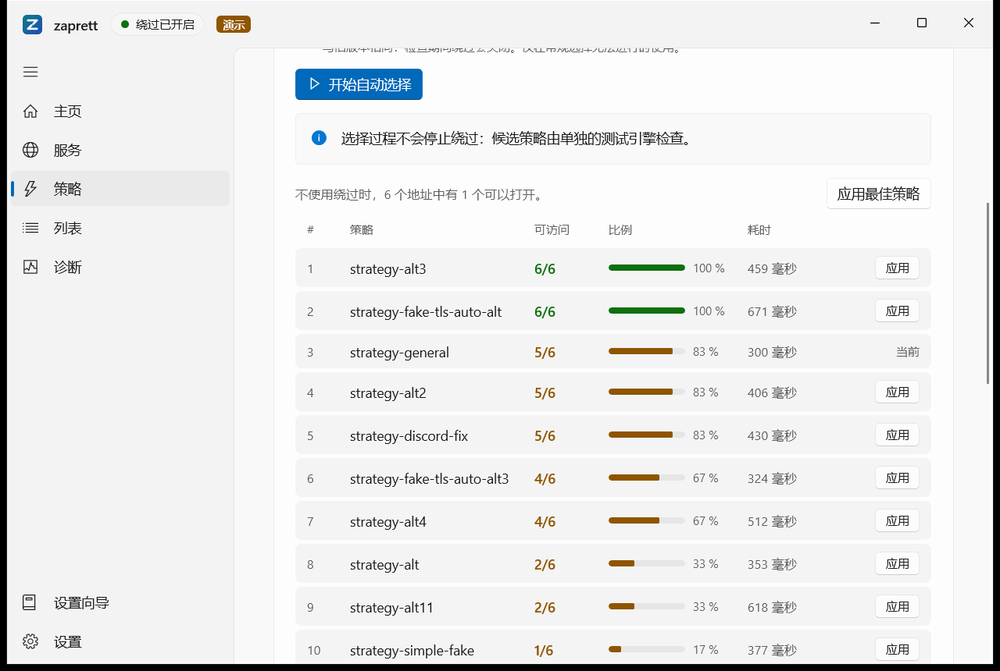

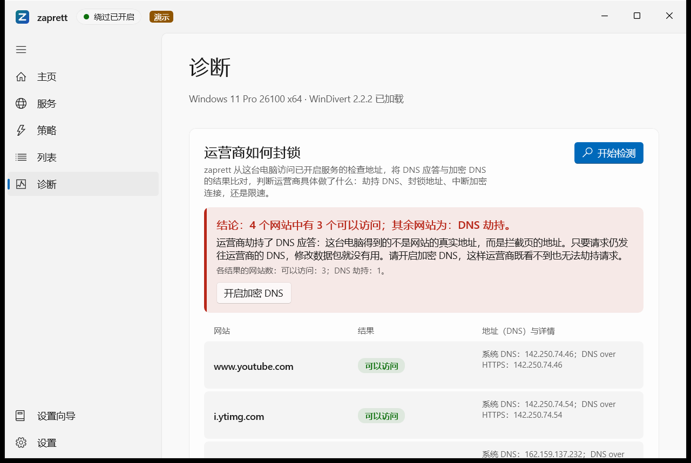

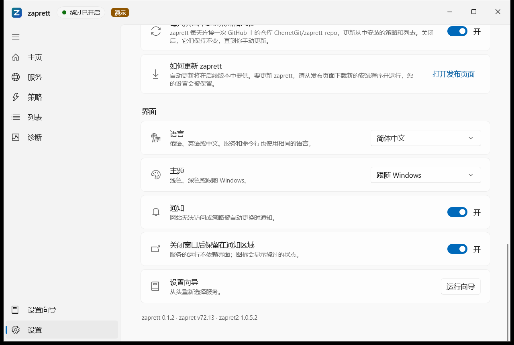

深色主题：

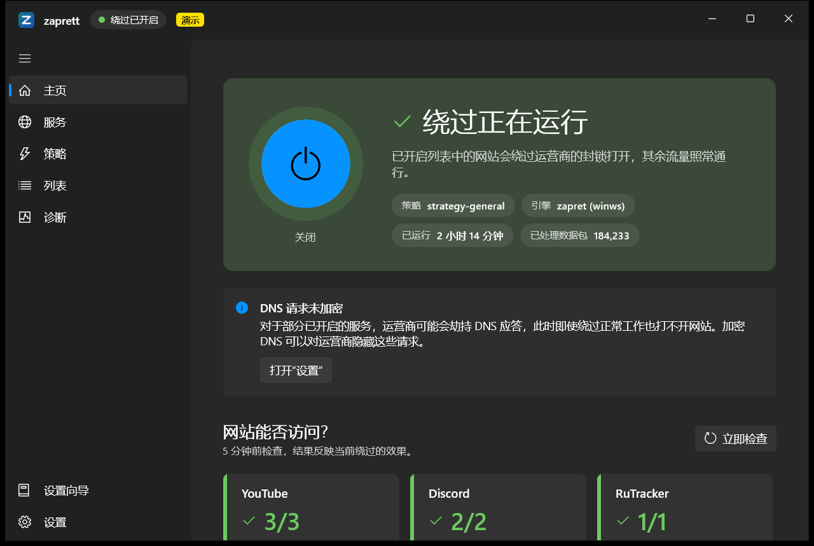

## 7. 通知区域图标

时钟旁的 zaprett 图标随绕过状态变化（开启、关闭、需要注意、错误）。**单击**打开窗口；**右键**菜单包括：
**“开启绕过”** / **“关闭绕过”**、**“立即检查网站”**、**“打开 zaprett”**、**“退出界面（服务继续运行）”**、
**“关闭 zaprett（关闭绕过）”**。**“关闭 zaprett（关闭绕过）”** 会完全关闭程序：关闭绕过、关闭窗口并移除图标（只读模式下绕过开启时不可用）；
Windows 服务保留，若启用了“Windows 启动时开启绕过”，下次启动时绕过会再次开启。
关闭窗口或 **“退出界面”** **不会**关闭绕过：绕过由 Windows 服务执行。

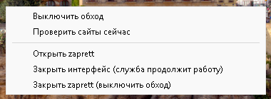

## 8. 更新与卸载

**0.1.4 中新增：**

- 通知区域图标的右键菜单新增 **“关闭 zaprett（关闭绕过）”**：完全关闭程序——关闭绕过、关闭窗口并移除图标。原有的
  **“退出界面（服务继续运行）”** 保留：它关闭窗口和图标，绕过继续运行。只读模式下绕过开启时新菜单项不可用。Windows 服务仍然安装并运行；
  若启用了“Windows 启动时开启绕过”，下次 Windows 启动时绕过会再次开启（见第 7 节）。

**0.1.3 中新增：**

- 新文件 **`zaprett-0.1.3-x64-setup.exe`**——推荐的安装方式。内含同一个 MSI；双击后 Windows 立即请求管理员许可，若许可窗口被拒绝或关闭，
  它会说明发生了什么并提供重试。`.msi` 仍在发布页中，供管理员使用；
- “安装前须知”页新增 **“在桌面创建 zaprett 快捷方式”** 复选框（默认勾选）。升级和修复时会记住该选择；从 0.1.0–0.1.2 升级时
  同样默认勾选，也可以取消勾选——此时快捷方式会被删除。卸载程序时快捷方式会一并删除；
- “准备安装”页提示在 Windows 窗口中点击“是”（或点击任务栏上闪烁的盾牌图标），“安装已中断”页说明可能的原因和解决办法。

**0.1.2 中新增：**

- “设置” → “更新”以及向导最后一步中新增 **“每天从仓库更新策略和列表”** 开关，可以在界面中关闭每日目录更新；
- 可用性监控的额外检查被推迟时（引擎未运行、等待所选网络或正在执行其他后台任务），日志中会出现一条相应记录；
- 通知区域图标在启动后更可靠地立即出现；
- 从 0.1.1 更新无需重启：安装完成后服务、绕过和通知区域图标立即工作。

**更新：** 0.1.4 没有自动更新，该功能将在后续版本提供。请从 [Releases](https://github.com/RomanKern89/zaprett-openwrt/releases)
下载新的安装程序（`setup.exe` 或 MSI）并运行（“设置”的更新部分有按钮可打开该页面）：旧版本会被替换，设置、自定义列表和策略、登录时显示图标的选择以及桌面快捷方式的选择会保留。
0.1.4 可直接安装在 0.1.3、0.1.2、0.1.1 和 0.1.0 之上。不能在新版本上安装旧版本。

**卸载：** “设置” → “应用” → **zaprett** → “卸载”。卸载程序会停止服务和引擎，卸载 WinDivert 驱动（仅当它由 zaprett
自己的副本加载时；其他程序的驱动不受影响，无需重启），删除 zaprett 的防火墙规则、“zaprett Operators”组以及“开始”菜单和桌面快捷方式，并在 zaprett
修改过 DNS 时恢复网卡的 DNS 服务器。普通卸载会**保留** `C:\ProgramData\zaprett` 中的设置和列表；如需一并删除：

```powershell
msiexec /x zaprett-0.1.4-x64.msi REMOVEDATA=1
```

## 9. 面向管理员：静默安装

```powershell
msiexec /i zaprett-0.1.4-x64.msi /qn SERVICES=youtube,discord AUTOSTART=1 LANG=zh-CN /l*v install.log
.\zaprett-0.1.4-x64-setup.exe /qn SERVICES=youtube,discord AUTOSTART=1 LANG=zh-CN /l*v install.log   # 同上，参数原样传给 msiexec，返回码即 msiexec 的返回码
msiexec /i zaprett-0.1.4-x64.msi /qn DESKTOPSHORTCUT=0                 # 不创建桌面快捷方式
msiexec /i zaprett-0.1.4-x64.msi TRANSFORMS=:2052 LANG=zh-CN          # 中文安装程序和中文界面
msiexec /x zaprett-0.1.4-x64.msi /qn REMOVEDATA=1                      # 静默卸载并删除设置和列表
```

属性：`SERVICES`（逗号分隔：`youtube`、`discord`、`telegram`、`rutracker`、`cloudflare`、`roblox`、`signal`、`rkn_full`；
列表集用冒号，例如 `discord:full`）、`AUTOSTART=1`（立即开启绕过并随 Windows 启动）、`LANG`（`ru`、`en`、`zh-CN`，默认与安装程序语言一致（`ru`；`TRANSFORMS=:1033` 时为 `en`，`:2052` 时为 `zh-CN`）；安装程序本身的语言用 `TRANSFORMS=:2052` 或 `:1033` 指定，请与 `LANG` 一起使用）、
`TRAYAUTOSTART=0`（登录时不启动图标）、`DESKTOPSHORTCUT=0`（不在所有用户的桌面创建快捷方式，默认 `1`）、`INSTALLFOLDER`（安装文件夹）、`REMOVEDATA=1`（卸载时删除数据）。
`SERVICES`、`AUTOSTART` 和 `LANG` 只在**首次**安装时生效。组策略部署请使用 `.msi`。

任何用户都可以查看状态；更改设置、开启或关闭绕过需要管理员权限或 **“zaprett Operators”** 组成员身份（安装用户会被自动加入）。
添加其他用户：`net localgroup "zaprett Operators" 用户名 /add`。

## 10. 命令行 `zaprett.exe`

`zaprett.exe` 位于安装文件夹，不会加入 `PATH`，请使用完整路径调用：

```powershell
$z = "C:\Program Files\zaprett\zaprett.exe"
& $z status                                              # 状态
& $z autostart on                                        # Windows 启动后开启绕过（不改变当前状态）
& $z help                                                # 完整命令列表
& $z test start --quick --apply-if-better                # 快速自动选择
& $z probe                                               # 立即检查网站
'{"main":{"quic_block":true}}' | & $z settings set       # 通过标准输入传入 JSON：开启阻止 QUIC
```

参数：`--json`（JSON 输出）、`--quiet`（成功时不输出）、`--lang ru|en|zh-CN`（输出语言）。返回码：`0` 成功、`1` 命令出错、
`2` 参数无效、`3` 服务不可用。

## 11. 常见问题

- **安装程序提示安装已中断，“应用”/“程序和功能”中没有 zaprett：** 通常是 Windows 请求管理员许可（“你要允许此应用对你的设备进行更改吗？”）
  时没有得到“是”。使用 `.msi` 安装时，该窗口在点击 **“安装”** 后出现，有时位于其他窗口后面，任务栏上的盾牌图标会闪烁；无人回答时
  约 2 分钟后自动关闭，计算机不会被更改。请重新运行安装并点击 **“是”**（看不到窗口时点击闪烁的盾牌图标）。最简单的方法是使用
  **`zaprett-0.1.4-x64-setup.exe`**：它在启动时就会请求许可。
- **绕过已开启但网站打不开：** 在主页点击 **“立即检查”**；在 **“策略”** 页运行自动选择（先 **“快速”**，必要时 **“完整”**）；
  仍无效时在 **“诊断”** 中 **“开始检测”**——若是 DNS 劫持，请开启加密 DNS（Windows 11）；若按 IP 地址封锁，zaprett 无能为力，
  需要 VPN。网站不在任何列表中时，把它加入 **“列表” → “自定义列表” → “我的网站”**。
- **“权限不足：需要管理员权限，或加入“zaprett Operators”组。”** 请管理员把您的账户加入该组（见第 9 节）；刚加入后仍提示时，
  注销 Windows 再重新登录。
- **“zaprett 服务未运行”：** 在窗口中点击 **“启动服务”**（需要管理员确认），或在“服务”（`services.msc`）中启动 zaprett 服务。
- **杀毒软件报警或删除了 WinDivert / `winws.exe`：** 该驱动能拦截流量，因此部分杀毒软件会报警。引擎文件取自 zapret 官方发布版，
  未做修改。如被删除（zaprett 会提示“绕过引擎未安装”），请把安装文件夹加入杀毒软件的排除项，然后重新安装 zaprett。
- **冲突程序：** GoodbyeDPI、另一份 zapret 以及其他自带 WinDivert 的程序不能与 zaprett 同时运行。请停止并删除它们的服务后
  重启电脑。VPN 可能让流量绕开 zaprett，开启 VPN 时检查结果可能不同。
- **YouTube 在一个浏览器中能打开、在另一个中打不开：** 开启 **“设置” → “阻止 QUIC”**。

## 12. 隐私

zaprett **不会发送**任何关于您或您电脑的信息：没有遥测，没有账户。程序只在以下情况联网：打开已开启服务的测试地址（网站检查、
监控、自动选择、诊断）、下载您开启的订阅、每天更新一次 GitHub 上的 zaprett 策略和列表目录（可在“设置” → “更新”中用“每天从仓库更新策略和列表”开关关闭）。诊断报告不会自动发送到任何地方。

## 13. 已验证内容与已知限制

**已验证**（全新系统）：**Windows 10 LTSC 2021（内部版本 19044）** 和 **Windows 11 24H2**——仅用一个 MSI 安装、
设置向导、绕过本身、隔离式自动选择（主绕过不重启）、卸载。

0.1.3 安装程序在同样的系统上验证：`setup.exe` 启动后立即出现 Windows 许可窗口，拒绝后显示“重试 / 取消”说明窗口并可再次请求；
全新安装（程序以非管理员权限启动）；在程序和图标运行时从 0.1.2 升级；桌面快捷方式（创建、升级时用 `DESKTOPSHORTCUT=0` 删除、
下次升级保留选择、随程序一起删除）；通过 `setup.exe` 静默安装并传递参数和退出代码；`.msi` 的“准备安装”和“已中断”页面提示。

0.1.4 在 Windows 11 上验证：通过 `setup.exe` 静默（`/qn`）从 0.1.3 升级，退出代码为 0；图标菜单中有“关闭 zaprett（关闭绕过）”，
选择后图标和窗口关闭，绕过已关闭（`winws` 引擎未运行），服务继续运行。只读模式下该菜单项不可用仅由自动化测试覆盖。

**0.1.4 的限制：** `setup.exe` 和 MSI 都没有代码签名（会出现 SmartScreen 警告，许可窗口显示“未知发布者”）；暂无自动更新；加密 DNS 仅支持 Windows 11；
仅支持 x64；没有按程序过滤；不处理共享给其他设备的流量；与各种 VPN 和杀毒软件的兼容性尚未全面测试。

zaprett 代码采用 MIT 许可证（[LICENSE](../LICENSE)）。引擎：[bol-van/zapret](https://github.com/bol-van/zapret)、
[bol-van/zapret2](https://github.com/bol-van/zapret2)；驱动：[WinDivert](https://github.com/basil00/WinDivert)
（LGPL v3 / GPL v2）。
